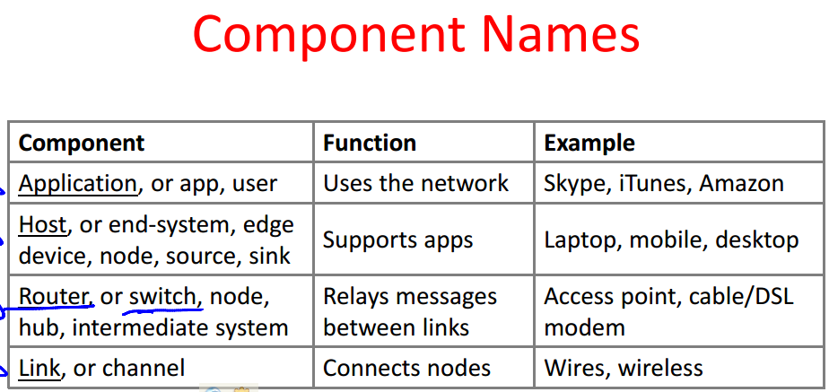
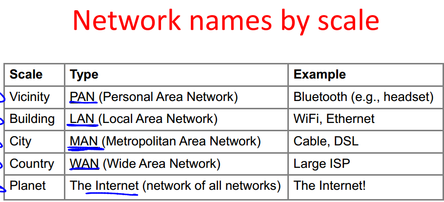

## 目录： ##

- 介绍、协议和层（Introduction, Protocols and Layering）
- 物理和链路层（Physical and Link layers）
- Retransmissions, Multiple access, Switching
- Network layer, Internetworking
- Intra- and Inter-domain Routing
- Transport layer, Reliability
- Congestion Control
- DNS, Web/HTTP, Content Distribution
- Quality of Service and Real-time Apps
- Network Security

### 1.介绍、协议和层 ###

- 学习Internet如何工作的
	- 当你浏览网页时发生了什么？
	- 什么是TCP/IP、DNS、HTTP、NAT、VPNs、802.11等
- 学习计算机网络的基础
	- 我们要解决什么困难问题？
	- 我们要设计什么方法？
- 连接计算机到物理世界
	- 用于收集传感器数据，和控制世界
	- 这是一个丰富的、新兴的用途

- 网络需要模块化
	- 网络需要为apps提供：
	- 制造和打破连接
	- 通过网络找到一个路径
	- 可靠地传递信息
	- 传递任意长度的信息
- Protocols and Layers
- Encapsulation is the mechanism used to effect protocol layering
- Demultiplexing
- 我们要在那个层实现什么功能？
- OSI “7 layer” Reference Model

### 2.Physical Layer Overview ###

- 物理层范围
- Bandwidth-Delay Product
- 媒体类型
- 频率表示
- 调制
- 通频带调制
- 基本的限制
- Nyquist Limit
- Putting it all together – DSL
- 链路层的范围
- Framing Methods
