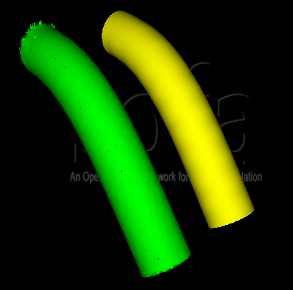
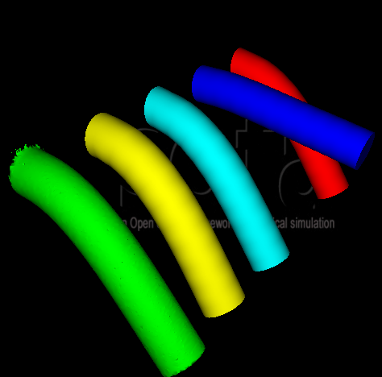
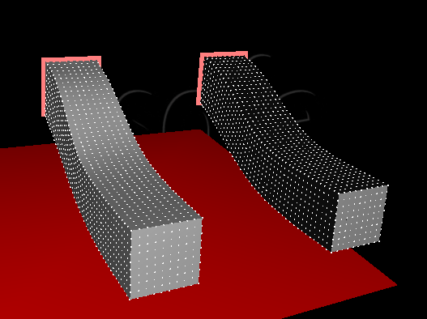
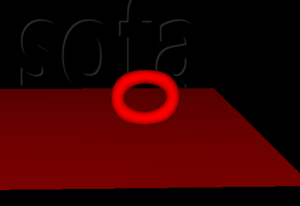
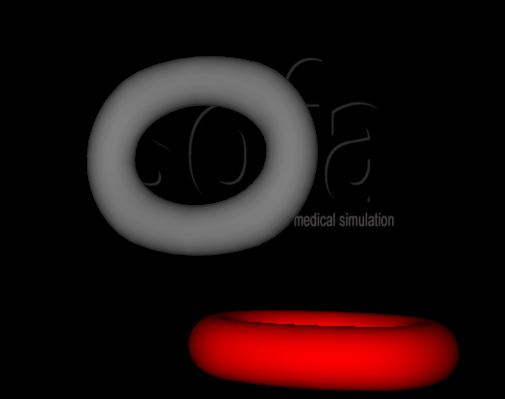

## SofaCuda例子 ##

## 目录 ##

- 一、SofaCuda例子1
- 二、SofaCuda例子2
- 三、SofaCuda例子3
- 四、SofaCuda例子4
- 五、SofaCuda例子5

## 一、SofaCuda例子1 ##

这个例子比较简单

1. 新建文件，删除默认组件。然后在root节点下添加一个组件RequirePlugin，这个组件用来使用sofacuda插件。

2. 在root节点下添加一个节点Reference，然后在这个节点下添加一个组件OglModel。修改这个组件的属性，在Path to the model下添加文件“mesh/truthcylinder1-bent.obj”，用来添加模型。然后修改Initial Translation of the object为（0 -1 0），修改Initial Scale of the object为（0.95 0.95 0.95），这是用来确定模型的位置和大小。这个节点只有一个组件，作用是用来显示一个静止的模型。

3. 在root节点下添加一个新的节点Springs。然后添加组件EulerImplicitSolver、CGLinearSolver，这两个组件是解算器，用来对模型的变化进行计算，一般对其属性不做修改。

	添加组件MeshGmshLoader，命名为"loader"，然后添加一个文件“mesh/truthcylinder1.msh”。这个组件主要是加载一个.msh模型。

	添加组件MeshTopology，然后修改如下：

		position="@loader.position"  edges="@loader.edges"  triangles="@loader.triangles"  quads="@loader.quads"  tetrahedra="@loader.tetras"  hexahedra="@loader.hexas”

	"@loader."表示从之前的loader（即之前的.msh文件）获取信息，分别是模型的位置、边、三角、四边形、四面体和六面体。这是一个拓扑组件，生成一般的网格拓扑。

	添加组件MechanicalObject，注意这个组件的模版是CudaVec3f，即是由cuda插件生成的一个组件。对这个组件只需要修改Translation of the DOFs为（15 0 0），即改变位置。这个组件是一个力学状态矢量组件，就是赋予模型力学性质，显示为一个个白色粒子的样子。

	添加组件UniformMass，模版为CudaVec3f。修改Mass of each particle为1，修改Sum of the particles' masses为15。这个组件用来赋予之前的MechanicalObject质量。

	添加组件FixedConstraint，模版为CudaVec3f。这个组件的作用就是对模型进行固定，其中要固定的是MechanicalObject中的一些粒子。指定这些粒子，即其索引，修改如下：

		"indices="0 1 2 3 4 5 6 7 8 9 10 11 12 13 14 15 16 17 18 19 20 21 22 23 24 25 26 27 28 29 30 31 32 33 34 35 36 37 38 39 40 41 42 43 44 45 46 47 268 269 270 271 343 345“。

	最后添加组件MeshSpringForceField，模版依然为CudaVec3f，修改Stiffness for the Tetrahedra为1870，即四面体的刚度。这个组件是一个ForceField，主要是连接之前的MechanicalObject粒子为一个ForceField。

4. 接下来在Springs节点下添加一个节点1，然后在1节点下添加组件OglModel，模版为ExtVec3f。修改这个组件，添加文件”mesh/truthcylinder1.obj“，然后修改Initial Translation of the object为（15 0 0）。这是一个可视化组件，用来显示模型。

	在1节点下添加组件BarycentricMapping，模版为"CudaVec3f,ExtVec3f"，这是一个质心映射组件，用来将两个组件联系起来。这里默认的会将"MechanicalObject"和"OglModel"联系起来，即一个力学模型和一个可视化模型。

	至此，就完成了场景的创建。

5. 运行sofa，效果如下：
 
 	

## 二、SofaCuda例子2 ##

这个例子比这前一个复杂一些，因为又多添加了几个模型。下面是在前一个例子的基础上进行修改。新增加的3个模型和之前节点Springs下的模型效果一样，不过模型的创建方式会有些不同。

1. 在root节点下添加节点CoFEM。

	在这个节点下添加组件EulerImplicitSolver和CGLinearSolver，对其属性不做修改。

	添加组件MeshGmshLoader，设置和之前一样，也是添加一个模型，然后组件命名为loader。

	添加组件MeshTopology，设置和之前一样。

	注意下面组件的属性都是CudaVec3f。

	添加组件MechanicalObject，设置和之前类似，不过是位置不同，这里Translation of the DOFs为（30 0 0）。

	添加组件UniformMass和FixedConstraint，设置和之前一样。

	添加组件TetrahedronFEMForceField，这是一个四面体的ForceField，对其修改method="polar"  poissonRatio="0.49"  youngModulus="1116"。

	在CoFEM节点下添加节点2，然后在2节点下添加组件OglModel，然后添加和之前相同的文件，修改位置，Initial Translation of the object为（30 0 0）。

	之后同样的添加映射BarycentricMapping，注意模版为CudaVec3f,ExtVec3f。

2. 在root节点下添加一个节点CoFEM_firstOrder。
	
	添加组件的过程和之前一样。

	注意这里需要改变的位移变为了（45 0 0）。

3. 在root节点下添加一个节点LinearFEM。
	
	添加组件的过程和之前一样。

	这里的位移变为了（60 0 0）。

	还有是修改组件TetrahedronFEMForceField的属性时，修改method="small"。

4. 都完成后，运行sofa，效果如下：

	

## 三、SofaCuda例子3 ##

在之前beam10x10x46-fem-implicit-CPU.scn的例子上进行修改，新添加了一个模型。

1. 在root节点下添加节点M2，在M2下添加组件EulerImplicitSolver和组件CGLinearSolver，这两个组件是解算器用来在模型变化时进行计算。

	添加组件RegularGridTopology，修改属性如下：

		n="10 10 46"  min="-1.5 0 -7.5"  max="1.5 3 7.5"  p0="-1.5 0 -7.5"，设置网格拓扑的尺寸。

	添加组件MechanicalObject，模版为CudaVec3f，修改Translation of the DOFs为（10 0 0），设置MechanicalObject的位置。

	添加组件UniformMass，模版为CudaVec3f，修改totalmass="400"。

	添加组件BoxROI，模版为CudaVec3f。设置box="8.4 -0.1 -7.6 11.6 3.1 -7.4"，这个组件的作用是找到在给定box中的基本图元。

	添加组件FixedConstraint，模版为CudaVec3f，设置indices="@[-1].indices"，表示获取前一个组件的取得的索引，即是固定在BoxROI中的点。

	添加组件TetrahedronFEMForceField，模版为CudaVec3f，设置method="large"  poissonRatio="0.4"  youngModulus="10000"。这是一个四面体ForceField。

	添加组件PlaneForceField，模版为CudaVec3f，设置normal="0 1 0"  d="-3"  stiffness="10000"  draw="1"。这个组件表示地板的ForceField。

2. 在M2节点下添加节点4，然后添加组件RegularGridTopology，设置n="2 2 9"  min="-0.75 0.75 -5.5"  max="0.75 2.25 6.5"  p0="-0.75 0.75 -5.5"。设置了网格拓扑的尺寸。

	添加组件MechanicalObject，模版为CudaVec3f，设置Translation of the DOFs为（10 0 0），即和M2节点下的MechanicalObject在同一个位置。

	添加组件TSphereModel，模版为CudaVec3f，这个组件用来表示碰撞模型。

	添加组件BarycentricMapping，模版为CudaVec3f,CudaVec3f，作用是用来连接当前节点下的MechanicalObject和M2节点下的MechanicalObject。

3. 在M2节点下添加节点5，然后添加组件CubeTopology，这是一个拓扑组件用来建立网格拓扑。

	添加组件MappedObject，模版为CudaVec3f。

	添加组件SubsetMapping，模版为"CudaVec3f,CudaVec3f"，在M2节点下的MechanicalObject和MappedObject之间建立映射。

4. 最后新建一个节点6，在这个节点下添加组件CudaVisualModel，模版为CudaVec3f，作用是用来渲染网格。

5. 运行sofa，效果如下：

	

## 四、SofaCuda例子4 ##

这是一个碰撞的例子。

1. 新建文件，删除默认组件MinProximityIntersection和组件DefaultCollisionGroupManager。

	然后添加组件RequiredPlugin，这个组件的作用是说明场景使用sofacuda插件。

	添加组件CudaProximityIntersection，这个sofacuda插件带的组件，设置alarmDistance="0.002"  contactDistance="0.001"。用来说明两个碰撞对象之间的检测距离。

2. 在root节点下添加节点Floor，在Floor节点下添加组件RegularGridTopology，这是一个拓扑组件，用来显示网格拓扑，设置n="2 1 2"  min="10 -3.05 -10"  max="-10 -3.05 10"  p0="10 -3.05 -10"。

	然后添加组件MechanicalObject，模版为Vec3d，这是一个力学对象组件，赋予对象力学属性。只需要设置translation="0 -5 0"。

	在Floor节点下添加新的节点Visu，然后添加组件OglModel，可视化组件，可以设置颜色为红色，设置translation="0 -5 0"。

	在Visu节点下再添加一个组件IdentityMapping，这是一个特殊的映射，child points和parent points是一样的。使组件OglModel和组件MechanicalObject关联起来。

3. 在root节点下添加节点FEM，添加组件组件MechanicalObject和组件CGLinearSolver，这两个是解算器，一般不修改属性。

	添加组件MeshGmshLoader，作用是加载一个"share/mesh/torus_low_res.msh"模型。

	添加组件MeshTopology，网格拓扑，根据前一个加载模型的大小设置网格拓扑。设置position="@meshLoader.position"  edges="@meshLoader.edges"  triangles="@meshLoader.triangles"  quads="@meshLoader.quads"  tetrahedra="@meshLoader.tetras"  hexahedra="@meshLoader.hexas"。

	添加组件MechanicalObject，模版为CudaVec3f，给模型添加力学属性，设置translation="2.5 0 0"  rotation="90 0 0"。

	添加组件UniformMass，模版为CudaVec3f，给模型添加质量属性，设置mass="0.0189394"  totalmass="5"。

	添加组件PlaneForceField，模版为CudaVec3f，设置normal="0 1 0"  d="-8"  stiffness="10000"。这是一个平面的ForceField，与模型的ForceField可以相互作用。

	添加组件TetrahedronFEMForceField，模版为CudaVec3f，设置poissonRatio="0.3"  youngModulus="1000"  gatherPt="8"  gatherBsize="256"。四面体有限元ForceField，作用在模型上。

	在FEM节点下添加节点Visu，这是一个可视化节点，添加组件OglModel，添加模型"share/mesh/torus.obj"，设置模型的颜色为红色。

	然后添加组件BarycentricMapping，模版为"CudaVec3f,ExtVec3f"，这个映射关联FEM节点下的组件MechanicalObject和组件OglModel。

	在FEM节点下添加节点Collision，然后添加组件MeshObjLoader，这个组件的作用和之前一样，不过添加了不同的模型，这里加载模型"/share/mesh/torus_for_collision.obj"。

	然后添加组件MeshTopology，这是一个网格拓扑组件，同样的使用前一个模型的尺寸进行设置。

	添加组件MechanicalObject，模版为CudaVec3f，设置translation="2.5 0 0"  rotation="90 0 0"。

	添加组件TTriangleModel，模版为CudaVec3f，这是一个碰撞模型，使用的是三角网格。

	添加组件TLineModel，模版为CudaVec3f，和前一个组件一样，这里使用的是线性网格。

	最后添加组件BarycentricMapping，重心映射组件，将FEM下的MechanicalObject和Collision节点下的MechanicalObject关联起来。

4. 运行sofa，效果如下：

	

## 五、SofaCuda例子5 ##

这个例子没有成功，感觉组件都添加好了，而且设置的也没什么问题，但是运行不成功，还没有找到什么原因。

1. 新建文件，删除默认组件MinProximityIntersection，然后添加组件RequiredPlugin和组件CudaProximityIntersection，设置CudaProximityIntersection的属性，修改alarmDistance="0.3"  contactDistance="0.2"。

2. 在root节点下添加节点Chain，然后在Chain节点下添加节点Fixed。

	在Fixed节点下添加组件MeshObjLoader，这个组件是加载模型，添加文件"/share/mesh/torus_for_collision.obj"。

	然后添加组件MeshTopology，网格拓扑组件，这个组件在前一个模型的基础上设置网格拓扑的尺寸。设置position="@loader.position"  edges="@loader.edges"  triangles="@loader.triangles"  quads="@loader.quads"  tetrahedra="@loader.tetras"  hexahedra="@loader.hexas"。

	添加组件MechanicalObject，模版为CudaVec3f，这为模型添加力学属性。

	添加组件TTriangleModel，模版为CudaVec3f，为模型添加碰撞模型。

	添加组件OglModel，可视化组件，添加模型"/share/mesh/torus.obj"。

	Fixed节点是一个静止的链环，具有力学属性，还有碰撞模型，能够和接下来的链环模型进行碰撞。

3. 在Chain节点下添加节点FEM，然后添加组件EulerImplicitSolver和CGLinearSolver。

	添加组件MeshGmshLoader，作用是加载一个"share/mesh/torus_low_res.msh"模型。

	添加组件MeshTopology，网格拓扑，根据前一个加载模型的大小设置网格拓扑。设置position="@meshLoader.position"  edges="@meshLoader.edges"  triangles="@meshLoader.triangles"  quads="@meshLoader.quads"  tetrahedra="@meshLoader.tetras"  hexahedra="@meshLoader.hexas"。

	添加组件MechanicalObject，模版为CudaVec3f，给模型添加力学属性，设置translation="2.5 0 0"  rotation="90 0 0"。

	添加组件UniformMass，模版为CudaVec3f，给模型添加质量属性，设置mass="1"  totalmass="5"。

	添加组件TetrahedronFEMForceField，模版为CudaVec3f，设置method="polar"  poissonRatio="0.3"  youngModulus="1000"  gatherPt="8"  gatherBsize="256"。四面体有限元ForceField，作用在模型上。

	在FEM节点下添加节点Visu，这是一个可视化节点，添加组件OglModel，添加模型"share/mesh/torus.obj"，设置模型的颜色为红色。

	然后添加组件BarycentricMapping，模版为"CudaVec3f,ExtVec3f"，这个映射关联FEM节点下的组件MechanicalObject和组件OglModel。

	在FEM节点下添加节点Collision，然后添加组件MeshObjLoader，这个组件的作用和之前一样，不过添加了不同的模型，这里加载模型"/share/mesh/torus_for_collision.obj"。

	然后添加组件MeshTopology，这是一个网格拓扑组件，同样的使用前一个模型的尺寸进行设置。

	添加组件MechanicalObject，模版为CudaVec3f，设置translation="2.5 0 0"  rotation="90 0 0"。

	添加组件TTriangleModel，模版为CudaVec3f，这是一个碰撞模型，使用的是三角网格。

	添加组件TLineModel，模版为CudaVec3f，和前一个组件一样，这里使用的是线性网格。

	添加组件CudaPointModel，这是点碰撞模型。

	最后添加组件BarycentricMapping，重心映射组件，将FEM下的MechanicalObject和Collision节点下的MechanicalObject关联起来。

4. 运行sofa，效果如下：

	

	两个链环没有碰撞。
