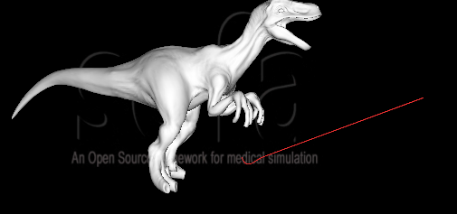
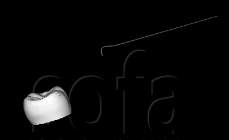
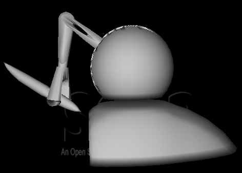

## Sofa Sensable 插件 ##

## 目录 ##

- 一、安装Sensable插件
- 二、Sensable Howto
- 三、Sensable例子1
- 四、Sensable例子2
- 五、Sensable例子3

## 一、安装Sensable插件 ##

[安装Sensable Plugin](http://wiki.sofa-framework.org/wiki/SensablePlugin)

- 下载[OpenHaptics SDK](http://dsc.sensable.com/welcome.asp)，需要进行注册，以及产品的S/N。

- 这个OpenHaptics SDK中包括了Omni设备的驱动和OpenHaptics库，首先安装驱动，然后是sdk。

- 运行Phantom Test程序，用它来监测Omni的工作。也推荐你用它来校正Omni。

- 在Sofa CMake配置中，选择SOFA-PLUGIN_SENSABLE，然后configure。如果你在默认的位置安装OpenHaptics，CMake应该可以自动的找到所有的库和目录。

	如果CMake没有找到，它会返回错误，你应该手动设置。HD和HL库在OpenHaptics/Academic/3.1/lib/"系统子目录"中能找到，然后HDU库在OpenHaptics/Academic/3.1/utilities/lib/"系统子目录"中找到。
- 一旦所有的变量设置好，你就可以Configure，Generate 。然后进行编译。

使用这个插件：

方法1

在场景中使用Omni的一个方法是控制一个刚性体和Omni联系起来，然后根据这个刚性体和场景中其它对象之间的接触来计算力反馈。

这个Sensable插件包括两个重要组件。

NewOmniDriver组件用来和Omni设备通信，获取工具的位置，然后发送给它合适的力反馈。

EnslavementForceFeedback组件根据在场景中Sofa已经完成的碰撞监测来计算力反馈值。

示例：

在Sensable Plugin的示例文件夹中，可以找到一些例子。其中有SimpleBox.scn（没有找到）。

这个场景包括两个主要对象。一个受Omni控制的长而弯曲的工具，以及一个简单的box。

来更详细的看一下这个场景，我们看到碰撞：

	<CollisionPipeline name="pipeline" depth="6" verbose="0"/>
	<BruteForceDetection name="detection" />
	<CollisionResponse name="response" response="default" />
	<MinProximityIntersection name="proximity" alarmDistance="0.8" contactDistance="0.5" />

这是碰撞检测的作用。

接下来是NewOmniDriver：

	<NewOmniDriver name="Omni Driver"  listening="true" tags="Omni" forceScale="0.5" scale="500"  permanent="true" />

我们稍后会更详细的讨论这些属性，但是现在需要注意的是"tags"属性。NewOmniDriver组件需要找到MechanicalObject来控制，然后ForceFeedback会对它计算力反馈。它会在组件中查找具有相同的tag来完成上面的工作，在这个例子中是Omni。

接下来，我们看到Instrument节点，首先我们看到MechancialObject：

	<MechanicalObject template="Rigid" name="instrumentState" tags="Omni"  />

这里模版类型很重要。NewOmniDriver组件会寻找模版为Rigid的MechanicalObject。然后，我们看到它有匹配的tag，那么NewOmniDriver这个MechanicalObject应该被它控制。

UniformMass组件只是赋给MechanicalObject质量。

在VisualModel节点，OglModel组件加载用来可视化仪器的mesh。

	<OglModel template="ExtVec3f" name="InstrumentVisualModel"  fileMesh="data/mesh/dental_instrument.obj" scale3d="10 10 10" translation="-2.12256 1.32361 35.5" rotation="180 0 150" material="Default Diffuse 1 1 0.2 0.2 1 Ambient 1 0.2 0.04 0.04 1 Specular 0 1 0.2 0.2 1 Emissive 0 1 0.2 0.2 1 Shininess 0 45" />

注意translation和rotation的属性。material属性只是使仪器看起来和box不一样。

RigidMapping组件将我们MechanicalObject和我们之前看到的OglModel。这使得仪器的可视化和Omni的运动是同步的。

在Collision Mode节点：
	
	<MechanicalObject template="Vec3d" name="Particle" position="0 0 0" />
	<Point name="ParticleModel" contactStiffness="2" />
	<RigidMapping template="MechanicalMapping&lt;Rigid,Vec3d&gt;" name="MM->CM mapping"  object1="instrumentState"  object2="Particles" />
	<EnslavementForceFeedback name="forcefeedback" tags="Omni" collisionModel1="@ParticleModel" collisionModel2="" relativeStiffness="4" attractionDistance="0.3" normalsPointOut="false"/>

首先，我们看到MechanicalObject被命名为Particle，然后position属性为"0 0 0"。这里我们定义了一个单独的点用于我们的碰撞。这个点代表这Omni的顶端。我们将它放置在"0 0 0"。

然后是赋给粒子一个Point碰撞模型。

RigidMapping组件，和之前一样，使得粒子和Omni设备的运动同步。这个可视化模型同样的和运动同步，然后我们想要仪器的顶端和粒子碰撞，那么在仪器的顶端发生碰撞。这是InstrumentVisualModel组件的translation和rotation的属性的作用。它们将工具的可视化模型和粒子并行。我们将转化放在可视化模型而不是在粒子中，那么顶端的运动和旋转和Omni同步。

EnslavementForceFeedback组件监听Particle Model和场景其它模型的任何碰撞，然后据此计算Omni的力反馈。要注意tag属性和NewOmniDriver要匹配。

Box节点需要可视化模型和碰撞模型。在这个例子中，同一个网格用在了两个模型。这里，DistanceGrid是box的碰撞模型。

**NewOmniDriver属性：**

- listening - 当设为true，NewOmniDriver会监听ForceFeedback，来计算反馈。
- tags - NewOmniDriver会寻找模版为Rigid而且有匹配tag的MechanicalObject，以及匹配的ForceFeedback。
- forceScale - 赋给Omni的全方位的力反馈。这个属性涉及到一个平衡。如果设置太高，你会感到很大的振动和颤动。设置太低，你又很容易的推过你的表面。
- scale - Omni全方位的运动。这改变实际的Omni设备要运动多大来改变在场景中的运动。
- permanent - 如果力反馈要永久的应用设为true。
- alignOmniWithCamera - 如果对象被Omni控制设为true，来自Omni的运动方向，应该顺着摄像机。这表示当你改变摄像机视角，移动Omni总会使对象在场景中移动。默认下，使用场景的默认摄像机，但是如果你想要指定一个摄像机，你可以通过匹配摄像机的tags和NewOmniDriver的tags。

**EnslavementForceFeedback属性**

- tags - 和在NewOmniDriver中tags属性一致。
- collisionModel1 - Omni控制的碰撞模型。EnslavementForceFeedback会得到在场景中所有碰撞的信息。
- collisionModel2 - 如果你对collisionModel1和场景中其它模型的碰撞感兴趣，你可以在这里指定另一个模型。EnslavementForceFeedback然后会得到所有的碰撞信息。注意：如果你不想指定另一个模型，需要将属性设置为 collisionModel2=""。
- relativeStiffness - 当和一个表面接触时减少振动，当仪器内的其他对象被发现是所施加的力是高于外部时。这些力的比率被relativeStiffness来指定。这一值同样涉及到一个平衡。如果值太高，你会感到许多振动和颤动。值太低，你又很容易的推过你的表面。
- attractionDistance - 当和一个表面接触时减少振动，当设备很接近时产生一个碰撞，它稍微吸引到接触点。一旦它到达接触点，这个力反馈将物体推离，来组织仪器进入。这个接触的距离的属性是由attractionDistance赋予。
- normalsPointOut - 为了使力反馈能够应用到恰当的方向，EnslavementForceField要知道场景中其它对象的法线是向内还是向外。如果是向外的，normalsPointOut设为true，如果是false则是向内的。注意：所有对象需要它们的法线指向同一个方向。
- contactScale - 力反馈强度的尺度要根据场景中对象的大小。大的对象需要一个大的contactScale来更好的适应力反馈。

**不同尺度下的场景：**

场景中力的计算会根据场景中对象的不同而不同。例如在SimpleBox.scn中box是10x10x10，然而在 SimpleBoxLarge.scn中是之前的10倍。在更大和更小的尺度下，一些属性值也需要变得更大或更小。其中对尺度敏感的属性值如下：

- MinProximityIntersection: alarmDistance
- MinProximityIntersection: contactDistance
- NewOmniDriver: scale
- EnslavementForceFeedback: attractionDistance
- EnslavementForceFeedback: contactScale
 
## 二、Sensable Howto ##

以下内容源自SOFA Wiki上的[Sensable Howto](http://wiki.sofa-framework.org/wiki/Sensable_Howto)

**如何在SOFA中使用SensAble插件**

要求：

SensablePlugin需要在系统中安装OpenHaptics SDK和Phantom drivers。当前的OpenHapticsSDK ( 3.1 ) 已经提供了Phantom Device Drivers，所以你只需要下载这个安装包就行了。

使用：

这个教程只介绍了如何使用NewOmniDriver组件；OmniDriver和SensAble application完全过时了。

Omni操作：

首先不要忘记加载新创建的插件SensablePlugin.dll。然后将组件NewOmniDriver放到你的场景中（最好是在根节点下）

<NewOmniDriver  />

定制的参数如下：

- omniVisu:在场景中绘制一个虚拟的Omni设备来快速的转换坐标。对于调试很常用。
- positionBase(Vec3)，orientationBase(Quaternion)和scale(float):根据设备的坐标进行转换(haptic frame->world frame)
- forceScale(float):应用于力反馈的力的比例
- permanent:在场景中应用不变的力。否则，你需要按住一个按钮来激活力反馈。

positionTool (Vec3)和orientationTool (Quaternion)是Omni设备末端的位置和方向。(不应该改变)

在场景中互动：

下一步是使用得到的位置和方向。主要是映射这个DOF(自由度)到场景中的对象，即一个MechanicalState。这一方法通过：

<MechanicalStateController  />

完成，它修改了在同一节点下的力学状态(NewOmniDriver发送事件，然后被MechanicalState自动读取)。然后使用这个mechanical state映射来移动对象。

力反馈：

最后，我们要发送力到触觉设备来是场景->用户进行交互。有不同的方式来达到这一目地。其中一个方法是使用：

<LCPForceFeedback />

将这一组件放在和mechanical state在同一节点，然后会发送力。(记住你需要按下设备的按钮来得到力，除非你在NewOmniDriver中激活了"permanent"参数)
 
## 三、Sensable例子1 ##

1. 新建文件，删除默认组件MinProximityIntersection和DefaultCollisionGroupManager。添加组件Gravity，设置gravity="10 0 0"，这赋给场景重力属性。

	添加组件LocalMinDistance，作用是如果两个图元足够接近就认为碰撞。然后设置alarmDistance="0.15" contactDistance="0.05" angleCone="0.0"。

	添加组件FreeMotionAnimationLoop和LCPConstraintSolver。这两个组件是解算器。

2. 在root节点下添加节点Raptor。然后添加组件EulerImplicit和CGLinearSolver。

	添加组件SparseGridTopology，这是个网格拓扑，添加模型fileTopology="mesh/raptor_8kp.obj"，设置n="5 5 10"。

	添加组件MechanicalObject，设置rotation="0 0 90"。

	添加组件PrecomputedConstraintCorrection，在一个仿真对象中计算接触力。

	添加组件DiagonalMass，对每一个粒子赋予质量，设置massDensity="1"。

	添加组件HexahedronFEMForceField，六面体的有限元ForceField。设置youngModulus="1000000" poissonRatio="0.45" method="large"。

	添加组件FixedConstraint，固定粒子，设置要固定粒子的索引indices="0 1 2 18 19 20 59 58 57 96 97 98 135 136 137"。

3. 在Raptor节点下添加节点VisualModel，然后添加组件OglModel，添加模型文件fileMesh="mesh/raptor_35kp.obj"，设置颜色为white。

	添加组件BarycentricMapping，将Raptor节点下的MechanicalObject和OglModel联系起来。

	在Raptor节点下添加节点CollisionModel，然后添加组件MeshObjLoader，命名为name="loader"，加载一个文件filename="mesh/raptor_8kp.obj"。

	添加组件MeshTopology，这是个网格拓扑，设置src="@loader"。
	
	添加组件MechanicalObject，设置src="@loader"。

	添加组件TTriangleModel，设置contactStiffness="100"。

	添加组件TLineModel，设置contactStiffness="100"。

	添加组件TPointModel，设置contactStiffness="100"。

	最后添加组件BarycentricMapping，设置mapForces="false"，然后使Raptor节点下的MechanicalObject和这个节点下的MechanicalObject联系起来。

4. 在root节点下添加节点Omni。添加组件OmniDriver。设置scale="50" omniVisu="0" orientationBase="0 0 0.707107 0.707107" positionBase="-1 0 2"。

	添加组件MechanicalObject，模版为Rigid，然后设置position="0 0 0  0  0  0  1.0"。

	添加组件MechanicalStateController，模版为Rigid，设置listening="true" mainDirection="-1.0 0.0 0.0" handleEventTriggersUpdate="true"。作用是提供了鼠标键盘控制一个Mechanical State。

	在Omni节点下添加新的节点VisuAvatar。然后添加组件OglModel，添加模型fileMesh="mesh/sphere.obj"，设置颜色color="gray"，以及scale="0.1"。

	添加组件RigidMapping，使之前的MechanicalObject和OglModel联系起来。

	在Omni节点下添加新的节点RefModel，然后添加组件MeshObjLoader，命名为name="loader"，然后加载模型filename="dental_instrument_centerline.obj"。

	添加组件MeshTopology，设置src="@loader"。

	添加组件MechanicalObject，设置src="@loader"，ry="-180" rz="-90" dz="3.5" dx="-0.3"。
	
	添加组件RigidMapping。

5. 在root节点下添加新的节点Instrument。

	添加组件EulerImplicitSolver和CGLinearSolver。

	然后添加组件MechanicalObject，模版为Rigid。

	添加组件UniformMass，设置totalmass="0.05"。

	添加组件LCPForceFeedback，作用是设备的LCP力反馈，设置activate="true" forceCoef="0.001"。

	添加组件UncoupledConstraintCorrection。

	添加组件VectorSpringForceField，Spring force field作用在一个网格的边上。其中object1="Omni/RefModel/instrumentCollisionState" object2="Instrument/CollisionModel/instrumentCollisionState" stiffness="10" viscosity="0"。

	在Instrument节点下添加节点VisualModel。然后添加组件OglModel，添加模型fileMesh="dental_instrument.obj"，设置color="1.0 0.2 0.2 1.0" ry="-180" rz="-90" dz="3.5" dx="-0.3"。

	添加组件RigidMapping，关联Instrument节点下的MechanicalObject和OglModel。

	在Instrument节点下添加节点CollisionModel。然后添加组件MeshObjLoader，命名为loader，加载文件filename="dental_instrument_centerline.obj"。

	添加组件MeshTopology，设置src="@loader"。

	添加组件MechanicalObject，设置src="@loader"，ry="-180" rz="-90" dz="3.5" dx="-0.3"。

	添加组件TLineModel，设置contactStiffness="10"。

	添加组件TPointModel，设置contactStiffness="10"。

	添加组件RigidMapping，关联Instrument节点下的MechanicalObject和这个节点下的MechanicalObject。

6. 运行sofa，效果如下：

	
 
## 四、Sensable例子2 ##

这个例子是SOFA网站上介绍SensAble插件时举的一个例子。其中有些问题，做了些调整。

1. 新建文件，删除默认组件MinProximityIntersection、DefaultContactManager。

	在root节点下增加组件Gravity。这是一个重力组件。

	增加组件LocalMinDistance，设置alarmDistance="0.3"  contactDistance="0.15"  angleCone="0"。
	
	增加组件LCPConstraintSolver。

2. 在root节点下，增加节点Tooth。

	在Tooth节点下，添加节点VisualModel，在这个节点下添加一个组件OglModel。添加模型文件fileMesh="data/mesh/tooth-closed.obj"，然后可以修改颜色。这一组件的作用是可视化模型。

	在Tooth节点下，添加节点CollisionModel，在这一节点下添加组件MeshObjLoader，修改为loader，然后加载模型文件filename="data/mesh/tooth-closed.obj"。

	添加组件MeshTopology，修改src="@loader"。

	添加组件MechanicalObject，模版为Vec3d，修改src="@loader"。

	添加组件TTriangleModel、TLineModel、TPointModel，它们的模版都是Vec3d，然后contactStiffness="100"。

3. 在root节点下添加节点Omni。

	然后添加组件NewOmniDriver，修改listening="1"  scale="10"  positionBase="0 1 -0.5"  omniVisu="0"。

	添加组件MechanicalObject，模版为Rigid，修改position="1.2 1.6 -3.55 0 0 0 1"。

	添加组件MechanicalStateController，模版为Rigid，这个组件的作用是映射Omni设备的DOF到对象的MechanicalObject。修改listening="1"  handleEventTriggersUpdate="1"  mainDirection="-1 0 0"。

	在Omni节点下添加节点RefModel，添加组件MeshObjLoader，命名为loader，然后加载模型文件filename="data/mesh/dental_instrument_centerline.obj"。

	添加组件MeshTopology，修改src="@loader"。

	添加组件MechanicalObject，模版为Vec3d，修改src="@loader"，修改translation="-1.2 -1.6 3.55"  rotation="180 0 150"。
	
	添加组件RigidMapping，模版为"Rigid, Vec3d"，将Omni节点下的MechanicalObject和当前节点下的MechanicalObject关联。

4. 在root节点下添加新的节点Instrument。

	添加组件EulerImplicitSolver、CGLinearSolver。

	添加组件MechanicalObject，模版为Rigid，修改position="1.2 1.6 -3.55 0 0 0 1"。

	添加组件UniformMass，模版为Rigid，修改totalmass="0.05"  filename="BehaviorModels/dental_instrument.rigid"。

	添加组件LCPForceFeedback，模版为Rigid，修改listening="1"  activate="1"  forceCoef="0.005"。

	添加组件UncoupledConstraintCorrection，模版为Rigid。

	在Instrument节点下添加节点VisualModel。然后添加组件OglModel，加载模型文件fileMesh="data/mesh/dental_instrument.obj"。修改translation="-1.2 -1.6 3.55"  rotation="180 0 150"。
	
	添加组件RigidMapping，模版template="Rigid,ExtVec3f"，使Instrument节点下的MechanicalObject和当前节点下的OglModel关联。

	在Instrument节点下添加新的节点CollisionModel，然后添加组件MeshObjLoader，命名为loader，加载模型文件filename="data/mesh/dental_instrument_centerline.obj"。

	添加组件MeshTopology，修改src="@loader"。

	添加组件MechanicalObject，模版为Vec3d，修改src="@loader"，修改translation="-1.2 -1.6 3.55"  rotation="180 0 150"。

	添加组件TTriangleModel、TLineModel、TPointModel，它们的模版为Vec3d，修改contactStiffness="10"。

	添加组件RigidMapping，模版为"Rigid,Vec3d"。使节点Instrument下的MechanicalObject与当前节点下的MechanicalObject关联起来。

	最后在Instrument节点下添加组件VectorSpringForceField，模版为Vec3d，设置stiffness="10"，连接两个对象：object1="@Omni/RefModel/instrumentCollisionState"  object2="@Instrument/CollisionModel/instrumentCollisionState"。

	添加组件JointSpringForceField，模版为Rigid，设置spring="BEGIN_SPRING  0 0  KS_T 50 50  KS_R 500 500  KS_B 500  END_SPRING"，连接两个对象object1="Omni"  object2="instrumentState"。

5. 运行sofa，效果如下：

	

## 五、Sensable例子3 ##

1. 新建文件，删除默认组件。在root节点下添加组件NewOmniDriver，设置tags="omni"  listening="1"  scale="10"  positionBase="0 1 0.75"  omniVisu="1"。

2. 在root节点下添加新的节点Instrument。在这个节点下添加组件MechanicalObject，模版为Rigid，设置tags="omni"  position="0 0 0 0 0 0 1"。
添加组件MechanicalStateController，模版为Rigid，设置listening="1"  handleEventTriggersUpdate="1" mainDirection="-1 0 0"。

3. 在Instrument节点下添加节点Collision，然后添加组件MeshTopology。

	添加组件MechanicalObject，模版为Vec3d，添加模型文件filename="mesh/blade_instrument_centered.obj"。

	添加组件TTriangleModel，模版为Vec3d，设置contactStiffness="10"。

	添加组件RigidMapping，模版为template="Rigid,Vec3d"，这个映射组件连接input="@Instrument下的MechanicalObject"和output="@Instrument/Collision下的MechanicalObject"。

4. 在节点Instrument下添加节点Visual-blade-tooltip，然后添加组件OglModel，加载模型文件fileMesh="mesh/blade_instrument_tip.obj"。

	添加组件RigidMapping，模版template="Rigid,ExtVec3f"，连接input="@Instrument/下的MechanicalObject"  output="@Instrument/Visual-blade-tooltip/下的OglModel。

	在节点Instrument下添加节点Visual-blade-handle，然后添加组件OglModel，加载模型文件fileMesh="mesh/blade_instrument_handle.obj"

	添加组件RigidMapping，模版template="Rigid,ExtVec3f"，连接input="@Instrument下的MechanicalObject"  output="@Instrument/Visual-blade-handle/下的OglModel"。

5. 运行SOFA，效果如下

	

	注意运行时，会提示NewOmniDriver组件：no MechanicalObject found，不知道是什么原因。