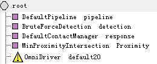
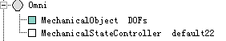
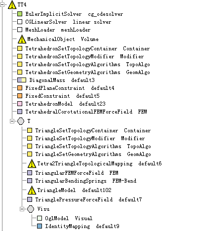
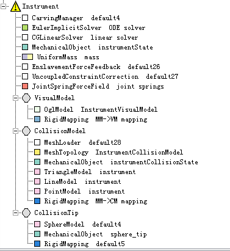
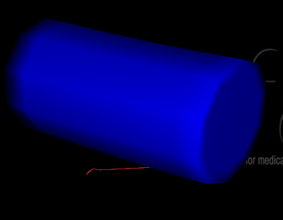
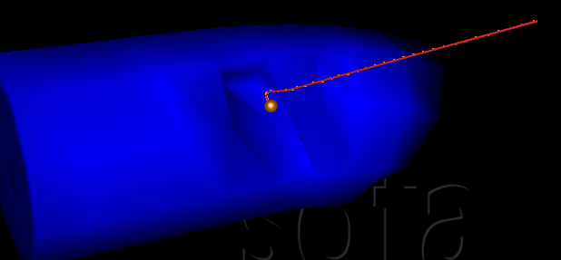

## 使用Omni在Sofa中实现Carving ##

## 目录 ##

- 一、编译sofa1.0 beta4及SensAble插件
- 二、使用Omni在Sofa中实现Carving的一个例子

## 一、编译sofa1.0 beta4及SensAble插件 ##

由于找到的一些例子在现有的Sofa版本中无法实现，而在sofa1.0 beta4可以实现，所以先要编译Sofa1.0 beta4。

1. 编译sofa1.0 beta4

	其中Sofa使用的版本是sofa1.0 beta4。在https://gforge.inria.fr/frs/?group_id=690上找到源代码进行下载，使用VC2008进行编译。

	源代码主要是以下文件：

		dependencies-win32-msvc-2008-1.0-beta4.zip
		sofa-applications-1.0-beta4.zip
		sofa-framework-1.0-beta4.zip
		sofa-modules-1.0-beta4.zip
	
	下载完成后，解压放入同一个文件夹sofa中。

	接着使用Visual Studio 2008命令提示工具进入这个Sofa文件夹，然后输入以下命令：

		"Project VC9.bat"

	（记得带上引号，否则可能会出现错误。）

	然后就生成了一个.sln文件，使用Visual Studio 2008打开，进行编译。

	编译没有错的话，就生成了sofa1.0 beta4。

2. 编译SensAble插件

	为了和Omni设备连接还需要生成一个SensAble的插件。

	首先要在http://dsc.sensable.com/3dtouch/OpenHaptics_Academic_win/software_downloads.asp

	下载OpenHaptics，注意要下载这个版本OpenHaptics Academic Edition for Windows - v3.0 。下载安装。

	之后在Sofa目录下编辑sofa-local.cfg文件，取消注释DEFINES += SOFA_HAVE_SENSABLE，即开启SensAble插件。

	然后同之前一样输入以下命令：

		"Project VC9.bat"

	使用Visual Studio 2008编译生成的.sln文件。

	注意在编译的时候会提示缺少一些文件，主要是OpenHaptics中的一些文件，按照提示找到并复制到相应的目录下。

	编译成功后在bin目录下会生成有sensAble.exe，不过打开这个文件会无法运行。不过已经不影响我们进行Omni在Sofa中实现Carving了。

## 二、使用Omni在Sofa中实现Carving的一个例子 ##

1. 在sofa中新建文件，在root节点下添加以下组件：

	

2. 然后添加一个Omni节点，在这个节点下添加组件：

	

3. 接着添加节点TT4，这个节点是要进行Carving的模型，添加组件如下：

	

	其中组件UncoupledConstraintCorrection添加失败了，因为没有适当的模版。

4. 最后是Instrument节点，这是Omni控制的工具模型，添加组件如下：

	

	在这里组件VectorSpringForceField也因为缺少模版创建失败了。

5. 以上出现的叹号是在警告有些组件的属性没有用到。虽然出现了一些警告但也是可以运行的，运行效果如下：

	

	当Omni控制的红色工具碰到圆柱体时，便会实现Carving，即圆柱体被碰到部分（基元，四面体）会被消除，效果如下：
 	
 	

	组件的参数设置见源文件
