## Sofa Documentation ##

## 目录 ##

- 第一章 介绍SOFA
- 第二章 设计
- 第三章 模块
- 第四章 如何做

## 第一章 介绍SOFA ##

### 1.1简介 ###

SOFA是开源的C++库，用于物理仿真，主要专注于医学仿真。它可以作为其它项目外部库，或者作为其中一个关联的GUI应用。

比起其它库，SOFA的主要特性是它的灵活性。它允许对一个对象使用多个互动的几何模型，典型的是，一个力学模型，带有质量和基本laws，一个碰撞模型，带有简单的几何体，以及一个可视化模型，带有详细的几何体和渲染参数。每一个模型都可以独立其它模型进行设计。在运行的时候，使用映射来维护一致性。

此外，SOFA的场景在图形库中使用一个类似于分层的场景图的数据结构。这允许拆分物理对象为一组独立的组件，它们中的每一个来描述模型的一个特性，例如质量，力函数以及约束。例如，你可以使用有限元元素力替换弹簧力，通过简单的替换组件，其它的部分不需要改变。

此外，仿真算法，例如时间积分或碰撞监测和建模，在场景中都是作为一个组件来建模。这使我们有很好的灵活性。

灵活性允许组件专注于自己的功能，可以重复使用其他人在其它领域的组件。然而，效率是一个主要问题，我们已经尝试设计一个框架能够胜任效率和灵活性。

### 1.2 带注释的例子 ###

图1.1是一个由两个不同对象组成的简单的场景，一个是刚性体，另一个是通过弹簧连接粒子。这个场景是用C++建模并仿真的。

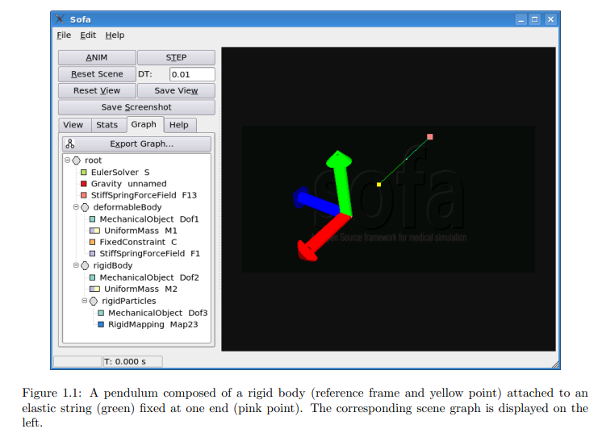
 
这个场景是用四个节点组成的一个树形结构：

- root 
- deformableBody
- rigidBody
- rigidParticles

每个节点都可以有子节点和组件。每一个组件应用了一个简化的功能函数。

组建中最重要的一个类型是MechanicalObject，它包含一列degrees of freedom（DOF）,即坐标、速度、关联的辅助向量，例如力和加速度。在MechanicalObject中所有的坐标都有相同的类型，例如对例子来说是3D矢量，对于刚性体是pairs。和SOFA中的其它类一样，MechanicalObject是C++中的一个一般类根据它存储的DOF类型进行实例化。粒子DOFs画出来作为白点，刚性体DOFs画为红色、绿色和蓝色根据框架轴线。在一个节点下至多只有一个MechanicalObject。这保证所有的组件附属同一个节点处理相同类型的DOF。因此，粒子和刚性体必定要属于不同的节点。

在这个例子中，质量存储在UniformMass组件中。它们值的类型和它们关联的DOF类型有关。UniformMass是由抽象的Mass类派生出来的，并且只存储一个值，对于这种情况所有关联的对象都有相同的质量。如果需要它可以用DiagonalMass进行替换使用相同的DOF类型，对于这种情况关联的对象可以有不同的质量。这是SOFA的一个重要特性：每一个组件可以被另一个派生于同一个抽象类的组件替换。结果是具有很高的灵活性。

FixedConstraint组件关联一个粒子到一个世界空间中的固定点，显示出来是粉红色。这个约束作为过滤器，取消了作用力，并替换了作用于他们的粒子。它们不是模拟更复杂的约束例如维持三个点对齐。

StiffSpringForceField组件存储一列spings，它们中的每一个用一对索引建立，同样的是标准的物理参数，刚度、阻尼、rest length。

刚性体连接可变形string通过一个spring。由于这两个spring由两个对象共享，在关联一个共同的原型的StiffSpringForceField中建立。我们的springs只能连接粒子。我们需要关联一个粒子到刚性体上。由于粒子DOFs类型和刚性体DOFs类型不同，他们必须存储在另一个MechanicalObject中，在这个例子中称为rigidParticleDOF，然后关联到另一个节点。然而rigidParticleDOF不是一组独立的DOF，因为它们固定在刚性体的参照框架。我们因此关联它到刚性体的子节点，然后使用RigidMapping将它和rigidDOF连接。这个组件存储粒子坐标在刚性体的参考框架。它的作用是传播位置，速度以及替换刚性体到黄色粒子，然后反向的传播作用于粒子上的力到刚性体。

Mapping是SOFA中的一个主要特性。它们允许我们使用不同的几何模型对一个给定的对象。例如一个粗糙的四面体网格代表粘弹性的内部力，一组体球代表碰撞检测和建模，然后一组好的三角网格用于渲染。

应用场景中的重力使用Gravity组件。它应用于所有场景，除非在局部的多载另一个重力组件。

抽象组件类在命名空间core::componentmodel来定义。

目前为止，我们讨论了场景中的物理模型。为了能够动画，我们需要一个Ordinary Differential Equation(ODE)。有许多ODE solvers，SOFA允许设计和重新使用它们，这里我们使用一个简单的Euler方法，使用EulerSolver组件。它会触发计算，例如力的累积、加速度计算、状态矢量的线性操作。更复杂的solvers在SOFA中也能用，然后只需要替换掉EulerSolver，例如使用RungeKutta3或CGImplicit.

### 1.3 多模型对象 ###

SOFA的一个重要特点是一个单独的物理对象能够使用不同的模型。图1.3展现了一个代表肝脏的图表，有三个不同的图。肝脏呈现三种不同的几何体，分别是力学、渲染和碰撞。

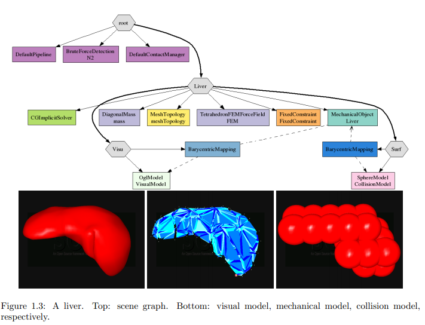

在图表的顶部，碰撞关联组件允许用户通过碰撞模块交互，使用来自鼠标点的rays casted和碰撞模块。

肝脏使用三个节点，分两个层级。父层级包括力学DOFs（粒子位置和速度）在一个MechanicalObject组件。这些DOFs是对象的力学独立自由度，以拉格朗日形式。这个节点也包括关联粒子动力学的组件，例如质量和内应力。我们称它为行为模块。

另外两个节点在低一级的层级，因为在仿真过程中，它们的坐标完全由父节点的坐标来定义。因此，它们不属于一套力学独立DOFs。Mapping用来根据它们父节点的位置和速度进行计算，使用虚箭头作为指针代表。Mapping不是对称的。父节点DOF的运动被映射到子节点DOFs，然而子节点DOFs的运动不会映射到它们的父节点。这保证了一致性。

VisualModel有顶点，用来进行渲染，和其它的渲染数据一起，例如多边形和法线。Mapping是单程的，被映射的DOFs没有力学的影响。

SphereModel类派生自MechanicalObject，带有附加的半径值。它也派生自CollisionModel，这使它能够通过碰撞检测和建模管道被处理。当接触或鼠标作用力应用到球体上，力会通过映射被从由下而上传播到它们父节点的DOFs。这使得接触力考虑到动态方程中去。这个映射是双向的，派生自MechanicalMapping而不是Mapping。这就是为什么在图表中它有不同的颜色。同样的，力学映射不是对称的：力从子节点到父节点传播，反方向不行。

映射只能自顶向下传播力，然而MechanicalMapping会额外的传播速度自顶向下和力自下向上。

被映射的模型可以设计成和它们的父节点独立，假如有充足的映射可以利用。结果是带来很高的灵活性。例如，碰撞球体能够被碰撞三角替换，而不需要改变任何在行为模块或在可视化模块的东西。类似的，其它的可视化模块可以使用，而不需要修改行为和碰撞模块，而且不同的行为模块能够使用相同的碰撞和可视化模块。

### 1.4 循环数据处理 ###

一个典型的仿真程序，通过GUI应用来控制。在SOFA中每一个仿真方法用来作为一个循环的图表遍历。

**1.4.1 Visitors**

数据结构是使用称为visitors的对象来处理。它们递归的遍历树结构，然后调用适当的虚方法到组件的子集在Top-Down Traversal(TDT)过程中，使用虚方法Visitor::processNodeTopDown，然后在Bottom-up Traversal(BUT)过程中，使用虚方法Visitor::processNodeBottomUp。

例如VisualDrawVisitor绘制VisualModel组件在TDT的过程中，然后不做任何处理在TDT过程中，之后传播力给父节点DOFs使用力学映射在BUT的过程中。

当通过一个visitor a处理时，一个组件可以fire另一个组件visitor b，通过它关联的子树。Visitor a能够循环，直到Visitor b完成时。在TDT过程中，每一个穿过组件决定是否让调用calling继续，或是剪掉及终止关联这个节点的子树。

这个组件直接进入它们的兄弟组件，除了这个映射。一个组件被一个visitor穿过能够直接使用数据在它关联的子树，使用visitors以读写模式。然而数据在它的父图表是只读形式，而且只是部分可进使用方法getContext。相同类型的兄弟节点能够被visitors以任意顺序遍历。

**1.4.2 ODE Solvers**

当一个AnimateVisitor遍历一个节点使用一个OdeSolver组件，求解器控制它关联的子树，并砍掉AnimateVisitor。解算器触发visitors在它关联的子树来执行标准力学计算和积分时间。

最简单的solver是显示的Euler方法，应用EulerSolver方法。Net力在第一行被计算。在第二行，加速度is deduced by dividing the force by the mass。然后固定点的加速度被取消。最终，位置和速度被更新。

算法不能直接应用到SOFA中，因为没有状态矢量x、v、f、a,这些状态矢量聚集了场景中的所有状态值。解算器处理对象的任意数，可能的不同类型，例如粒子或刚性体。每一个物理对象携带它的状态值和辅助矢量在它自己的MechanicalObject组件中，这对于解算器不是直接可以接近的。

这个解算器呈现状态矢量作为MultiVector对象使用符号识别应用类VecId。有四种预定义识别：VecId::position()，VecId::velocity()，VecId::force()和VecId::dx()。一个Multivector被一个解算器声明，带有一个给定的VecID，隐含的指向所有状态矢量在不同的MechanicalObject组件，使用相同的VecId在解算器的子树中。

矢量操作能够被移除，使用一个给定类型的visitor的解算器来触发，这定义了操作，给出VecID，这定义了操作对象。在子树遍历时，操作应用到了遍历的Mechanical组件的给定矢量。

例如，让我们通过EulerSolver来评价visitors的表现。它的应用在方法component::odesolver::EulerSolver::solve(double)中。首先，多重矢量被声明。

然后方法core::componentmodel::behavior::OdeSolver::computeForece(VecId)被调用。这首先引起一个MechanicalResetForceVisitor来复位所有MechanicalObject组件的力学矢量。它然后触发一个MechanicalResetForceVisitor。在TDT过程中，每一个组件从core::componentmodel::behavior::BaseForecField派生来计算和积累力，在它的同胞MechanicalObject中。在如图1.1的例子中，F13添加它的贡献给Dof1和Dof3。然后F1和M1添加它们的贡献给Dof1，然后是M2给Dof2。然后在BUT过程中，力学映射总计它们子DOF到它们父DOF的力，在Dof3到Dof2的力中，通过M23在同一个例子。注意分支deformable和rigidBody能够平行的处理。最后，在Dof1的力矢量，包括应用到粒子上的网格力，以及在Dof2中包括网格力应用到刚性体上。

然后，方法OdeSolver::accFrom(VecId,VecId)引发一个MechanicalAccFromFVisitor。每一个组件继承自core::componentmode::behavior::BaseMass计算加速度对应的力在它的同胞MechanicalObject。

### 1.5状态矢量 ###

状态矢量包括坐标、速度，和其它DOF关联值，例如力和加速度。它们存储在MechanicalObject组件。这种模板类能够实例化各种类型来建立粒子、刚性体或其它类型的物体。这一模版参数是一个DataType类，描述数据和数据容器。例如坐标类型和使用到的坐标派生物。这两种类型在粒子事例中是相同的，但是在刚性体对象中不同。

每一个MechanicalObject可以代表一组相同类型的物理对象，例如粒子。坐标状态矢量能够被VecCoord类型来定义，然后派生物被VecDeriv类型来定义。每一个MechanicalObject存储两个状态矢量数组，其中一个为坐标，另一个为派生物。

对于复杂的解算器辅助矢量也是必须的，例如RungeKutta2Solver。这一解算器首先执行半个长度Euler步，然后评估这个新状态的派生物，然后最终使用这派生物来更新这个初始状态，在所有的时间步之上。

**1.5.1力学组**

## 第二章 设计 ##

### 2.1映射 ###

**2.1.1 几何图层**

在接触中不同的几何模型用来建立模型对象。我们以层级方式对它们进行组织。图2.1是一个例子，一个刚性对象碰撞一个可嵌入单元格中的一个形状。

一个仿真系统的状态可以用数值和时间derivatives来描述，产生两个vectors x0和v0的独立自由度。动态方程（牛顿定律）关联两个时间derivatives，DOF的a0和作用于它们的f0：即f0=Ma0。M是建立系统质量的矩阵。

几何体可以关联DOF用于可视化或是接触计算。我们称它为shape。它典型的用点来定义，例如三角顶点或是球体中心，额外的数据有三角连接或是球体半径。我们称这些点为vertices。它们的位置，速度和关联的作用力存储在vectors x1，v1和f1中。它们不是独立的变量，因为位置和速度受DOF的约束，使用运动学的计算，我们称这个映射：

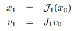

当顶点和DOF都相同时，映射才统一。例如当我们仿真布制或是刚性球体时，这种特殊的情况会发生。更多的情况是使用本地坐标包括多边形形状联系刚性物体，或是使用中心坐标嵌入可变形单元。使用顶点混合技术使表皮包含有关节的身体。矩阵J1解码DOF速度和形状速度之间的线性联系。根据线性度，相同的关系保留基本的取代dx。它也保留加速度，当位置映射是非线性时，在大多数情况下，运算符是相同的，但对于刚性体，是非线性的关于x,然后不能写作矩阵。对于表面嵌入可变形单元，矩阵包含重心的坐标。对于和刚性体相关的表面，矩阵的每一行对每一顶点编码常关系式。类似的对于所包含的铰接体，由于刚性体的作用而受力。

当形状碰撞时，额外的几何体能够塑造接触。例如，当一个边和另一边交叉时，接触力应用于交叉点上。这些点被代表它们边的顶点的重心坐标定义。另一个关系式可以使用，根据the king of接触几何体。这种额外的几何体需要另一个几何图层通过一个映射连接图形，像图2.1所示。

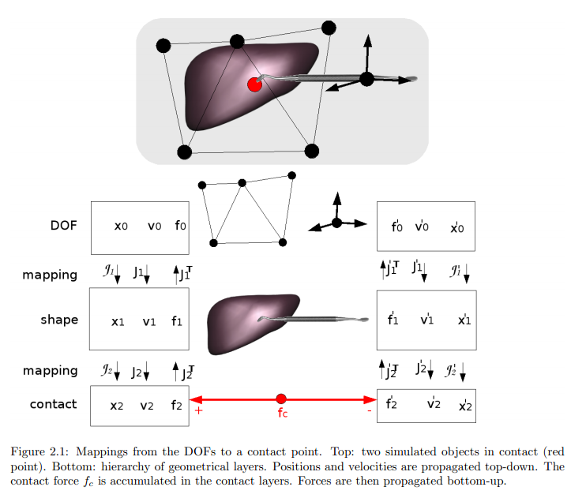
 
我们可以直观的扩展这种方法到树枝状的几何层级，在根节点带有DOF图层。例如，DOF图层可能有两个独立的子对象，其中一个用于使用粗糙的网格进行碰撞，另一个使用好一点的网格进行渲染。这些兄弟图层的同步性被它们依赖的共同的父对象所自动的保证，DOF图层。这种层级也可以更深，使用例如使用一个好网格进行渲染，然后它的凸面壳用于碰撞。这种灵活的框架给了我们物理建模的自由性。

**2.1.2力学映射**

位置和速度可以通过我们的层继承使用在先前部分呈现的关系自上而下传播。为了在动态方程里考虑接触力，我们必须转变接触力应用到接触点，以及力应用与DOF，牛顿力学会使用到。这需要位置和速度在2.1.1所表示的扩展。我们称之为mechanical mapping。

我们派生一个新的、一般方法来传播力自下而上通过几何层级的图层。将里fn应用与一个几何图层n，我们导出相同的作用力应用于它的父图层n-1。等价力必须有相同的功。然而，我们必须计算fn-1如：

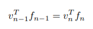

这种关系使我们可以重写之前的方程：

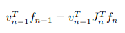

由于关系必须hold for任意速率vn-1，我们可以简化得到：

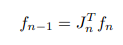

这符合虚拟工作的准则。

### 2.2框架 ###

**2.2.1UML图表**

## 第三章 模块 ##

### 3.1 碰撞模型 ###

**3.1.1射线跟踪碰撞检测**

这一模块应用了"Ray-traced collision detection for deformable bodies"论文所介绍的算法。当两个对象碰撞时，一条射线从各个面的顶点发射出来，以内部法线的方式。一个碰撞会被检测出来，当属于另一个对象的一个内部表面三角交叉时。在顶点和对应的点之间会创建一个接触力。实验表明这种方法是快速而且更强健比起传统的基于接近方法的碰撞检测。

为了加速搜索穿过射线的元素，我们存储每一个碰撞对象的所有的三角到一个八叉树。因此我们在这个八叉树中可以很容易操纵，并且很有效的找到穿过射线的点。这种八叉树结构允许我们有一个满意的表现，独立于使用三角的大小，这种情况对常规的网格不行。

使用这个模块

一个介绍射线跟踪碰撞监测的例子能够在scene文件夹下的RayTraceCollision.scn中找到。这种碰撞监测机制必须设置为RayTraceDetection，不是使用TriangleModel，而是要使用TriangleOctreeModel。这个TriangleOctreeModel会创建一个八叉树，包含碰撞模型中所有的三角。

### 3.3柔性关节 ###

**3.3.1概念**

这个方法的目标是使用硬力来仿真关节，而不是传统的约束。

为了这样做，使用六个自由度的弹簧建立一个关节模型。顺便的，用户在每一步的移动和旋转上定义一个刚度。

一个零刚度定义自由运动。

一个大的刚度定义禁止运动。

所有的细微差别都是可行的来定义semi驱动运动。

这种方法有两个主要优点：

- 更好的稳定性。我们不试图满足所有的约束，只是应用力，总有方法来解算这个系统。
- 建立关节更加可行。由于刚度定义关节的自由度，比起仿真禁止运动，自由运动的更好精度是可行的，即关节轴线不是不可避免的完全自由或完全固定。

**3.3.2实现**

为了定义一个物理的铰接体，我们首先要有一组刚体（骨骼）。

每一组骨骼包含多个关节点，也通过刚体定义具有方向信息。

像之前看到的，两个骨骼之间的铰接是由一个六自由度的弹簧建立的。这些弹簧关联在关节点上。

### 3.4如何在SOFA中使用网格拓扑 ###

**3.4.1介绍**

网格几何描述在空间中网格顶点的位置，网格拓扑会告诉顶点是如何通过边、三角形或任何其它类型的网格元素来彼此连接的。以下所有的信息都需要来计算网格：
- 网格可视化
- 碰撞检测：一些碰撞监测是基于网格的
- 力学建模：变形一个网格也需要网格拓扑。例如一个弹簧质量模型需要知道连接一对顶点的边界。
- 触觉渲染
- 标量的描述（温度，电势能）或矢量域

由于拓扑改变对于手术仿真很重要，一个常见的困难是什么时候设计这些仿真器来保证所有网格的可视化、力学、触觉以及碰撞行为保持有效，以及根据拓扑改变始终如一。

我们控制拓扑改变的方法是模块化，由于每一个软件组件（碰撞监测、力解算）被书写，而对其它组件的性质了解很少。这是通用的因为任何类型的拓扑改变能够被控制通过所推荐的设计。

我们的目标是保持模块化设计，关联信息的网格在网格数据结构中不集中，但是存储在软件组件中，来使用这些信息。此外，我们管理一个有效和直接的信息存储到数组，不管在拓扑改变时元素的重新编号。

**3.4.2 Family of Topologies**

网格上的拓扑描述单元复杂组成k-simplices或k-cubes。这些网格在实时的手术仿真中最常用到，然后能分层的分解为k-cells，边为1-cells，三角和四边形为2-cells，四面体和六面体为3-cells。为了利用这些特性，不同的网格拓扑结构化作为一个family tree，子拓扑由它们的父拓扑组成。这种层级使得设计仿真组件十分通用，因为一个组件工作在给定的网格拓扑类型，也工作在派生的类型中。例如一个弹簧-质量力学组件，只需要知道边的列表。根据这种设计，这个组件可以不需要改变来使用，在三角或六面体网格上。

这种继承也在conformal和manifold网格间产生差异。然而通用的FEM组件需要一个网格是manifold，许多高层级的软件组件（例如切割、碰撞、触觉反馈算法）需要网格是manifold，网格的法线需要在每一顶点处很好的定义出来。

拓扑对象由四种函数成员组成：Container、Modifier、Algorithms和Geometry。

- Container成员创建和更新，当需要两个互补的数组。
- Modifier成员提供低层次的方法，应用基本的拓扑改变，例如移除或增加一个元素。
- Algorithms成员提供高层次的拓扑修改方法（切割，细化），分解复杂任务到低层次的任务。
- Geometry成员，提供几何信息，包括网格（例如长度、法线和曲率），然后需要知道存储在自由度组件中的顶点位置。

**3.4.3组件相关的数据结构**

我们设计的关键特性是容器存储存储在组建中的网格信息（材料刚度，固定点列表，节点质量，...），然后在仿真树中进行传播。这一模块化方法和通过使用类的指针或模板类集中式存储网格数据结构信息形成强烈对比。

另一种选择是大多数存储器是简单的数组，带有连续的内存空间，以及短的直接接近次数。这对实时仿真十分重要，但是有一些缺点，当数组元素被去除时，它需要重新编号。例如，当一个单独的元素被移除时，数组的最后一个元素被重新编号，数组能够连续。幸运的是，所有重新编号的工作能够自动地保持一致的数组，当网格增多，改变拓扑时对于用户是不显的。此外，更新数组结构的时间不是根据网格元素的总数量，只是根据修改元素的数量。因此，在我们的结构中，网格数据结构存储在简单有效的容器中，在拓扑改变时保持容器的一致性会被自动完成。

**3.4.4控制拓扑改变**

手术仿真包括复杂的拓扑改变在网格上，例如当沿着一个线段进行切割表面，或者当局部的细化一个体积，在去除一些组织之前。然而总可以分解这些复杂的改变为一系列基本操作，例如添加一个元素，去除一个元素，重新编号元素列或修改顶点位置。

我们控制拓扑改变的方法更新数据结构对用户透明，通过拓扑事件传播的机制。一个拓扑事件符合添加或移除一列拓扑元素。但是拓扑元素的移除不能以相同的方式进行处理，当增添元素时。事实上，元素移除时间必须必须首先被其它组件注意到，在这个元素真的被Modifier移除之前。相反的，元素添加是首先被Modifier处理，然后元素添加事件被其它组件注意到。此外，创建元素的这一事件通知也包括一些初始元素。因此，当拆分一个三角为两个分支三角，每一个关联的组件信息关联着分支三角会被创建，分支三角起源于一个特定的三角。这一机制很重要要，在处理不均匀特性网格时。

有和拓扑元素一样多的容器：顶点、边、三角...。这些容器和STL std::vector类似，并允许存储组成关联的数据结构。弹簧质量模型的一个典型应用是使用边容器存储每一个边，弹簧的刚度和阻尼值，最后，当需要时其它两种容器也会被用到。前者存储拓扑元素子集的数据结构（例如表面三角上的压力），后者存储元素索引的子集。

**3.4.4控制拓扑改变**

手术仿真包括在网格上复杂的拓扑改变，例如当沿着一条线切割一个表面时，或在移除一些组织之前局部的细化一个体积。然而，总是可以分解这些复杂的改变为一系列基本的操作，例如增加一个元素，移除一个元素，重新编号一列元素或是修改一个顶点的位置。

我们改变拓扑方法是使数据结构的改变对于用户是透明的，通过传播拓扑事件的机制。一个拓扑事件对应着增加或移除一列拓扑元素。但是拓扑元素的移除不会和拓扑元素的增加以相同的方式处理。的确，元素的移除时间必须首先被其它元素注意到，在元素真正的被Modifier移除之前。相反的，元素的增加必须先被Modifier处理，然后被元素增加事件通知到其它组件。此外，事件通知元素的创建也包括一列原始的元素。虽然，当撕裂一个三角为两个子三角，每一个关联组件信息关联着一个子三角会被创建，子三角起源于一个特定的三角。这样的机制对于处理不均匀特点的网格很重要。

通知包括累积拓扑事件序列，包含高层级的拓扑事件到一个存储在容器中的缓冲。然后事件列表被传播到所有它的邻居和子叶，通过使用一个visitor机制，称为Topology Visitor。一旦一个给定的组件被访问到，拓扑事件实际上被一个个的处理，数据结构用来存储关联网格的信息被自动更新。

在实际中，对于每一个特定的组件，一组回调函数被提供来描述如何更新数据结构，当增加或移除一个元素时。我们应该观察者设计模式，那么关联组件的数据结构被自动的更新。

**3.4.5结合拓扑**

在一个手术仿真的场景中控制一个单独的网格拓扑通常是受限制的。至少有三种一般的仿真是必须要有的，对于同样的网格，多种拓扑描述共享相同的自由度：边界，复合和代理。在边界情景中，特定的算法可能被应用到一个网格的边界中，四面体网格的边界是一个由三角组成的网格，然后一个三角网格是一个多边形的边。例如，这些算法可能由应用额外的薄膜力组成或可视化一个纹理表面。不是为了设计特定的仿真组件来控制三角测量作为四面体的边界，我们的框架允许我们创建一个三角测量对象拓扑从一个四面体网格中，然后使用常规的组件和三角测量联系起来。

这一组成方案组成有一个网格，包括多种元素：带有四边形的三角，或带有四面体的六面体。对于这些符合网格不是要设计新的组件，而是重新使用专注于每一个网格类型的组件，这样子更简单更有效。最后，对应于一个拓扑元素可能被一组带有相同自由度但不同类型的元素所替换。例如一个四边形可能被劈成两个三角，一个六面体可能被劈成多个四面体。这样一个四边形网格可能同样被视为一个三角形网格，它的网格被四边形网格拓扑所约束。

这三种情况可以通过使用多重拓扑来无缝的处理。拓扑对象在顶节点，有特定的规则来控制下面的节点。尽管我们选择复制拓扑信息到内存中，对于计算作用力没有时间要求。Fig 3.15提供了一个方案，Fig 3.14展示了一般的拓扑图形布局，在之前描述的三种情况下。在许多情况下，这些图表包括一个专用组件，称为Topological Mapping，它的对象是双倍的。首先，它们转换来自主拓扑的原始拓扑事件为拓扑作用适合于从属拓扑。第二，它们提供索引等值，在主拓扑下的全局元素数和从属的局部数之间。可能来自一个拓扑对象的Topological Mappings到另一个之间被蓝色箭头所替换，在Fig 3.9中。

注意这些拓扑图能够结合和串联，例如通过构造一个从一个六面体网格创建的四面体的三角形边界网格。但是只有主拓扑的拓扑算法可能被调用来仿真切割或是局部的细化体积。通过结合拓扑图和通用组件，我们可以仿真相当复杂的仿真场景，拓扑改变能够被无缝的应用。

**3.4.6一个拓扑映射的例子：从TetrahedronSetTopology到RriangleSetTopology**

一个拓扑映射是一种新的映射，转变一个输入拓扑为一个输出拓扑。

**3.4.7带有拓扑映射的场景文件例子**

**3.4.8如何使一个组件意识到拓扑改变**

**3.4.9当我分开一个边时，反生了什么？**

### 3.5 ###

**3.5.1第一步**

一旦SOFA编译好，在目录bin下会有一个可执行文件叫runSofa。当你第一次打开SOFA时，一个使用Qt的GUI界面会出现。默认情况下一个仿真的肝脏带有一些固定的点会出现在界面里。仿真对象必须是xml格式，一般来讲Sofa scenes带有后缀“.scn”，然后Sofa objects带有后缀“.xml”。你可以通过文件目录或是在界面里拖拽它们来进行加载。

一般来讲一个GUI界面分为两部分：

- 一个控制面板分为几部分，给用户显示各种关于仿真的不同信息，甚至可以交互的进行修改。
- 一个观看窗口：默认的，你会使用OpenGL查看器。也有些其他可用的查看器，下面我们会介绍如何制作自己的查看器，如果你想要插入一个更强大的渲染引擎。

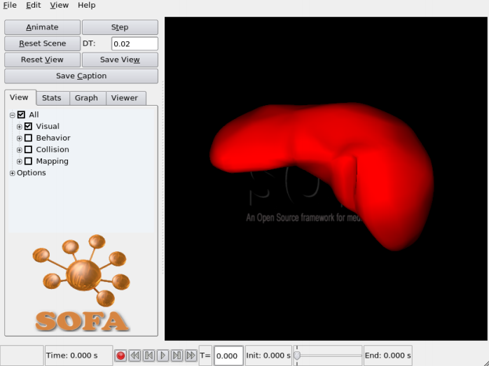

SOFA 第一次打开界面

在任何情况下，你可以隐藏控制面板通过将右边界移动到左边。

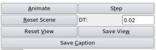
 
基本的控制

基本的控制有：

- Animate:运行仿真。除非你再次按下Animate，仿真不会停止。
- Step：只运行仿真的一步。
- Reset Scene：复位所有组建的初始值。
- Reset View：复位像机到它的最初位置。
- Save View：保存摄像机的位置和方向。下一次当你加入你的场景，这些信息会被使用。
- Save Caption：对当前的仿真保存快照。

DT要与计算仿真的时步一致。它可以进行人为的改变。

**3.5.2 View Tab**

“观察选项卡”是默认的，你可以过滤你想要显示的信息。它对于快速和全局的控制很有用。

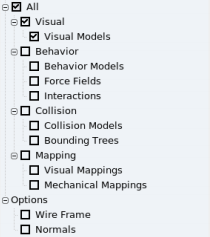

基本控制

可选项是：

- All：启动或关闭SOFA中可用的全部可视的信息。
- Visual Models：对象的图形化表现。
- Behavior Models：仿真的力学DOFs。
- Collision Models：用于执行碰撞检测的模块。
- Bounding Tree：碰撞模型的分层边框盒子（the hierarchical bounding boxes of the collision models）
- Mappings：所有非力学的贴图（例如可视化的贴图关联一个力学的对象到它的可视化表现）
- Mechanical Mappings:所有的力学贴图来表示一个力学对象传递力和位置到另一个。
- Interactions：各种对象之间的相互作用。有一些是当penalty response使用时，collison pipeline所产生的。
- Wire Frame：改变3d对象的显示方式。
- Normals：所有可视化模块的法线。

**3.5.3 Stats Tab**

“统计选项卡”用来显示呈现在场景中的碰撞模块的一个目录（三角形、线、点、球体的数量，它们用于执行碰撞检测）。你也可以输出关于当前仿真的一些信息。

- Dump State：输出“dumpState.data”仿真状态
- Log Time：在控制台显示，每一步仿真花费的时间。对于监视有用。
- Gnuplot：输出gnuplot文件。它会输出位置，速度和能量。文件会和对象在仿真里的名字相同。跟随着：

其中：

- “_x”代表位置
- “_v”代表速度
- “_Energy”代表能量（包括动能，势能和机械能）

你可以详细设置这些文件的保存位置。

**3.5.4 Graph Tab**

“图表选项卡”是最重要的选项卡。它显示了仿真的场景图表。你可以快速的看到在当前仿真里用到的所有组件。

这个图表在仿真过程中可以动态的改变：碰撞会产生新的节点，新的组件以免接触。但是你也可以直接和它交互。双击图表中的一项，会出现一个小窗口来显示重要的数据。

为了明白如何显示Sofa组件的信息，请看“How to configure your Comonent”部分。只有对象是“sofa::core::objectmodel::Data”或是"sofa::core::objectmodel::DataPtr"能够被显示。如果你决定保存仿真时，要明白只有这些信息才能被保存。载入一个保存的仿真时，将会填入这些数据。这些对话窗口可以直接修改对象的一些特征。要注意，一旦完成了这些修改要点击“Update”按钮。

一个节点可以做更多的交互控制：邮件点击它们中的一个会出现小的上下文窗口。

- Collapse：
- Expand：

	

	肝脏的图表场景

	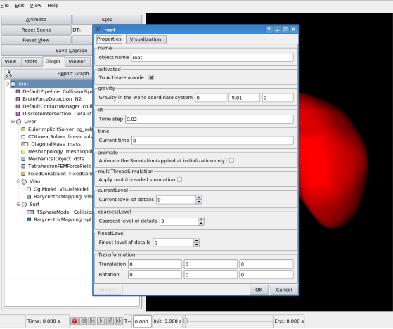

	双击图表中的一项

- Desactivate：使场景中的一部分无效。在这个节点下的任何对象都不会再考虑。但是它依然在场景中，而且在任何时候都可以被激活。
- Save Node：将场景中的一部分输出为一个XML文件。
- Add Node：读取一个描述对象或是整个场景的XML文件，然后将它放在选择的节点下。关于节点的一个有趣的特性是，当你要经常使用时，添加同样的对象的设置，你会发现添加文件scenes/object.txt到路径下会很方便。像这样，它们会默认的直接出现在对话框窗口下。
- Remove Node：移除在选择节点下的所有对象。你将不会使它们再出现，除非你选择重新开始或重新加载这些场景。
- Modify：双击打开相通的对话框：这一操作对图表下的所有项目都一样。

	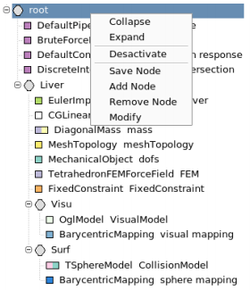

	右键点击图表中的一个结点

**3.5.5 Viewer Tab**

“Viewer Tab”描述了对当前viewer可用的快捷键。

这一选项卡下最有用的一点是调整viewer的大小，这对于在一个给定的分辨率下录制视频很有用。

**3.5.6 交互**

你可以和仿真对象通过SHIFT+鼠标右键进行交互。一条射线会出现，如果它和场景中的碰撞对象交叉，一个弹簧对象就会产生，使你可以拉场景中的一些元素。

**3.5.7 Architecture**

下图给出了GUI for SOFA的体系结构：

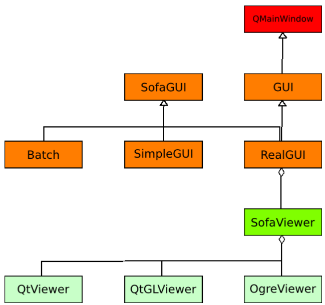

GUI 的模块化结构

**3.5.8 改变观察器**

默认情况下，SOFA给出了三种观察器，可以很容易的集成到Qt界面里。

- QtViewer:使用OpenGL功能函数。
- QtGKViewer:使用Gilles Debunne创建的QGLViewer库
- OgreViewer：这种观察器还在实验阶段，但它给出了如何集成一个强大的渲染器如OGRE3D。

为了使用它们，你需要编辑位于SOFA目录下的sofa-default.cfg文件，取消你选择的观察器的注释。如果你将多个viewers都激活了，你可以以下面的方式启动SOFA：

- "runSofa -g qt" : for QtViewer
- "runSofa -g qglviewer"  : for QtGLViewer
- "runSofa -g orge" : for OgreViewer

当SOFA运行时你也可以动态的进行改变。目录中的View会显示所有可用的viewer，然后让你随时去改变。

如果你想要创建一个新的viewer，第一步是要将它派生于Sofa Viewer。

**3.5.9 选择GUI**

默认情况下GUI提供了三种GUIs。

- Batch
- GLUT：GLUT窗口只执行基本的函数。为了启动动画，你需要传递“-s”给runSofa。
- Qt：默认的GUI

	Batch GUI总是可用的。为了使用GLUT或是Qt界面，你需要在对应的地方取消注释。

- "runSofa -g batch" : 没有GUI
- "runSofa -g glut" : GLUT窗口

**3.5.10 Player/Recorder**

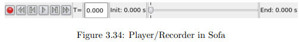

Sofa提供了Qt的图形界面，当你想要记录一个仿真时，按下红色按钮（记录）。自动的，一些组件会添加到你的图表中，会创建文件来保存所有的力学元素的位置和速度。停止记录时，再次点击红色按钮。一个和你的仿真有着同样名字的文件会被生成，但它的后缀是".simu"。Sofa可以读取这些文件，然后可以正确的初始化。

为了观察一个已记录的仿真，你可以一步步的或是连续的paly。你可以跳到你记录的一个特定时刻。你甚至可以改变记录的Dt值，如果你想要加速，或是减慢playing的速度。
文件会被默认的保存在你的SOFA目录的scenes/simulation下。不过你可以改变路径。
 
## 第四章 如何做 ##

这部分内容我们会给出一个教程，关于你在使用SOFA时可能遇到的一些topics。

### 4.1如何创建一个仿真 ###

为了创建你的仿真，可以用xml描述或是一个c++文件，你需要遵守一些规则。Modeler可以让你很快熟悉在Sofa中可用的一些组件。

**4.1.1.创建一个动态对象**

为了创建一个动态对象，你需要按照以下几步：

Mechanical

1. GNode：一般的，我们给出整个对象的名字
2. Solver：选择你仿真时需要的solver（你可能需要两个组件，一个OdeSolver伴随着一个LinearSolver）
3. Topology：描述dofs是如何连接的
4. MechanicalState：你的对象的自由度（dofs）。这是仿真的核心
5. Mass：关联到对象的每一个dofs的质量
6. ForceField：描述对象的行为，它是如何作用的。如果你不指定一个，你的对象是不会变形的。
7. Constraint：可选

经过这几步，你会得到一个力学模型，这会集成到Sofa仿真中。然而，你不会得到任何可视化模型，只有代表dofs的点。

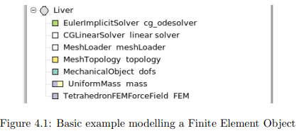

Visual

根据前面描述的Mapping的机理，你可以附加一个可视化模型，任何类型的，能够代表你的力学对象。

1. GNode：在你当前的对象里添加一个GNode。它会包括需要visual mapping所必须的组件。
2. VisualModel：这个组件包含代表你对象的网格
3. Mapping：一个非力学的mapping会连接你的mesh到dofs。这个mapping不会传递力从你的visual model到dofs。如果你用以下方式：

	- 一个C++文件，注意使用一个非力学的模版：第二个对象应该是一个ExtVec3Types模版
	- 一个xml文件，你需要指定两个被mapped模型的路径：

		- object1="../..":表示这个dofs位于一个层级之下
		- object2="Visual":"Visual"是指你的VisualModel的名字（像这个例子描述的，它位于你的mapping的同一级）

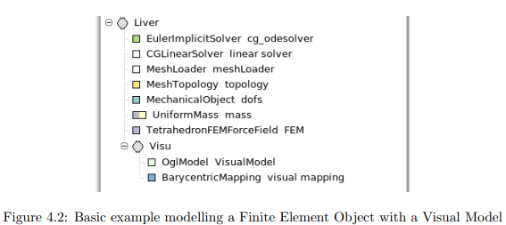

Collision

如果你需要仿真对象直接的相互作用，你需要另一个节点，Collision Node。在这个我们要描述的例子里，我们会使用一个Triangle Models作为碰撞模型。我们选择它，是因为它的表现和我们大多数碰撞模型一样，需要一个topology和dofs。但是如果你使用SphereCollisionModel，这个组件已经包含了一个topology。那么你只需要创建一个力学mapping。

1. GNode：在你当前的对象里添加一个GNode。它会包括需要做力学mapping所必须的组件。
2. Topology
3. MechanicalState：你的碰撞模型的的dofs.它们会传递从你的对象的真实力学dofs接收到的作用力。
4. CollisionModel：碰撞模型，它们可以被详细规定（例如，TrangleModel，LineModel，PointModel）.
5. MechanicalMapping：使用XML描述你的对象，你不需要指定谁是object1或object2
你的对象现在已经集成到Sofa仿真中了。
另一个例子使用SphereModels。

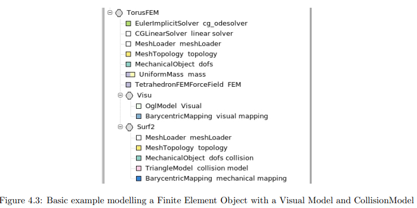

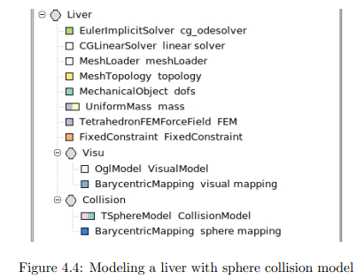

**4.1.2创建一个静态对象**

固定对象，例如地板，墙或是那些必须作为障碍物的对象很容易去建模。

1. GNode：一般来说，我们给它一个全部对象的名字。
2. Topology:描述dofs是如何连接的
3. MechanicalState：你的对象的自由度
4. CollisionModel：碰撞模型，一系列参数可以去设置。通过设定一些标记可以指定你的对象是固定的。

	- moving：如果你的对象可以被替换。你可以考虑外部的作用，例如使用一个触觉设备
	- simulated：如果你的对象是通过仿真来控制的。一般来说一个固定对象是不能被仿真的。
5. VisualModel：这个组件包括代表你对象的mesh
不需要任何mapping，因为没有力或是位置修改会被传递。

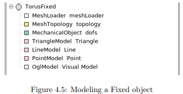

4.1.3包含碰撞

为了完成碰撞检测，就像你看到的，场景中的对象必须有一个或几个碰撞模块。但是，你需要设定几个模块作为碰撞检测和响应。

1. CollisionPipeline：目前只有我们默认的碰撞管道可用。
2. CollisonDetection：检测碰撞的方法
3. IntesectionMethod：根据碰撞检测算法，例如你需要指定一些组件来作为proximity intersection test。
4. ContactManager：接收碰撞发现，它会生成一个响应。你可以选择你想要的响应。默认的我们使用penalty响应。
5. CollisionGroupManager：管理两个不同仿真对象间的碰撞。通过动态的改变图形避免你的仿真爆炸，在相互作用的对象之上放置恰当的solver。

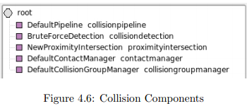

### 4.2如何创建一个新的Force Field ###

在SOFA中，Force Field已经存在位于命名空间sofa::component::forcefield。它们派生自核心类sofa::core::componentmodel::behavior::ForceField。它可以是一个可变形对象有1，2，3或6 dimensions，或是刚性对象有2和3 dimensions。

要完成你自己的ForeceField最简单的方式是：

1. 使它派生自sofa::core::componentmodel::behavior::ForeceField
2. 实现以下虚函数：addForce，getPotentialEnery。其他还存在的虚函数有addDForce，addDForceV（如果你想要实现动态），然后你应该读一下关于ForeceField的文档。
3. 像其它你创建的组件一样，你需要将它添加到项目中。修改$SOFA_DIR/modules/sofa/component/component.pro,然后添加路径到新文件在HEADERS和SOURCES部分。
4. 修改$SOFA_DIR/modules/sofa/compoent/init.cpp，然后添加你的新forcefield到list上。这一步是Windows系统必须要做的，使新的组件连接到factory。如果你忘记了，你的组件在初始时不会被创建。

addForce方法计算并累积作用力关联的力学状态的位置和速度。
如果ForceField可以表示为一个矩阵，这种方法计算为

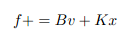

这种方法通常被ForceField::addForce()访问。

### 4.3如何使你的组件可修改 ###

当你创建自己的组件时，可以很方便的显示一些内部数据，或是通过1修改几个参数来修改它的行为。通过使用以下两个对象：

- sofa::core::objectmodel::Data
- sofa::core::objectmodel::DataPtr

它可以是“classic”类型，bool, int, double(...)或是更复杂的类型（你自己的数据类型）。

在你自己对象的构造函数中，你可以调用函数initData或initDataPtr。
例如，让我们称你的类为foo。你想要控制一个布尔类型的参数叫做verbose。initData采用了几种参数：

1. the Data的地址
2. 默认值：它必须和你的模版是相同的类型（OPTIONAL）
3. 数据的名字：它会出现在你的XML文件里
4. 描述你的数据：它会出现在GUI里
5. 布尔值来确定它是否出现在GUI里（OPTIONAL）

一旦在GUI里修改了你的数据，按下“Update”按钮会被所有的对象调用虚函数"void reinit()"。
