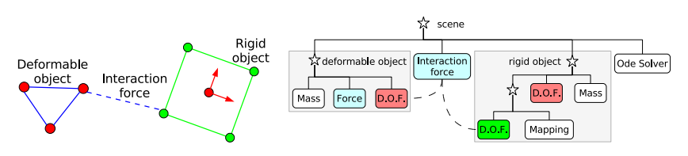
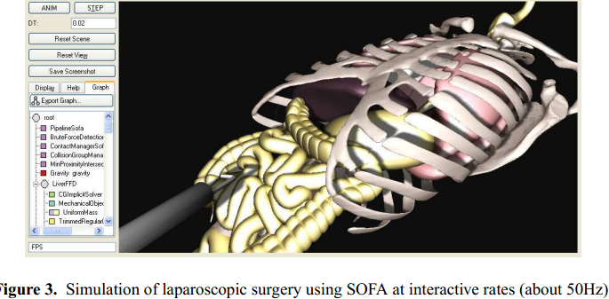
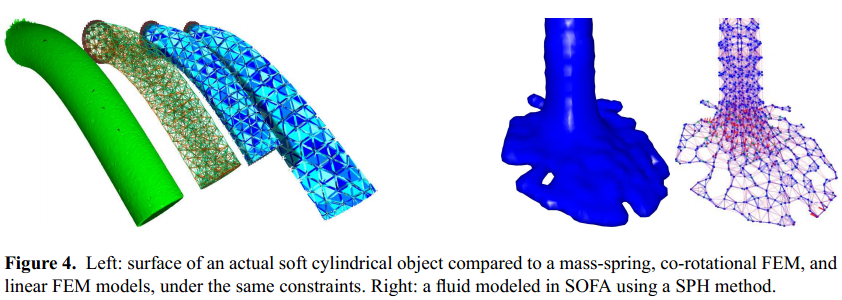
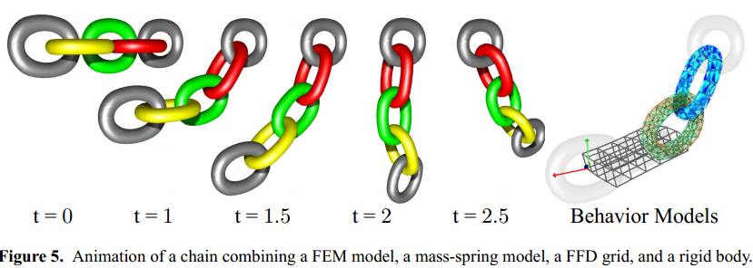

## Sofa-an open source framework for medical simulation ##

## 2. The SOFA architecture ##

SOFA的框架依赖于多个创新的概念，尤其是多模型呈现的概念。在SOFA中，大多数仿真组件——可变形模型，碰撞模型，仪器等——能够有多种呈现方式，它们之间的连接通过一种称为映射的机制。每一种呈现对一个特定的任务是一种最优化——例如：碰撞监测，可视化——同时通过在仿真组件间的功能方面创建一个清晰的分离，提高了互操作性。结果，能够使不同性质的模型相互集成起来，例如刚性体，可变形对象，以及流体。在一个好的间隔尺寸下，我们也提出了物理模型的分解——即任何模型能够根据物理定律进行表现——成为一些基本的组件。这种分解导致如力学模型的表现作为一组自由度，然后力场作用在这些自由度上。SOFA的另一个关键部分是使用场景图来组织和处理仿真元素，清晰的从它们的并行调度中分离计算任务。

### 2.1 高级别的模块性 ###

任何涉及到的仿真，在某种程度上，就算可视化反馈，触觉反馈，医学设备和解剖结构间的相互作用。这就是一个典型的仿真循环，在每一时间步下，监测对象间的碰撞，计算变形和碰撞响应，然后作为结果的状态可以可视化和触觉的渲染。为了执行每一步动作，在仿真中会包括各种算法，暗地的根据仿真对象的不同数据结构。在SOFA中我们明确的分解一个对象为不同的表现，通过这种方式每一种表现对一个特定的任务会更加适合——渲染，可变形，或是碰撞监测。然后，这些表现会连到一起，那么它们可以一致的更新。我们称这些表现之间的联系为一个映射。不同的映射函数能够被定义，然后每一个映射会关联一种表现中的一组基元到另一种表现中的一组基元。

### 2.2Fine Grain Modularity ###

## 2.3 场景图代表 ##

创建并维持一个仿真中的所有元素会变得相当复杂。来自图形社区的重用概念，我们决定均衡图表的表现。每一个组件关联一个树结构的节点。然而组件是自定义的，能够进行扩展，内部的节点总是相同的。它们只存储它们本地组件的指针，同样的它们的父节点和子节点。这种简单的结构能够容易访问一个场景中所有的或是部分子集，然后组件间的依赖关系可以通过检索同一节点下的兄弟组件进行控制。例如，一个Force Field组件可以接近DoF组件，通过从节点得到它的指针。图表也可以动态的进行重组，允许例如创建互动对象组。这样的组群然后能够作为一个独特的使用solver方程式系统。允许有效利用stiff contact forces。使用图表的另一个优点是在仿真循环中大多数组件的执行可以作为图表的一个遍历。这种遍历在SOFA中成为一个action。例如，在每一时间步，仿真状态会通过发送一个Animate动作给Solver组件作为更新。每一个Solver然后向前通过递归的在它的子树发送动作来请求适当的组件。

 
图2.左边：两个相互作用对象。DoFs表示为圆，然后作用力为直线。实线表示为内部力，点画线表示为外部力。右边：图表和左边的场景关联。场景的节点作为星星来表示，允许有结构的组件组。

为了举例说明SOFA的模块性，使用了一个图表，我们考虑图2所示的例子。在这个例子中，两个仿真对象——一个刚性正方体和一个简单的Mass-Spring模型——在空间上移动，然后最终碰撞。为了计算对象的动作和变形，我们需要定义它们的一组DoFs和一组内部及外部的力。mass-spring模型中的DoF组件和mass-points是一致的，然而对于刚性对象它符合中心质量的位置和方向。这意味着每一个对象的DoFs有不同的数据类型——一组3D vectors对应mass-springs，然后是3D vectors带有quaternion对应网格对象。将Collision Models关联每晚i一个对象使对象间的接触是可行的。对于mass-spring对象的Collision Model包含一组顶点对应与对象的DoFs。对于网格对象的Collision Model——在图2中的正方形——和通过一个映射引用框架的主题严格的关联。Mapping组件负责传播刚性体到Collision Model顶点的运动，然后当碰撞发生，接触力应用到Collision Model被反向传播给刚性体对象的DoFs。因为Collision Model的顶点不和DoFs的顶点一致，我们关联它们给图表中一个不同的节点。然而，当它们的动作完全被刚性体定义时，它们不是独立的，然后新结点作为刚性体节点的子节点被创建。作用与collision model顶点上的交互力，和它们是否actual或mapped DoFs相互独立。在这一点，动作可以在图表中传播来仿真对象作为一个结合的力学系统。

## 3.结论 ##

我使用SOFA开发的仿真例子。这些例子说明了框架的多样性和灵活性，尤其是能够使物件相互们展示一个SOFA间具有不同的行为交互。我们也展示了一些validation算法用具仿真的可变形结构的早期结果。

Laparoscopic Simulation：SOFA的首要目的是用于医学仿真，我们开发了一个laparoscopic simulation系统的早期产品，这个系统中liver和intestines使用可变形物体建模，能够使用一个laparoscopic instrument操作，然后能够和肋骨进行碰撞。像图三所示。SOFA结构的模块化是我们可以很容易的测试不同的器官模型。在这个例子中liver作为一个co-rotational FEM建模，然后intestines作为一个spring-based FFD grid。Visual, Collision，和Behavior模块的分开使我们产生一个形象化生动的仿真at interactive rates。

Quantitative validation and comparison of algorithms：sofa-tissue比较算法会make sense，如果它们和issued from真实世界的对照模型进行比较。最后我们建立了一个cylinder using silicon gel of已知的材料属性。然后应用controlled constraints to this object as它被CT扫描。当图像处理时结果表面obtained，像图4所示。这个表面用来作为一个可视化模型，对于它各种Behavior Models被assigned-mass-spring, co-rotational FEM和linear FEM。然后变得容易形象化，然后quantitatively描述各种模型的精度。

Chain Links:控制heterogenous模型间的交互is prone to stability issues。为了测试不同算法的robustness，我们测试falling chains,每一个link使用不同的Behavior Model，像图5所示。预先定义的links之间没有约束。使用implicit integrator控制动态创建交互对象组在一个stable仿真中。

