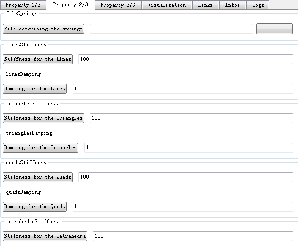
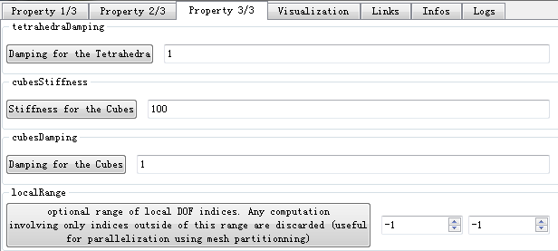
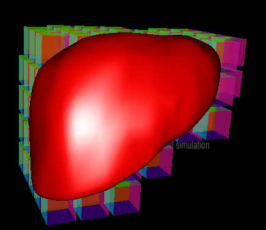

## Sofa Tutorials ##

## 目录 ##

- （一）Basic Cube
- （二）Collision Tutorials
- （三）Mappings Tutorial
- （四）ForceField Tutorials
- （五）OdeSolver Tutorial
- （六）Topology Tutorial
 
## （一）Basic Cube ##

TutorialBasicCube.scn

介绍：

在这个教程中，有一个可变形立方体受内力和外力的作用。这是一个我们可以使用Sofa仿真的最简单的场景。我们使用它来介绍组件结构。

立方体的形状是使用一个MechanicalObject建模，它描述了粒子状态，然后一个Topology描述这些粒子是如何连接的。

作用力是MeshSpringForceField，它根据网格边缘（the Topology）定义了springs，然后PlaneForceField试着仿止粒子能够穿过平面。
EulerImplicitSolver包括了用来更新粒子在每一时间步的位置和速度的算法。它使用一个辅助组件CGLinearSolver，用来计算方程系统。

创建过程：

1. 清空默认组件，只保留VisualStyle组件。
2. 在默认节点下添加EulerImplicitSolver, CGLinearSolver,MechanicalObject,MeshTopology和UniforMass组件。
3. 外形是通过MechanicalObject来描述粒子的状态。UniformMass被添加到MechanicalObject中，给每个MechanicalObject粒子相同的质量。
4. 双击MechanicalObject，打开Vector 1/4，在”position coordinates of the degrees of freedom”中输入8，之后依次输入8组坐标:

	0	 0	 1
	
	1	 0	 1

	0	 1	 1
	
	1	 1	 1
	
	0	 0	 2

	1	 0	 2
	
	0	 1	 2
	
	1	 1	 2

	双击MeshTopoloy,在Property 3/3中的List of hexahedron indices中输入”1”，然后”Display the value”，输入0 4 6 2 1 5 7 3.

	添加MeshSpringForceField,然后修改属性，修改”uniform damping for all springs”（所有弹簧统一的阻尼值）的值为1。，然后修改Property 2/3的值如下：

	

	然后对Property 3/3的值修改如下：

	
 
	其中”Stiffness for the Lines”为线的刚度值100，

	“Damping for the Lines”为线的阻尼值1，

	“Stiffness for the Triangles”为三角的刚度100，
	
	“Damping for the Triangles”为三角的阻尼值1，

	“Stiffness for the Quads”为Quads的刚度值100，

	“Damping for the Quads”为Quads的阻尼值1，

	“Stiffness for the Tetrahedra”为四面体的刚度值100，

	“Damping for the Tetrahedra”为四面体的阻尼值1，
	
	“Stiffness for the Cubes”为立方体的刚度值100，

	“Damping for the Cubes”为立方体的阻尼值1.

5. 添加两个地板作为障碍物，添加组件PlaneForceField，修改其中一个PlaneForceField组件的参数”plane normal”（平面法线）为（0 -0.2 1），以及”force stiffness”（力的刚度值）为100，”force damping”（力的阻尼）为1.然后修改另一个PlaneForceField组件的参数”plane normal”为（0 -1 0）。修改”plane d coef”值为-4.”force stiffness”和”force damping”的值同上相同。

运行sofa，点击Animate，一个线框型的立方体下落到地板上，然后落下。
 
## （二）Collision Tutorials ##

介绍：

在这个教程里，我们会试着解释在SOFA中创建碰撞检测和响应的不同方式。首先，我们会回忆你之前在Step by step tutorials中关于碰撞模型的建立学到了内容。然后我们会解释如何控制对象之间的碰撞，以及不同方法的稳定性的影响。最后，我们会看到关于碰撞响应的高级特性，基于响应的约束使我们可以仿真摩擦。

Modelization:

**Triangle Based Modelling**

创建过程：

1. 在Sofa Modeler中新建文件，删除默认的TreeCollisionGroupManger组件。打开MinProximityIntersection的属性，修改”Proximity detection distance”（接近检测距离）更大或更小，修改”Distance below which a contact is created”(在一个*距离下创建一个接触)。

2. 添加一个节点GNode，命名为Cube。然后在这个节点下添加EulerImplicitSolver,CGLinearSolver,MechanicalObject,MeshTopology和UniformMass组件。修改MechanicalObject属性”position coordinates of the degrees of freedom”,为8，然后添加以下坐标

	0	0	4

	4	0	4

	0	4	4

	4	4	4

	0	0	8

	4	0	8

	0	4	8
	
	4	4	8

	修改MeshTopology的参数”List of hexahedron indices”（六面体索引列表）为1，添加值（0 4 6 2 1 5 7 3）

3. 在Cube节点下添加”MeshSpringForceField”组件，可以同前一个例子一样，修改参数。

4. 之后在Cube节点下添加”TTriangleModel”,”LineModel”和”PointModel”组件。

5. 在根节点下添加一个新节点”Floor”,添加组件MeshTopology，MechanicalObject和TTrianglemodel.打开MeshTopology属性，在Filename of the mesh下选择mesh文件夹下的floor.obj文件。打开MechanicalObject属性，修改Translation of the DOFs（自由度的移动）值为（0 -10 0），修改Scale of the DOFs in 3 dimensions（自由度的3维尺寸）值为（1 0.5 1）。打开TTrianglemodel属性，取消选择flag indicating if this object is changing position between iterations（如果对象在迭代过程中改变位置则进行标记），以及取消选择flag indicating if this object is controlled by a simulation（如果对象被一个仿真控制则进行标记）

运行sofa，点击Animate，一个线框型的立方体下落到地板上

**Sphere Based Modelling**

创建过程：

在上一个例子的基础上，删除Cube节点下的”TTriangleModel”,”LineModel”和”PointModel”组件。然后在Cube节点下添加TSphereModel组件。

运行sofa，点击Animate，一个线框型的带有8个球体的立方体下落到地板上。

Multiple Objects:

**Two Cubes**

创建过程：

1. 继续以前一个例子为基础，这一次是添加了一个新的立方体。在根节点下添加一个新的节点GNode，命名为Cube2.

2. 在Cube2节点下添加组件EulerImplicitSolver,CGLinearSolver,MechanicalObject,MeshTopology和UniformMass组件。（可以复制前一个Cube的组件）。修改MechanicalObject的属性”Translation of the DOFs”值为（5 20 0）。

3. 在Cube2节点下添加MeshSpringForceField组件，修改属性，修改”uniform stiffness for the all springs”的值为15，修改”uniform damping for all the springs”的值为1

4. 在Cube2节点下添加”TTriangleModel”,”LineModel”和”PointModel”组件。
运行sofa，点击Animate，两个立方体碰撞在一起。

Static Collision Groups

Dynamic Collision Groups 

Advanced Solvers:

Multiple Groups Solver 

Advanced Response:

Constraint Based Collision Response

创建过程：

1. 新建文件，删除默认组件MinProximityIntersection，增加新组建LocalMinDistance和FreeMotionAnimationLoop。修改FreeMotionAnimationLoop属性，修改Proximity detection distance为0.2,修改Distance below which a contact is created为0.09.修改默认组件DefaultContactManager属性，修改contact response class为FrictionContact。

2. 在root节点下添加新的GNode，命名为Cube。然后添加组件EulerImplicitSolver、CGLinearSolver、MechanicalObject（模版为Rigid）、UniformMass（模版为Rigid）、UncoupledConstraintCorrection(模版为Rigid)。修改MechanicalObject属性，命名为Cube RigidDOF，修改Translation of the DOFs为（0 2 0）.修改UniformMass属性，修改Sum of the particles’ masses为10.

3. 在Cube节点下添加新的节点，命名为Visual Model。然后添加组件OglModel（模版为ExtVec3d）和RigidMapping(模版为Rigid，ExtVec3f).修改OglModel属性，命名为Visual Cube，在Path to the model下加入mesh文件夹下的cube.obj文件。然后修改Diffuse为黄色。

4. 在Cube节点下添加新的节点，命名为Collision Model。然后添加组件MeshTopology、MechanicalObject（模版为Vec3d）、TTriangleModel、LineModel、PointModel和RigidMapping。修改MeshTopology属性，在Filename of the mesh下添加mesh文件夹下的cube.obj文件。修改MechanicalObject 属性，命名为Collision Cube。

	下面来创建另一个立方体。

5. 复制已创建好的立方体节点，然后粘贴到根节点下。修改Cube节点下的MechanicalObject属性，修改Translation of the DOFs为（1 5 0）。
下面是添加地板。

6. 在root节点下新建组件，命名为Floor，然后添加组件MeshTopology、MechanicalObject（模版为Vec3d）和TTriangleModel。修改MeshTopology属性，在Filename of the mesh下添加mesh文件夹下的floor.obj文件。

7. 运行SOFA。
 
## （三）Mappings Tutorial ##

介绍：

在这个教程里，我们会展现在SOFA中已存的不同的映射：

- Rigid Mapping,
- Identity Mapping, 
- Barycentric Mapping, 
- Skinning Mapping. 

**Rigid Mapping :**

介绍：

一个刚性体（严格的刚性）是不可变形的。因为它的不可变形性的属性，一个刚性体组成一组粒子来确保任意对点间的距离以及任意对向量的角度保持恒定。在SOFA中的刚性体以不同模式来表现（可视化模型、碰撞模型、行为模型），确保了它们有适当的任务。这些模型通过一个映射关联（在这个例子中是rigid mapping）。

关键点：

- Model Behaviour Rigid：质量中心的位置和定位（quaternion）。
- Model Colision Rigid:一组粒子用来计算和其他对象的碰撞
- Model Visual Rigid:一组粒子用来可视化

创建过程：

1. 清空默认组件，只保留VisualStyle组件。

	（注意：选择以下组件时要注意组件的模版！！！）

2. 添加组件”EulerImplicitSolver”,”CGLinearSolver”,”MechanicalObject（模版为Rigid）”,”UniformMass(模版为Rigid)”.修改MechanicalObject的名字为”RigidDOF”。修改Transformation下的”Translation of the DOFs”的值为（0 0 1），修改Rotation of the DOFs的值为（90 0 -90）

3. 添加新的节点，命名为”DragonVisual”。添加组件”OglModel”，”RigidMapping”.然后修改OglModel属性，修改名字为” DragonVisualParticles”，然后打开Property 2/4在Path to the model中选择mesh文件夹下的dragon.obj文件。修改Transformation下的Initial Scale of the object的值为（0.1 0.1 0.1）。修改” RigidMapping”的属性，在Links下修改”Input object to map”的内容为”@../RigidDOF”(即指向MechanicalObject组件)，然后修改”Output object to map”的内容为”@DragonVisualParticles”（即指向OglModel组件）。

4. 在根节点下添加新的节点”Dragon”，然后添加组件”MeshObjLoader”,”MechanicalObject(模版为Vec3d)”,”PlaneForceField”,”PlaneForceField”,”RigidMapping(模版为Rigid,Vec3d)”.修改” MeshObjLoader”属性，命名为”loader”，然后在Filename of the object中找到mesh文件夹下的dragon.obj文件。修改” MechanicalObject”属性，修改名字为” DragonParticles”，在Vector 1/4中的”position coordinates of the degrees of freedom”(位置坐标的自由度)中输入” @loader.position”（即为MeshObjLoader下的position）。修改Transformation下的Scale of the DOFs in 3 dimensions为(0.1 0.1 0.1)。修改”RigidMapping”的属性，在Links下修改”Input object to map”为” @../RigidDOF”（即为根节点下的MechanicalObject），修改”Output object to map”为” @DragonParticles”（即为Dragon节点下的MechanicalObject）

5. 修改其中一个PlaneForceField属性值，修改plane normal值为（0 0.2 1），修改force stiffness值为100，修改force damping值为1，选择enable/disable drawing of plane。设置另一个PlaneForceField属性，修改修改plane normal值为（0 -1 1），修改plane d coef值为-4，修改force stiffness值为100，修改force damping值为1，然后修改plane color为（1 1 1），选择enable/disable drawing of plane。
运行sofa，点击Animate，有一个龙的模型会在两平面间碰撞。

**Identity Mapping ：**

介绍：

力学映射用来映射一个力学系统的位置到另一个组件。在这个例子中，IdentityMapping用来传递立方体网格上的所有位置到可视化模型。因此所有的点会被显示出来。

关键点：

IdentityMapping能够在两个MechanicalObjects间使用。的确，它的结果会是一个精确位置的副本，第一个MechanicalObject的修改会被传递到第二个MechanicalObject。

创建过程：

1. 在Modeler中新建文件，清空默认组件，只保留VisualStyle组件。修改根节点的属性”Gravity in the world coordinate system”（世界坐标系下的重力）的值为（0 0 -9.81），添加组件”EulerImplicitSolver”,”CGLinearSolver”,”MechanicalObject”,”MeshTopology”和”UniformMass”。

2. 修改MechanicalObject属性，命名为Particles，更改”position coordinates of the degrees of freedom”,为8，然后添加以下坐标

	0	0	4

	4	0	4
	
	0	4	4

	4	4	4

	0	0	8

	4	0	8

	0	4	8

	4	4	8

3. 修改MeshTopology属性，更改”List of hexahedron indices”的值为1，然后添加（0 4 6 2 1 5 7 3）.

4. 修改UniformMass属性，更改”Sum of the particles’ masses”（粒子的质量之和）为1。

5. 添加MeshSpringForceField组件，更改Uniform damping for the all springs的值为1.

6. 添加两个PlaneForceField组件，模版为Vec3d，修改其中一个的属性为：plane normal的值为（0 0.2 1）（确定方向），修改force stiffness（力的刚度）的值为100，修改force damping（力的阻尼）的值为1，最后选择enable/disable drawing of plane。

	修改另一个的参数：plane normal值为（0 -1 0），plane d coef的值为-4，以及force stiffness的值为100，force damping的值为1，plane color的值为（1 1 1），最后选择enable/disable drawing of plane。

7. 在根节点下添加一个新的节点，更名为Visual，添加两个组件”OglModel”和”IdentityMapping”(模版为Vec3d,ExtVec3f).

8. 修改OglModel的属性，命名为Surface，将Diffuse的颜色改为红色。修改IdentityMapping的属性，在Links下，修改Input object to map为@../Particles，然后修改Out object to map为@Surface。

结果：运行sofa，点击Animate，会有一个红色的立方体在两平面间碰撞。

**Barycentric Mapping ：**

介绍：

和RigidMapping不同，Barycentric Mapping可以用来关联点到一个可变形物体。附加的主体坐标使用代表父单元的重心坐标来定义。父单元通过关联主体点的拓扑来定义。许多存在SOFA中的拓扑组件，用来描述组织的点集，例如TetrahedronSetTopologyContainer，HexahedronSetTopologyContainer，RegularGridTopology...

在SOFA中最常用的重心映射是附属一个可视化模型或一个碰撞模型成为一个潜在的行为模块。

在TutorialMappingLiverBarycentric中，你得到以下元素：

- 一个"Liver"节点包含一个liver装载通过MeshLoader行为模块和一个TetrahedronSetTopology以及TetrahedralCorotationalFEMForceField来控制变形。

- 节点"Visual"通过重心映射来映射到"Liver"节点，这包含liver的可视化表现。

- 节点"Surf"通过重心映射来映射到"Liver"节点，包括liver的碰撞模型。

关键点：

在这个场景中，事实上你有两种重心映射。一个可视化的重心映射，以及一个力学的重心映射。

- The visual barycentric mapping：涉及"Visual"节点（子节点）和"Liver"节点（父节点）.子节点和父节点之间的沟通只有一种方式。在每一时间步，子节点的位置会根据重心作用，更新位置和父节点的速度。

- The mechanical barycentric mapping：涉及"Surf"节点（子节点）和"Liver"节点（父节点）。这种映射事实上使你通过鼠标和对象交互。这里的沟通有两种方法。像visual mapping一样，子节点的位置和速度会更新它们的重心作用和父节点的状态向量。在那之上，在子节点上的交互（或力）计算会根据重心的作用传递给父节点。

结果：

你可以使用鼠标进行交互，来观察这两个重心映射在一个场景下是如何一起工作的。

- 在鼠标的交互作用下，你可以在"Surf"节点的碰撞力层级上积累作用力。这种作用力在"Liver"节点层级上使用重心力学映射会往回传播。

- 在行为模块层级上的作用力计算——“Liver”节点——创建一个运动，然后我们的liver对象会运动。在"Visual"节点，可视化模型由于重心映射，会关于行为模块位置和速度以一致的方式运动。

**Skinning Mapping：**

介绍：

Skinning Mapping广泛用于计算机动画：

- 我们对每一个仿真节点设置重量
- 通过计算皮肤上一个粒子的每一个节点的影响，我们可以对它的变形进行建模。

我们已经实现了许多不同的算法，使用户以他想要的方式配置skinning mapping，在执行和品质上进行权衡。

关键点：

- Weighting algorithms:通过结构使重力扩散可以用以下方式完成：

	- Inverse of the square distance 
    - Linear along the distance    
    - Hermite
    - Spline

- Distance algorithms：为了知道这种影响，我们可以使用皮肤上每一个仿真节点的粒子的距离。这个距离可以是：

	- Euclidian
	- Geodesic
    - Harmonic

- Interpolating algorithms：我们使用两种方法来插入可变形粒子：

    - Linear Interpolation：快速，但是结果会是一些nasty visual artifaces。
    - Dual Quaternion：给出更好的结果，但是稍微有点慢。

 
## （四）ForceField Tutorials ##

介绍：

ForceField是用来展示力学特性的SOFA组件。这会被几种理论所阐述如linear elasticity（线性弹性）、hyperelasticity（超弹性）、visco-elasticity（粘弹性）等。当一个外部力施加时，这些特性能够计算对象的力学响应。它们是力学固有属性，通常不依赖于对象的形状或大小。

ForceFields在SOFA中要依赖对象的拓扑结构。当选择一个ForceFields时，用户必须小心的选择恰当的拓扑。ForceFields组件有时具有一个特定力学模型的名字。在这种情况下，用户可以查找文档做更深的理解。在其他情况下，ForceFields是通过结合计算方法的名字、拓扑类型而命名的。

**Springs:**

ForceField based on springs 

介绍：

SpringForceField组件用来描述粒子间的一个springs网络。如果springs网络涉及同一力学对象的粒子，这个ForceField就被称为是内部的。否则，如果它连接多个力学对象，它被称为一个相互作用的forcefield。SpringForceField组件在SOFA中的实例有JointSpringForceField（用于刚性力学对象），StiffSpringForceField以及MeshSpringForceField（用于可变形力学对象）。

为了描述一个SpringForceField，我们因此需要特定下面参数：

- 这两个力学对象是相互作用的。在一个内部ForceField情况下，它可以是独一无二的力学对象。
- 一组指定端粒子的索引用于每一个springs的创建。
- 最后，每一个spring的内部参数，例如rest length，stiffness，damping因素。

关键点：

- 如果你有一组限定的粒子数，你想要用springs连接，你可以使用JointSpringForceField（用于刚性物体）或是StiffSpringForceField（用于可变形物体），然后手动说明索引和springs参数。

- 如果你使用一个MeshTopology组件从一个网格加载粒子，会有一个对应的MeshSpringForceField组件，用于创建springs。使你只需要对springs定义全局参数。如果你需要，你可以在以后进行微调。

创建过程：

1. 新建项目，删除默认组件MinProximityIntersection和TreeCollisionGroupManager。

2. 在根节点下新建节点，命名为Liver。

3. 在Liver节点下，添加EulerImplicitSolver、CGLinearSolver、MeshTopology组件。修改MeshTopology属性，在Filename of the mesh下添加mesh文件夹下的liver.msh文件。

4. 在Liver节点下添加MechanicalObject和MeshSpringForceField组件，修改MeshSpringForceField属性，改变uniform stiffness for the all springs（统一所有的弹簧刚度）的值为4500.

5. 在Liver节点下添加UniformMass和FixedConstraint组件，修改FixedConstraint属性，将”Indices of the fixed points”（固定点的索引）改为3，添加（3 39 64）

6. 在Liver节点下添加新的节点，命名为Visu。在Visu节点下添加OglModel和BarycentricMapping组件。修改OglModel属性，命名为VisualModel，在Path to the model下添加mesh文件夹下的liver-smooth.obj文件，然后将material下的Diffuse调整为红色。

7. 在Liver节点下添加新的节点，命名为Surf。在Surf节点下添加组件SphereLoader、MechanicalObject、TSphereModel、BarycentricMapping（注意选择Vec3d,Vec3d）。修改SphereLoader属性，在Filename of the object下添加mesh文件夹下的liver.sph文件。修改MechanicalObject属性，在position coordinates of the degree of freedom（位置坐标的自由度）下添加@[-1].position。修改TSphereModel属性，在Radius of each sphere（每个球体半径）下添加@[-2].listRadius。

8. 运行sofa，出现一个红色的肝脏模型，用鼠标右键+Shift键可以拖拽肝脏，会出现一个网状的球体。

结果：

在每一个时间步，SpringForceField计算的作用力会被添加到相互作用的力学对象上。当spring网络变得很大时，这会引起不稳定，尤其是你想要使用鼠标和你的对象进行交互时。你可以微调springs参数或是仿真参数来解决这个问题，（例如如果你使用一个implicit integration scheme会产生vdamping因素），但这是很难操作的。

照例， FEM ForceField方法提供了一个整洁的方式来控制变形。

**Tetrahedron FEM:**

ForceField FEM on Tetrahedra 

介绍：

TetrahedronFEMForceField组件用于建立一个模型，通过Finite Element Method在一个网格组成的四面体。计算时有三种主要方法：

- small：最简单的方法是使用线性公式，如果发生小的置换。
- large：corotational formulation允许大的置换。
- polar：polar分解公式允许大的置换。

Trivial用户可以使用至少两个主要参数，关系到建模对象的线性弹性参数

- 杨氏模量（Young's modulus）
- 泊松比（Poisson's ratio）

通过调整这些系数，可以理解它们和这个对象的力学行为间的关系，然后能选择恰当的参数。同样也有些更高级的参数：

- localStiffnessFactor
- updateStiffnessMatrix
- computeGlobalMatrix

通过双击组件，用户可以看到组件的所有参数。

关键点：

- TetrahedronFEMForceField只对一个tetrahedra网格起作用。
- 技术文档 [Nesme, Matthieu and Payan, Yohan and Faure, Francois] , Efficient Physically Plausible Finite Elements .2005 

创建过程：

1. 在前一个例子的基础上，删除组件MeshSpringForceField，然后替换为TetrahedronFEMForceField，修改属性，设置FEM Young Modulus为1，然后添加设置值为50.
2. 修改UniformMass组件的属性，设置Sum of the particles’ masses（粒子的质量之和为1）。

结果：运行SOFA，效果类似于上一个例子。

**Triangle FEM**

Hexahedron FEM

创建过程：

1. 在之前例子上进行修改，将MeshTopology组件替换为SparseGridTopology组件，然后进行属性修改，在Filename of the mesh下加入mesh文件夹下的liver-smooth.obj文件，然后修改grid resolution为（8 6 6）。

2. 将组件TriangleFEMForceField替换为HexahedronFEMForceField，修改”large” or “polar” displacements为polar，修改poissonRatio为0.3，修改youngModulus为250.

3. 最后修改UniformMass的Sum of the particles’s masses值为1.

4. 运行SOFA。效果如下：

 

## （五）OdeSolver Tutorial ##

介绍：

在这个教程里，我们展示了在仿真的每一步可用的不同的几何方案和算法来解决Ordinary Differential Equations（ODE）系统。SOFA提供了以下的整合方案：

- Static integration scheme,
- Explicit integration schemes,
- Implicit integration schemes. 

在进一步学习前，要知道在SOFA中state vectors被保存在一个称为"State"的组件里（看文档里的"State章节"）。例如，当力学模型被计算时，用户需要添加一个MechanicalState组件。在这个组件里，state vector的存储格式是一个称为"MultiVector"的结构体。在State组件中，自由度的大小和性质是通过里设定"template"来确定的。现在让我们深入了解SOFA中不同的ODE solvers。

- 首先，static integration是一个集成，它不考虑时间。这种静态集成对于检验算法的收敛很有用。

	此外，不同的dynamic solvers应用到SOFA中。不像static solvers，这些solvers考虑系统的动力学。然而，根据计算目标，需要仔细的选择solver。让我们回顾一下explicit和implicit solvers的基本不同点：

- 关于explicit solvers，它们从之前步的状态变量中计算新的状态变量。优点是explicit solvers是快速的，但是solver的稳定性不能保证。很小的时间步来得到令人满意的精度。此外，这样的solvers不适合每一个仿真。例如，explicit solvers不能正确计算cyclic loadings，但是在计算柔性或是高质量对象时可以考虑。

- 关于implicit solvers，它们通过解算包含了之前状态变量和新的状态变量的方程式来计算新的状态变量。相反，implicit solvers非常稳定（在每一时间步上没有条件），然后因此可以在大的时间步上工作。这种方法的缺点是它需要消耗更多的时间。例如，implicit solvers建议用于stiff或低质量的对象。

- 最后，一定要指出的是explicit和implicit solvers不是解算ODEs的唯一方式。还有其他的solvers存在，例如semi-implicit（也被称为explicit-implicit solvers）solvers。这样的solvers明确的解算部分方程式，然后含蓄的解算其它部分。这样的方程式使用来自不同步的数据，用户在多个时间步上可能要保存一些state vectors。关于这些solvers的应用更详细的介绍，请参考文档"State"和"Solvers"章节。

**Static：**

Static：

介绍：

StaticSolver包含用于在每一时间步更新粒子位置的算法。我们在处理一个Static solver时，不考虑时间（例如速度和加速度 terms）。在每一时间步，solver寻找在每一个节点上一般作用力的平衡。使用一个static solver来比较每个算法的收敛会很有用。

在解算每一点时，静态方程等于在计算一个线性系统Ax=b。在这种情况下，static solver会加上一个交互式线性solver：CGLinearSolver， 一起用来解算方程系统。

**Explicit:**

Euler:

介绍：

在SOFA，EulerSolver表示ODE solver使用explicit integration scheme，用来计算动态方程。这个集成化方案解决系统和时间的关系： 给出力学状态，在时间*计算状态。

关键点：

根据泰勒展开式，函数派生approximation的错误产生是和dt和*有关系。*代表系统的动力学（力，加速度）。因此，在使用explicit EulerSolver时，关于稳定性有两个重要标准：

- 时间步dt
- 系统动力学

在这个例子里，如果时间步设置的很高(dt=0.001)，或是使用[Shift+鼠标左键]来拖拽对象，为了动态的unstabilize系统，系统会变得不稳定。

创建过程：

1. 新建文件，清空默认组件。修改根节点属性，修改”Gravity in the world coordinate system”为（-1.8 0 100），修改Time step为0.0001.在根节点下添加新的节点DeformableObject.
2. 在DeformableObject节点下，添加组件EulerSolver、CGLinearSolver、MeshGmshLoader、MeshTopology。修改MeshGmshLoader属性，命名为loader，在Filename of the object下添加mesh文件夹下的truthcylinder1.msh文件。在MeshTopology下，修改List of point positions为@loader.position.修改List of tetrahedron indices的值为@loader.tetras。
3. 在DeformableObject节点下添加组件MechanicalObject、UniformMass。修改MechanicalObject属性，在position coordinates of the degrees of freedom（位置坐标自由度）下修改为@loader.position。修改Translation of the DOFs的值为（60 0 0）。

	修改UniformMass属性，修改Sum of the particles’ masses值为15.

4. 在DeformableObject节点下添加组件FixedConstraint和TetrahedronFEMForceField。修改FixedConstraint属性，修改Indices of the fixed points为4，然后添加（0 86 172 345）.修改TetrahedronFEMForceField属性，将”small”, ”large” (by QR) or “polar” displacements值改为small。修改FEM Poisson Ratio为0.49.修改FEM Young Modulus为1，然后添加1000.

5. 在DeformableObject节点下添加新节点，添加组件OglModel和BarycentricMapping（属性为Vec3d,ExtVec3f）。修改OglModel属性，命名为Visual，然后在Path to the model下添加mesh文件夹下的truthcylinder.obj文件，修改Diffuse为红色.修改Initial Translation of the object的值为（60 0 0）。

6. 运行SOFA。

**Runge Kutta 4**

介绍：

像Sofa中的EulerSolver，RungeKuttaSolver表示ODE solver使用explicit integration scheme来计算动态系统。这个集成方案根据时间明确的解算系统：在时间T赋给力学状态，在时间*计算状态。和RungeKuttaSolver不同的是，这种集成使用更精密的算法来计算状态。因此会更稳定，然后比起EulerSolver能够使用更高的时间步。否则RungeKuttaSolver比起EulerSolver使用一个更一般详细的方法。

关键点：

像每一个Explicit Integration方法一样，RungeKutta在每一个时间步上会累积错误。因此，当使用它时有两个标准必须控制：

- 时间步dt。
- 系统动力学

然而，RungeKutta4当然比Explicit Euler更稳定：在RungeKutta4中收敛错误是和*有关，但是在Explicit Euler *。例如，RungeKutta可以计算系统在dt=0.001，但不能是ExplicitEuler (0.0001)。

用户可以试用多种solvers使用不同的dt参数值，来了解solver的不同点（也可以通过使用[Shift+鼠标右键]根据系统动力学来测试solver的独立性）。

**Implicit:**

介绍：

EulerImplicitSolver可以按照第一或第二顺序用来解算ODE系统，使用Euler implicit integration scheme。离散化步长和SOFA的timeStep一致。

在方案的每一步，线性方程系统获取必须通过一个辅助组件进行解决，即CGLinearSolver组件，它可以是不同类型（conjugated gradient）。

关键点：

推荐不同的模拟：

- 绿色：指向变形
- 黄色：沿着边缘，力学系统使用springs。
- 浅蓝：使用四面体有限元的力学系统。
- 蓝色：和之前的系统一样，但是使用first order integration scheme。
- 红色：使用四面体线性有限元的力学系统。

**Netmark：**

Newmark Implicit Solver：

介绍：

Newmark Implicit Solver用来解算ODE系统，使用Newmark implicit integration scheme。离散步长和SOFA的timeStep一致。

在方案的每一步，线性方程系统获取必须通过一个辅助组件进行解决，即CGLinearSolver组件，它可以是不同类型（conjugated gradient）。

关键点：

推荐不同的模拟：

- 绿色：指可变形
- 黄色：沿着边缘，力学系统使用springs。
 
## （六）Topology Tutorial ##

描述：

在这个教程中，我们会介绍存在于SOFA中的不同拓扑结构。当然，根据代表我们力学对象的维数（1D,2D,或3D）,会采用适当的拓扑结构。

对于一个线性对象（1D），必须使用beams。对于一个面对象（2D），用户可以选择不同类型的元素，例如三角或quads。对一个立体对象（3D），可用四面或六面的拓扑结构。元素类型的选择十分重要，因此要根据网格的几何元素和仿真对象进行选择。

一旦选择了适合的元素类型，你需要在SOFA中输入对象的拓扑结构。

- 如果你使用一个输入的网格，你只需要使用适合的meshLoader或使用MeshTopology来加载整个对象的拓扑结构。

- 否则，你将需要在你的场景文件里定义以下组件：

	- SetTopologyContainer
	- SetTopologyModifier
	- SetTopologyAlgorithms
	- SetGeometryAlgorithms

大部分应用于SOFA中的拓扑结构都是线性单元。应用quadratic elements也是可以的，但是拓扑需要重新考虑。

最后，在教程的最后，我们也会介绍TopologicalMapping的概念。它符合一个拓扑结构变化映射到另一个拓扑结构。因此在一个六面体网格的基础上得到一个四面体网格是可行的。

**Modelization**

Linear:

描述：

这个教程的目地是描述拓扑组建的重要性。在这个教程里，有两个线性钟摆，应用了：

- 一个带有几何点位置的mechanicalObject
- 关于重力和固定点的质量
- 一个mesh spring forcefield在两两点之间创建springs
- 一个ODE scheme和一个linear solver用于在每一时间步上进行计算

关键点：

模型之间的唯一不同是MeshTopology组件。在第一个例子里，边缘被定义。因此，meshSpringForceField会确定一列边缘，在这之上会创建springs。在另一个例子里，没有springs被创建。

创建过程：

1. 新建文件。保留默认组件。
2. 在根节点下添加新节点Pendulum Static Mesh。在这个节点下添加MechanicalObject、UniformMass、CGLinearSolver、EulerImplicitSolver组件，修改MechanicalObject，将position coordinates of the degress of freedom改为6，然后添加：

	0	0	4

	1	0	4

	2	0	4

	3	0	4

	4	0	4
	
	5	0	4

	修改UniformMass，将Sum of the particles’ masses的值改为1.

	结果：

	因此，当仿真时，第一个模型会作为钟摆，然而在另一个例子里，点会下落，因为它们没有联系在一起。

3. 在Pendulum Static Mesh节点下添加FixedConstraint，MeshTopology，MeshSpringForceField组件。修改MeshTopology属性，将List of edge indices改为5，然后添加（0 1）（1 2）（2 3）（3 4）（4 5）。修改MeshSpringForceField属性，将uniform damping for the all springs改为1，然后修改Stiffness for the Lines为100,Damping for the Lines为1.

4. 作为对比，可以复制这个节点的所有内容，然后粘贴到根节点下，修改复制后的节点名为Pendulum No Mesh。然后修改MeshTopology组件，将List of edge indices改为0。修改MechanicalObject组件下Translation of the DOFs为（8 0 0）.

5. 运行SOFA。

**Linear Different:**

介绍：

这个教程用来展示创建线性网格拓扑的不同方式。在这个教程里，会出现三个线性钟摆，它们应用：

- 一个带有几何点坐标mechanicalObject
- 一个重力和固定点的质量
- 一个mesh spring forcefield在两两点之间创建springs
- 一个ODE scheme和一个linear solver用于在每一时间步上进行计算
- 一个拓扑的组件

关键点：

使用这些组件创建一个线性网格有三种方式：

- MeshTopology：创建一个静态网格。即一个组件可以控制不同的拓扑结构（2D/3D），不管是三角、tetrahedra、quads、或是六面体。但是这个组件只是一个容器。这意味着，这个结构或其它信息只能够被读取。但是不能做修改。

- RegularGridTopology：创建一个常规的网格。即，这个组件可以创建一个具有常规的栅格的网格（不需要mesh文件）。只需要赋给边界和尺度。

- EdgeSetTopologyContainer：创建一个动态的网格。即这个组件能只够控制边缘拓扑结构，但是，其它的其它的classes可以添加进来，来完成拓扑操作。Classes有EdgeSetTopologyModifier（作为统一操作），EdgeSetTopologyAlgorithms（用于更复杂的拓扑操作），EdgeSetGeometryAlgorithms（结合拓扑算法和几何位置）

结果：

当仿真时，这三个模型作为一个钟摆会以相同的方式运动。

**Surface:**

介绍：

这个教程的目地是介绍创建2D表面网格拓扑的不同方式。在这个教程里，会展现三个soft tissues，应用：

- 一个mesh loader来读取mesh文件。（不必是常规的mesh）
- 带有几何点坐标的mechanicalObject
- 一个重力和固定点的质量
- FEM forcefield用于创建点之间的交互
- 一个ODE scheme和一个linear solver用于在每一时间步上进行计算
- 一个拓扑的组件
- 可视化模型根据identity mapping再生当前模型的几何元

关键点：

使用以下组件创建2d表面网格有三种可能的方法。

- MeshTopology：创建一个静态网格（红模型）。这里有三角和边，使用一个网格文件。但是不能修改。
- RegularGridTopology：创建一个常规网格（蓝模型）。这里有常规的quads。不需要mesh文件，只使用边界和尺寸。
- TriangleSetTopologyContainer：创建一个动态网格（绿模型）。有三角和边，使用一个网格文件。其它的classes能够附加上去进行拓扑操作。Classes有TriangleSetTopologyModifier（用于统一操作），TriangleSetTopologyAlgorithms（用于更复杂的拓扑操作）和TriangleSetGeometryAlgorithms（用于拓扑算法和几何位置的结合）。

创建过程：

1. 新建文件，保留默认组件。在根节点下创建新节点，命名为Cloth Static Mesh。

2. 在Cloth Static Mesh节点下，添加MeshGmshLoader
、MechanicalObject、FixedConstraint组件。修改MeshGmshLoader属性，命名为loader，然后在Filename of the object下添加mesh文件夹下的square3.msh文件。修改MechanicalObject属性，修改position coordinates of the degrees of freedom为@loader.position。然后修改Translation of the DOFs为（10 0 5），修改Rotation of the DOFs为（0 90 90），修改Scale of the DOFs in 3 dimension为（10 10 10）.修改FixedConstraint属性，修改Indices of the fixed points为2，然后添加0 1.

3. 在Cloth Static Mesh节点下，添加UniformMass、EulerImplicitSolver、CGLinearSolver组件。修改UniformMass属性，修改Sum of the particles’ masses为50.

4. 在Cloth Static Mesh节点下，添加MeshTopology、MeshSpringForceField、TriangularFEMForceField、TTriangleModel组件。修改MeshTopology属性，修改List of point positions为@loader.position。修改MeshSpringForceField属性，修改uniform damping for the all aprings为1. 

5. 在Cloth Static Mesh节点下，添加OglModel、IdentityMapping（模版为Vec3d,ExtVec3f）组件，修改OglModel属性，命名为Visual，修改material Diffuse为红色。

6. 运行SOFA

结果：

当仿真时，三个模型会因为重力下落。因为常规网格由于使用了不同的拓扑元素（triangles versus quads）靠近固定点会有不同的行为。

注意添加三角行为给常规的栅格是可行的，要使用一个拓扑映射。

**Dynamic Surface:**

介绍：

教程的目的是展现在一个3d体积网格和一个2d表面网格之间使用拓扑映射。在这个教程里。一个立方体会出现，应用：

- 一个mesh loader来读取mesh文件。（不必是常规的mesh）
- 带有几何点坐标的mechanicalObject
- 一个重力和固定点的质量
- FEM forcefield用于创建点之间的交互
- 一个ODE scheme和一个linear solver用于在每一时间步上进行计算
- 动态拓扑组件
- 一个可视化模型会由于identity映射再生当前的模型几何。

关键点

在第一个节点下表示的是六面体，在第二个节点下是代表quad拓扑结构。

第二个代表不会再生所有的六面体拓扑结构的quads，即只有一个接近六面体的quads。这一过程和Tetra2TriangleTopologicalMapping类似。

在仿真中六面体的边缘以黄色表示，然而可视化模型是要依赖quads。因此，以线框结构来展示场景可以看到六面体和quads（绿色）。

为了创建映射，使用Hexa2QuadTopologicalMapping组件。这个组件获取输入拓扑（Data Object1），这是“upper”拓扑结构（这里是六面体）的容器，输入拓扑结构（Data Object2）是上面拓扑结构的容器（这里是quad）。

结果：

就像解释过的，可视化模型使用输出拓扑结构（quads）来渲染表面模型。你可以试着对于ogl模型在HexahedronSetTopologyContainer中直接使用quads来创建。结果是在体积内部会有一个显示quads的立方体。

最后，试着移除HexahedronFEMForceField或QuadularBendingSprings组件。结果是立方体的状态变坏。

- 附加结果

	当删除quads（在仿真中Shift+鼠标右键），拓扑映射会更新。因此，在被选择的quad下的六面体也会被删除。在边界的quads会更新，然后表面渲染。

**Volume：**

介绍：

教程的目的是介绍创建3d立方体网格拓扑结构的不同方法。在这个教程中会出现三个圆筒，应用：

- 一个mesh loader来读取mesh文件。（不必是常规的mesh）
- 带有几何点坐标的mechanicalObject
- 一个重力和固定点的质量
- FEM forcefield用于创建点之间的交互
- 一个ODE scheme和一个linear solver用于在每一时间步上进行计算
- 拓扑组件
- 一个可视化模型会由于identity映射再生当前的模型几何。

关键点：

使用以下组件有三种可能的方式来创建一个3d体积网格：

- MeshTopology：创建静态网格。有四面体、三角和边使用网格文件。但是不能修改。
- CylinderGridTopology：创建常规网格。有常规的六面体。不需要mesh文件，只使用边界和尺寸。CylinderGridTopology是RegularGridTopology的补充，在这个例子中它能创建一个立方体。
- TriangleSetTopologyContainer：创建一个动态网格（绿模型）。有四面体、三角和边使用网格文件。其它的classes能够附加上去进行拓扑操作。Classes有TriangleSetTopologyModifier（用于统一操作），TriangleSetTopologyAlgorithms（用于更复杂的拓扑操作），TriangleSetGeometryAlgorithms（用于拓扑算法和几何位置的结合）。

结果：

当仿真时，三个模型会根据重力下落。A different behavior can be noticed for the regular grid near the fixed points due to the different topology elements used (hexahedra versus tetrahedra). 

注意使用拓扑映射可以改变常规网格的行为。

**Topological Mapping**

Triangle -> Edge:

介绍：

教程的目地是展现在一个2D表面网格和一个1D线性网格间使用拓扑映射。在这个教程中，一个soft tissues会出现，应用：

- 一个mesh loader来读取mesh文件。（不必是常规的mesh）
- 带有几何点坐标的mechanicalObject
- 一个重力和固定点的质量
- FEM forcefield用于创建点之间的交互
- 一个ODE scheme和一个linear solver用于在每一时间步上进行计算
- 动态拓扑组件
- 一个可视化模型会由于identity映射再生当前的模型几何。

关键点：

在第一个节点下展现三角划分，第二个节点用来展现线性拓扑。

第二个代表不会产生triangulation的所有边，只会展示网格边缘的边。即，边上只有一个相邻的三角形。

在仿真中它们用绿色代表。

为了创建这个映射，使用Triangle2EdgeTopologicalMapping组件。这个组件获取输入拓扑（Data Object1），这是"upper"拓扑的容器（这里是三角划分），还有一个输出拓扑（Data Object2），这是上面拓扑的容器（这里是边）。

结果：

在这个仿真中，triangulation和边网格都有spring forcefields来创建点之间的交互。因此，当仿真时，软组织不会延伸。

试着移除TriangularBendingSprings组件。结果会是tissue完全延伸。

最后，试着移除MeshSringForceField组件。结果网格的边缘行为会很差。

- 额外结果：
	
	当删除三角，拓扑映射和边缘线会更新。

Quad -> Triangle

介绍：

教程的目地是展示两个2D表面网格间的拓扑映射。在这个教程里，一个柔性立方体会出现，应用：

- 一个mesh loader来读取mesh文件。（不必是常规的mesh）
- 带有几何点坐标的mechanicalObject
- 一个重力和固定点的质量
- FEM forcefield用于创建点之间的交互
- 一个ODE scheme和一个linear solver用于在每一时间步上进行计算
- 动态拓扑组件
- 一个可视化模型会由于identity映射再生当前的模型几何。

关键点：

第一个节点代表quad网格，第二个节点用来代表三角网格。

这里不同尺寸的拓扑映射会不同。在这种情况下，拓扑结构都是2d表面。因此，triangulation会分割每一个quad为两个连接的三角。三角边在仿真中以黄色代表。以线框方式展示可以看到quads。

为了创建这个映射，使用Quad2TriangleTopologicalMapping组件。这个组件接收输入拓扑（Data Object1），这是"upper"拓扑的容器（这里是quad），还有一个输出拓扑（Data Object2），这是以上拓扑的容器（这里为三角）。

创建过程：

1. 新建文件，保留默认组件。修改根节点属性，修改 Gravity in the world coordinate system为（0 -9.81 1），在根节点下添加新节点 Quads Mesh。

2. 在 Quads Mesh节点添加 MeshObjLoader、 MechanicalObject、 EulerImplicitSolver、 CGLinearSolver组件。修改 MeshObjLoader属性，命名为 loader，然后在 Filename of the object下选择 mesh文件夹下的 cubeQuad.obj文件。修改 MechanicalObject属性，命名为Quads，修改 ”position coordinates of the degrees of freedom”为 @loader.position.

3. 在 Quads Mesh节点添加 QuadSetTopologyContainer、 QuadSetTopologyModifier、 QuadSetTopologyAlgorithms、 QuadSetGeometryAlgorithms.修改 QuadSetTopologyContainer属性，命名为 Container，修改 Initial position of points为 @loader.position。修改 List of edge indices为@loader.edges，修改 List of quad indices为 @loader.quads。

4. 在 Quads Mesh节点添加 DiagonalMass、 FixedConstraint组件。修改 DiagonalMass属性，修改 ”mass density that allows to compute the particles masses from a mesh topology and geometry. Only used if > 0”为0.5. 修改FixedConstraint 属性，修改Indices of the fixed points为 4，然后添加 4 5 6 7 。

5. 在 Quads Mesh节点下添加新节点 Visu，然后在 Visu节点下添加组件 OglModel和 IdentityMapping（模版为 Vec3d,ExtVec3f）。修改 OglModel属性，命名为Visual，修改 Material Diffuse为绿色。修改IdentityMapping属性，添加input="@../Quads"  output="@Visual"。

6. 在 Quads Mesh节点下再添加一个新的节点 Triangles Mesh，然后在这个节点下添加 TriangleSetTopologyContainer、 TriangleSetTopologyModifier、 TriangleSetTopologyAlgorithms、 TriangleSetGeometryAlgorithms组件。修改 TriangleSetTopologyContainer属性，命名为 Container。

7. 在节点 Triangles Mesh下添加 Quad2TriangleTopologicalMapping、 TriangularFEMForceField、 TriangularBendingSprings、 TTriangleModel组件。修改 Quad2TriangleTopologicalMapping属性，添加input="@../Container"  output="@Container"。修改 TriangularFEMForceField属性，修改 Poisson ratio in Hook’s law (vector)中的值为0.3.修改 TriangularBendingSprings属性，修改 uniform stiffness for the all springs为3000.

结果：

在这个仿真中，没有 forcefield和 quads关联，在仿真中可以用来作为一个基础来展现 "above"拓扑。（当更多精密的拓扑需要时会很有用）
试着移除TriangularBendingSprings或 TriangularFEMForceField组件。结果会完全的 stretched tissue。

- 额外的结果

	当删除三角时，拓扑映射和quads更新。

Tetra ->Triangle

介绍：

教程的目的在一个3d体积网格和一个2d面网格间使用拓扑映射。在这个教程里会出现一个圆柱体，应用:

- 一个mesh loader来读取mesh文件。（不必是常规的mesh）
- 带有几何点坐标的mechanicalObject
- 一个重力和固定点的质量
- FEM forcefield用于创建点之间的交互
- 一个ODE scheme和一个linear solver用于在每一时间步上进行计算
- 动态拓扑组件
- 一个可视化模型会由于identity映射再生当前的模型几何。

关键点：

第一个节点下代表tetrahedrization，第二节点用来呈现三角拓扑。

第二个代表不会重新生成所有tetrahedrization的三角，只会重新生成网格边缘的三角。在相邻四面体间的三角。

在仿真中tetrahedra的边用黄色代表，然而可视化模型是在三角的基础上形成的。因此，以线框显示场景可以看到tetrahedra和三角（蓝色）。

为了创建这个映射，使用Tetra2TriangleTopologicalMapping组件。这个组件接收输入拓扑（Data Object1），这是"upper"拓扑容器（这里是四面体），还有一个输出拓扑（Data Object2），这是以上拓扑的容器（这里为三角）。

结果：

就像解释过的，可视化模型使用输出拓扑（三角）来渲染表面模型。对于ogl模型，你可以在TetrahedronSetTopologyContainer中直接使用三角创建。结果在体积中会有一个带有三角的圆柱出现。

最后，试着移除TetrahedralCorotationalFEMForceField或TriangularBendingSprings组件。结果圆柱的行为变差。

- 额外结果
	
	当删除三角，拓扑映射更新。因此，在所选三角背后的tetrahedra也会被删除。因此，边缘的三角也会更新，表面会渲染。

Hexa -> Quad

介绍：

教程的目地是展示在2d体积网格和一个2d表面网格间使用拓扑映射。在教程中，会出现一个立方体。应用：

- 一个mesh loader来读取mesh文件。（不必是常规的mesh）
- 带有几何点坐标的mechanicalObject
- 一个重力和固定点的质量
- FEM forcefield用于创建点之间的交互
- 一个ODE scheme和一个linear solver用于在每一时间步上进行计算
- 动态拓扑组件
- 一个可视化模型会由于identity映射再生当前的模型几何。

关键点：

第一个节点下代表的是六面体，第二节点用来呈现quad拓扑。

第二个代表不会重新生成所有六面体拓扑的quads，只会重新生成网格边缘的quads。在相邻六面体间的quads。

在仿真中六面体的边用黄色代表，然而可视化模型是在quads的基础上形成的。因此，以线框显示场景可以看到六面体和quads（绿色）。

为了创建这个映射，使用Hexa2QuadTopologicalMapping组件。这个组件接收输入拓扑（Data Object1），这是"upper"拓扑容器（这里是六面体），还有一个输出拓扑（Data Object2），这是以上拓扑的容器（这里为quad）。

结果：

就像解释过的，可视化模型使用输出拓扑（quads）来渲染表面模型。对于ogl模型，你可以在HexahedronSetTopologyContainer中直接使用quads创建。结果在体积中一个带有quads的立方体会出现。

最后，试着移除HexahedronFEMForceField或QuadularBendingSprings组件。结果立方体的行为变差。

- 额外结果

	当删除quads，拓扑映射更新。因此，在所选quad背后的六面体也会被删除。因此，边缘的quads也会更新，表面会渲染。

Hexa -> Tetra

介绍：

这个教程介绍一个在SOFA中很常用的映射。就像名字所暗示的，这个映射使你从一个hexadral中得到具有四面体的拓扑。因此，映射分割每一个六面体为6 tetrahedra。如果你正在处理RegularGrid几何体，这对于得到tetrahedra很有用。

通过使用Hexa2TetraTopologicalMapping，你会得到所有在下面组件中关联tetrahedra的数据：

- TetrahedronSetTopologyContainer
- TetrahedronSetTopologyModifier
- TetrahedronSetTopologyAlgorithms, 
- TetrahedronSetGeometryAlgorithms. 

必须要强调，总是使用相同的方式来默认区分每一个六面体，那么这会产生网格方向。为了避免这种偏斜影响，推荐使用一种交换方法，只要通过激活"swapping"标志，来执行更好的区分。
并且要注意拓扑改变不会被这种映射控制。
