## Sofa Tutorials-Step by Step文档 ##

## 目录 ##

- （一）创建钟摆 Pendulum Creation
- （二）创建场景 Scene Creation
- （三）拓扑映射 Topological Mapping
- （四）可视化 Visualization
- （五）Dentistry Haptic
 
##（一）创建钟摆 Pendulum Creation ##

### Creation of a Pendulum（1/8） ###

**1.Basic Components：**

介绍：

这一步步的教程是用于学习SOFA中使用到的基本组件，它们是如何交互的，以及你该如何对它们进行设置。我们会创建由两个对象和两个不同的弹簧组成的钟摆。我们不会深入介绍力学状态下的模版参数，以及使用到的力场。

按下在窗口上的Edit in Modeler按钮。

这会显示在Modeler窗口下的初始基本场景的场景图。

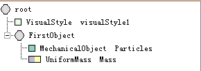
 
关键点：

我们用到了3个组件：

- 一个Node "FirstObject"来存储我们想要模拟的对象组件。重要的是场景中的节点层次反映着你想要建立的模型场景。
- 外形是通过MechanicalObject来建立的，它的作用是描述粒子的状态。
- UniformMass被添加到MechanicalObject中，作用是给每个MechanicalObject中的粒子以相同的质量。

按下Run in SOFA按钮。

这会打开由SOFA图表所描述的场景。在SOFA中，你会看到一个白点代表的粒子。（注意：你可能需要在View table下选择“Behavior”来看到场景）。

结果：

按下Animate按钮。

你看到什么都没有发生。在下一步你会了解到什么原因。

### Creation of a Pendulum（2/8） ###

**2.Simulation：**

描述：

在之前的场景里没有solver出现，所以没有完成仿真。在这一步我们会添加一个ODE solver在Root节点下。我们提供多个ODE solvers，伴随着不同的集成方案。可以看一看我们后面关于Solvers的教程。

关键点：

我们会用到经典的欧拉求解器EulerSolver来更新在每一时间点下粒子的位置和速度。在SOFA中，一个求解器作用于这个层次结构下的所有对象。

在Modeler的筛选窗口，输入“Euler”，点击并拖选EulerSolver在根节点下。按下Run in SOFA按钮，并按下Animate。
 
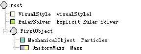

结果：

这一次，当你按下Animate，粒子会按照重力方向下落。重力是在根节点下被指定。我们使用默认的值（0，0，-9.81）。

在Modeler下，双击根结点。

这会打开这个结点的参数设置，你可以进行修改。我们暂时不做任何改变。

改变仿真中子节点重力值，不会对仿真有什么改变，因为在每一个时间点下，重力值以及其他参数（时间,dt…）会使用根节点的值而被重写。组件Gravity使你可以给一个节点以及所有它的子节点指定一个特殊的重力值。

### Creation of a Pendulum（3/8） ###

**3.FixConstraint：**

描述：

既然我们可以给一个粒子加上重力，让我们试着使用constraint来在空间中固定一个粒子。多个Sofa组件应用了约束的概念。

关键点：

为了固定粒子在它的位置上，我们使用FixedConstraint。它用来设置使一组粒子的速度和加速度为零。

在Modeler的筛选窗口中输入”FixedConstraint“，然后将FixedConstraint放在FirstObject节点下。然后按下Run in SOFA按钮。

作为调试信息，我们使用粉红色的方块来指示被固定的粒子。

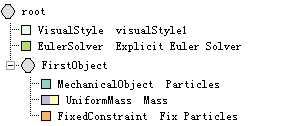 

结果：

按下Animate。

粒子不再下落。

在Modeler的场景图中双击FixedConstraint节点。然后点击Property 2/2 tab。

在这里你可以指定多个索引根据需要被约束的粒子。

### Creation of a Pendulum（4/8） ###

**4.Change Number of Particles：**

描述：

我们看到当场景动画起来，粒子没有运动，就像这个教程里第一个场景一样。然而，和第一个场景不同的是，我们的场景是在一个仿真作用下的结果，力在不断的积累，然后有一个ODE在计算新的位置和速度。为了验证这一点，我们会给MechanicalObject添加一个粒子。索引号为”0”的粒子会被约束在它的初始位置上。

在Modeler的场景图下双击MechanicalObject节点，点击Vector 1/4 tab。在顶端你会看到position选项。通过右边的箭头或是在box中直接输入数值，改变1为”2“。在矩阵新的一排上的X，Y和Z位置上，分别的输入”1“，”0“，”0“。

我们已经改变了MechanicalObject的尺寸，而且在位置（1，0，0）添加了另一个粒子。

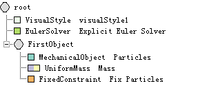

结果：

运行SOFA。

被粉红色方框标记的粒子依然是固定的，然而另一个粒子却因为重力落下。

### Creation of a Pendulum（5/8） ###

**5.Add Spring：**

描述：

现在我们会创建内部力，以增加我们的力学对象粒子间的相互作用。

在SOFA中力是通过被称为ForceFields的组件来控制的。我们应用了多种算法来模拟Mass Spring systems，有限元，刚体等等。而且有许多可用的例子对这些不同的类型。在这个教程中，我们会在两个粒子间添加一个Spring。

关键点：

我们会用一个StiffSpringForceField作为我们的spring模型。

在筛选框中输入”StiffSpring”，你会看到StiffSpringForceField在两个类别下。这两个都一样。拖放任意的StiffSpringForceField在FirstObject节点下。双击StiffSpringForceField。

点击Property 1/2 tab。在spring选项下，增加0到”1”.然后点击Display the values。然后，按下Update按钮。

现在列标题描述了要创建一个spring所需要的全部参数：两个索引（Index1，Index2）对应着要通过spring连接的粒子，刚度系数（Ks），衰减系数（Kd），以及spring其余部分的参数（L）。

输入值“0”，“1”，“100”，“5”和“1”到栏Index1，Index2，Ks，Kd和L。然后点击OK返回Modeler。运行SOFA。

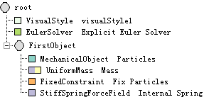

结果：

现在这两个粒子被一个spring连接在一起。第二个粒子因为重力继续下落，但是由于spring，显示为绿色的线，使它们连在一起。（注意：如果你看不到绿色的线，要确保在SOFA的View中“Force Fields”被选中了）

### Creation of a Pendulum (6/8)  ###

**6.Add Second Object：**

描述：

现在我们会添加另一个力学对象，它有自己的质量。它在图表中会位于ODE solver之下，因此在仿真过程中ODE solve会被考虑进去。

关键点：

在教程的第一部分，我们描述了如何创建一个力学对象。我们使用相同的SOFA组件，MechanicalObject和UniformMass来创建我们的第二个对象。

在Modeler窗口下找到GNode组件，拖拽它到根节点下。

双击这个新的节点，然后改变Object Name为”SecondObject”。

使用筛选器找到MechanicalObject组件，拖拽它到Second Object节点下。重复使用UniformMass组件。

双击新的MechanicalObject组件，找到Vector 1/4 tab。在这个位置下改变X坐标为“2”。

我们创建了一个新的粒子，将它放在了位置（2，0，0）上。

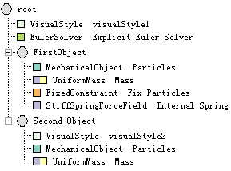

结果：

运行SOFA。

现在有三个粒子：2个属于第一个对象，然后第三个属于我们刚刚创建的第二个对象。因为这两个对象间不存在相互作用，因此粒子将根据重力落下。

### Creation of a Pendulum (7/8)  ###

**7.Add Interaction Spring**

描述：

为了连接这两个不同的力学对象，我们会在它们之间创建一个spring。

找到StiffSpringForceField组件，拖拽它到根节点下。Modeler会警告你“No MechanicalState found in your Node root”。点击Ignore。我们会手动的定义ForceField该如何作用。

双击新建的StiffSpringForceField改变它的属性。在窗口的底部，在First object in interaction文本框里，输入“FirstObject”。在Second object in interaction文本框里，输入“SecondObject”。

（说明在Modeler中无法直接进行修改，而且模块的颜色也没有改变，不过可以在对应的.scn文件中进行修改，添加object1="@FirstObject"  object2="@SecondObject"）

到Property 1/2 tab下，增加spring's pairs of indices, stiffness, damping, and rest length到1，然后点击Display the values，然后点击Update。之后分别在栏Index1, Index2, Ks, Kd,和L中填入"1", "0", "10", "0.1", and "1"。

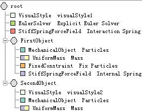

运行SOFA。

关键点：

和之前的教程一样，我们使用了相同的组件（StiffSpringForceField）。但是你可能会发现在SOFA的图表里它们的颜色并不相同。Internal Springs使用的是蓝色，然而Interaction Springs使用的是红色。和之前使用StiffSpringForceField不同的是我们需要说明两个力学对象间的相互作用：我们指定了MechanicalObjects为FirstObject和SecondObject。创建springs的过程是相同的：two indices, Ks, Kd and rest length。第二个spring显示为绿色，代表两个对象之间的相互作用。

结果：

为了得到一个更好的仿真视角，减小积分时间步长改变DT值，改变为0.01到“0.001”。然后点击Animate。

### Creation of a Pendulum (8/8) ###

**8.Different Solver：**

描述：

为了展示SOFA的genericity，最后的教程会使用不同的ODE solver来进行相同的仿真。

我们会移除EulerSolver，然后替换为EulerImplicitSolver。这个solver包含的算法可以实时更新粒子的位置和速度。它使用了一个辅助的组件CGLinearSolver来解决方程系统。

关键点：

在Modeler的图表中右键点击EulerSolver，然后进行删除。

找到EulerImplicitSolver组件，然后添加到根节点下。找到CGLinearSolver组件，然后添加到根节点下。

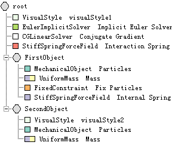

结果：

运行SOFA。

仿真的动作会有些稍微的不同。可以试着去修改ODE Solver and the Linear Solver的参数。
 
## （二）创建场景 Scene Creation ##

### Creation of a Scene (1/9)  ###

**1.Objective:**

描述

这个教程的目的是在一个可变形对象和一个障碍物间创建仿真。我们会使用一些SOFA中最常用的组件，不会详细深入介绍所选择的模版。这会在另一个教程中介绍。

在Modeler中选择New Tap。这会给我们一个带有一些默认组件的图表。

右键选择TreeCollisionGroupManager，然后删除。

在我们的场景中不需要这个组件。

在筛选框里找到OglModel组件，然后将它拖拽到根节点下。双击OglModel节点，修改它的属性。

改变模型的名字为"Objective"。

在Property 2/3 tab下，找到fileMesh部分。点击...按钮会打开文件浏览器。选择文件/Sofa/share/mesh/dragon.obj，然后点击OK，返回Modeler。

现在在场景中有了控制碰撞所需要的全部组件，以及一个代表我们可变形对象的虚拟模型。

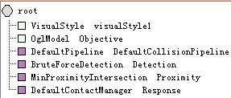

关键点：

这就是在SOFA中使用这些默认的组件，碰撞是如何执行的。

DefaultPipeline：启动所有的操作来执行碰撞响应和检测

碰撞检测：

1. Broad Phase：使用”Axis Aligned Bounding Boxes”（AABB），我们只需要保存一对对象的潜在碰撞。

2. Narrow Phase：我们使用几何图元（球、三角、线、点）来检测两个对象间的距离。我们使用BruteForceDetection来选择使用那个图元，然后用MinProximityIntersection来判断两个几何图元间的碰撞是否存在。

碰撞响应：

1. 和所有的碰撞图元一起，我们创建了一个相应的碰撞响应：ContactManager给出了关于我们要用那一个响应的信息。

2. 在图表中组件会被动态的创建，来产生斥力或是约束。在这个教程里，我们会创建PenalityContactForceField。

更高级的碰撞检测和响应被用到了SOFA里，所以不要犹豫试试其他例子。

结果：

运行SOFA。在这个场景里我们只有一个OglModel对应于一个纯粹的对象可视化表示。

### Creation of a Scene (2/9)  ###

**2. Basic Components:**

介绍：

在这一步，我们添加了一个带有质量和一个solver的力学对象来仿真我们的可变形对象。

在根部添加一个新节点，改变新节点的名字为"Object"。

在Object节点下添加EulerImplicitSolver, CGLinearSolver, MechanicalObject 和 UniformMass。

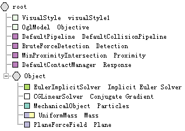

关键点：

我们会添加一个内部力场，PlaneForceField。它仿真一个平面（到原点的方向和距离）。

作为开始，我们会使用这种"virtual object"来仿真和地板的碰撞。更进一步的，我们会看到如何使用任意的真实对象作为一个障碍物。

找到PlaneForceField组件，然后添加到Object节点下。打开PlaneForceField属性设置，改变plane normal属性从（0 1 0）到（0 0 1）,然后是plane d coef属性值从0到"-10"。在根节点（root）属性下改变gravity从(0 -9.81 0)到(0 0 -9.81)。改变dt的值为0.001。

结果：

运行SOFA。

粒子根据重力的方向下落，然后会停在被PlaneForceField定义平面上。我们的dragon不会移动。（注意：你可能需要在SOFA里调整视角来观察平面。确保在SOFA的View tab下Collision被选中）

Related：

修改PlaneForceField参数，理解你的改变。

### Creation of a Scene (3/9)  ###

**3.Embedding the Model：**

介绍：

快速创建一个可变形物体的方法是将它放在一个规则的网格里。我们将只仿真网格单元的点。这个网格的描述被放入Topology中，Topology描述了粒子是如何连接的。

关键点：

我们会添加SpareGridTopology：它只保持嵌入式网格的全部单元。

现在在场景中有了一个topology，MechanicalObject会根据它，来初始化自身。

为了使用这个组件，你需要：

- 指定3d模型
- 指定网格的分辨率

打开SparseGridTopology参数，找到fileTopology部分，然后点击...按钮，找到across来自Filename of the mesh。使用文件浏览器选择/Sofa/share/mesh/dragon。

转向Property 4/6 tab。找到标记为n的区域。改变grid resolution（网格分辨率）从（2 2 2）到（7 6 5）。

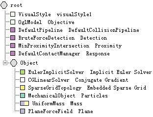

结果：

运行SOFA。

现在有多个粒子被创建，代表可变形对象：它嵌入到的可视化对象里。

点击Animate。

粒子向着我们之前定义的平面下落。因为除了一个平面没有内应力被定义，原来的形状不会保留。

Related:

改变三维网格的SparseGridTopology和网格的分辨率。

修改MechanicalObject来观察仿真粒子的数量。

### Creation of a Scene (4/9)  ###

**4.Internal Forces:**

介绍：

现在我们有了一个topology，一个初始化的力学对象，是时候来仿真可变形对象了，为了这样做，我们添加ForceField到场景里。

你要选择一个和你的MechanicalObject兼容的ForceField。为了兼容，这两者必须使用相同的template。

在筛选器中找到MechanicalObject组件。

注意在MechanicalObject旁边是一个下拉式目录，其中选择的Vec3d。

点击下拉式目录然后看一下其他可能的选项。

你会看到可选项有Rigid 和 Vec2f，这些都是候选的template。当我们添加MechanicalObject到场景中时，我们并没有和这些模版进行关联。我们的MechanicalObject使用默认的模版Vec3d。这表示我们不能够使用Rigid类型添加ForceFields。一些ForceFields要根据一个给定的topology。大都数时候，它们的名字提示你它们所依靠的topology。

我们可以看到SparceGridTopology创建了一个粒子网格。如果将这些网格的行和列用线连起来，它们就成了立方体。立方体有六个面，因此是有六面的。这意味着我们可以使用所有基于SpaceGridTopology的 ForceFields中的Hexadedron。

关键点：

我们选择通过使用有限元：HexahedronFEMForceField，来建立我们的变形模型。

找到并添加HexahedronFEMForceField到Object节点。找到Properties 2/2 tab，然后改变Young's Modulus值从50000到"200"。

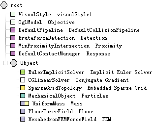

结果：

运行SOFA。为了得到更好的视角，改变DT值从0.02到"0.001"。

然后你会看到在六面体上有对应的有限元。当你点击animate时，你会看到网格中的单元格变形。

Related：

修改 young modulus of the FEM force field：越高，模型移动越不灵活。

修改 poisson ratio（在0到0.5之间）

### Creation of a Scene (5/9)  ###

**5.Visual Mapping**

描述：

这一步，我们会使用一个可视化模型来代表我们的可变形对象。然而，你必须知道它将只是一个可视化表达。计算量将会在粒子上完成，而这是你通常看不到的。

关键点：

对Object节点添加GNode，改变名字为"VisualNote"。

我们添加的这个节点将包括我们的可视化模型。下一步，我们将可视化模型从root层移动到VisualNode。

在Modeler的图表中选择OglModel。然后选择Copy。之后选择VisualNode，然后选择Paste。右键点击最初的OglModel，然后删除。

现在将可变形的仿真粒子和可视化的模型连接起来，我们需要一个mapping。由于在每一时间步上只需要更新可视化模型的位置，我们会使用一个Visual Mapping：BarycentricMapping。

这里我们真的需要注意对于这个组件我们使用的模版。

打开OglModel属性设置，然后找到Infos。

在instance下，你会看到Template是ExtVec3f。这表示我们需要我们的BarycentricMapping to map from Vec3d(MechanicalObject使用的模版) to ExtVec3f.

使用筛选器找到BarycentricMapping组。确保右边的模版信息是Vec3d, ExtVec3f.如果不是则在子菜单进行选择。将这个组件添加到VisualModel节点下。

修改BarycentricMapping属性，打开Links。改变Input object to map从@到"@../"。

这表示将MechanicalObject放在了这个节点的上面（Object节点）

改变Output object to map为"@Objective"。（无法修改）

这指的是我们之前命名为Objective的OglModel。

结果：

运行SOFA。

现在不仅网格粒子开始变形，可视化模型也跟着变形了，它总是一直潜入在网格里。

Related：（翻译的不清楚）

你可能也发现了可视化模型和仿真模型无关：我们像创建可视化模型一样使用相同的模型创建了网格，但是这无法阻止你使用不同的模型。改变在SparseGridTopology中使用的可视化模型或这个模型，然后看看结果。

为了理解 barycentric mapping是如何工作的，在SOFA的主应用里显示Visual Mappings。你会看到visual model上的没一点是如何根据力学模型上的一些点的。

### Creation of a Scene (6/9)  ###

**6.Collision Pipeline**

介绍：

现在我们用一个真实的障碍物来替换PlaneForceField，使用一个topology（读取一个mesh文件）来建模，一个力学对象，和一些碰撞模型。

关键点：

你需要使用Collision Models。它们描述了涉及在碰撞检测里的几何图元。为了证明你能拥有的灵活性，我们同时会使用一些球，三角，线和点。拥有球体的数量会和Topology中包含的粒子数量一样。

在根节点下添加一个新的GNode，然后更改名字为"Obstacle"。

添加一个MeshTopology组件在Obstacle节点下。设置Filename of the mesh为mySofaDirectory/Sofa/share/mesh/cube.obj。

在Obstacle节点中添加一个MechanicalObject。在Transformation tab下改变Scale of the DOFs in 3 dimensions为（1 1 1）到"（40 40 0.1）"

在Obstacle节点下添加一个TTriangleModel。在Property 2/3 tab下改变Default contact stiffness为500.Repeat both steps with a LineModel and a PointModel 

在Obstacle节点里添加一个OglModel组件。在Property 2/4 tab下，设置Path to the model为/Sofa/share/mesh/cube.obj。在Transformation tab下，改变Initial Translation of the object为“(0 0 -10)”,以及Initial Scale of the object为“（40 40 0.1）”.

（教程上没有说明的内容：在Object节点下添加TSphereModel组件）

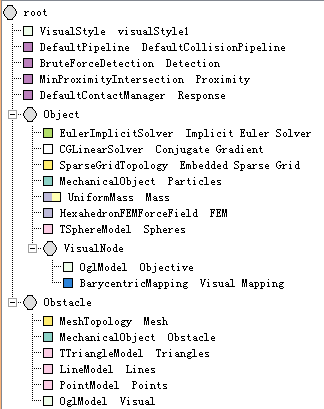

结果：

删除PlaneForceField。运行SOFA。

这时，我们的可变形物体会使用在每个粒子上放置的球体和地板进行相互作用。碰撞检测不会像我们可看到的那样准确的显示，但是这个龙的模型不会穿过地板。

Related：

你有多种方式修改碰撞检测和响应。

修改接近距离来了解什么时候两个图元开始碰撞：打开MinProximityIntersection，然后修改"alarmDistance" 和 "contactDistance"。

修改硬度和响应：响应是通过所包含的两个碰撞模型的接触刚度进行计算的。打开SphereModel，然后修改参数。你也可以对TTriangleModel, LineModel, PointModel进行修改。

### Creation of a Scene (7/9)  ###

**7.Mechanical Mapping**

描述：

我们会映射另一个模型来仿真力学对象。这一次将不仅仅是可视化模型，而是一个力学对象用来控制碰撞，在碰撞响应的过程中为传递力给仿真对象。一旦这个模型可以传递力，我们只需要添加一些碰撞模块。

记住：

- Visual Mapping：信息是自上而下传递：仿真对象传递位置和速度给映射的模型。
- Mechanical Mapping：信息传递是双向的：仿真对象传递位置和速度给映射的模型，另一方面，映射的模型传递力给仿真对象。

关键点：

添加一个新的GNode给Object节点，命名为“CollisionNode”。

现在我们需要从一个mesh文件加载模型。作为第一个例子，我们会使用立方体作为碰撞对象。

添加一个MeshTopology到CollisionNode，然后改变Filename of the mesh为/mySofaDirectory/Sofa/share/mesh/cube.obj.

接下来我们需要MechanicalObject来存储碰撞对象的位置，速度和力。

添加一个MechanicalObject到CollisionNode。改变Scale of the DOFs in 3 dimensions的值为"(6 6 6)"。

碰撞对象使用Mapping映射为仿真的可变形对象，这一次MechanicalMapping是BarycentricMapping。你可能会疑惑这个映射和之前对可视化模型使用到的映射有什么区别呢？因为我们使用的是相同的组件。是什么使得映射为可视化或具有力学特性？

这是由创建mapping的模版决定的：

使用筛选器找到BarycentricMapping组件。在下拉式目录里，选择Vec3d，Vec3d。

这意味着它转变了状态属性从Vec3d到Vec3d。记住，碰撞模块只能以Vec3d类型表达。因此映射状态必须是Vec3d。

打开BarycentricMapping属性，到Links。将Input object to map变为"@.."，然后Output object to map变为"@."

这分别对应着从MechanicalObject映射，从MechanicalObject的上一个节点映射。

现在，我们会移除之前的TSphereModel，然后在CollisionNode中替换它。

删除当前的TSphereModel。然后添加一个新的TSphereModel到CollisionNode，然后改变Default contact stiffness值为"1000"。

结果：

运行SOFA，改变DT值为"0.005".

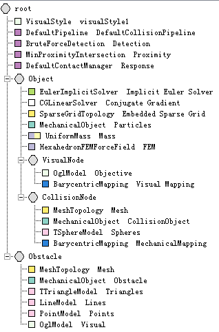

你可以看到球体，对应着所选择代表我们碰撞模块的立方体。当然使用四个球体要比我们之前场景中使用的171要快速。但是这种方式也非常困难。

通过按下shift键来在其中一个球体上施加作用力，然后使用鼠标点击并拖拽一个球体。

你可以使对象变形，这是由于MechanicalMapping的原因。

我们使用蓝色的线显示了关于作用力映射的信息。碰撞作用的每一点要依赖仿真对象上的多个点。如果作用力作用在碰撞模型点上的，这个力会传递到它所依赖的所有点上。

### Creation of a Scene (8/9)  ###

**8.More Precise Model:**

介绍：

在教程的这一步，我们会改变碰撞模型从立方体到龙的模型，那么碰撞模型将使用和可视化模型相同的模型。

在CollisionNode的MeshTopology属性里，改变Filename of the mesh，从/Sofa/share/mesh/cube.onj 到 /Sofa/share/mesh/dragon.obj。

在CollisionNode's MechanicalObject的属性里，在Transformation之下，改变Scale of the DOFs in 3 dimensions，从（6 6 6）到（1 1 1）。

结果：

运行SOFA，改变DT值为0.005

你会看到有更多的球体来控制碰撞，而有些是多余而且无用的。

这个例子说明了在选择你想要的碰撞模型时，需要注意。有一个好的方法是选择两个版本的的模型：一个好点的版本用来在场景中进行rendering，一个粗糙点的版本用来控制碰撞检测。

在碰撞响应时，球体的出现会产生一些artifacts，但是它们可以快速的仿真。停止显示碰撞模型，然后启动可视化模型来真正的看一下球体的效率。

### Creation of a Scene (8/9)  ###

**8.Different Modelization**

描述：

在最后一步，我们会改变碰撞组件转到碰撞检测。

在CollisionNode下删除TSphereModel。

添加一个PointModel组件给CollisionNode。

Repeat with a LineModel and a TTriangleModel

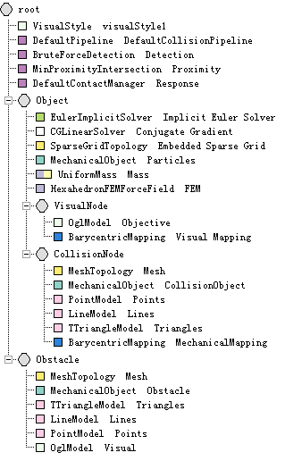

结果：

运行SOFA，改变DT值为0.005

不是使用球体，我们使用mesh来精确的建立我们的模型。这能改变响应质量，但需要更高的计算代价。
 
## （三）拓扑映射 Topological Mapping ##

### Topological Mapping (1/7) ###

**1.Objective**

介绍：

这部分教程的目地是在一个volume和一个surface的mesh之间，利用拓扑映射创建仿真。我们会使用一些最常用的SOFA组件。

关键点：

开始的时候是一个用来控制碰撞的具有所有默认组件的场景。

在Modeler中创建一个新的场景，删除TreeCollisionGroupManager。

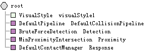

结果：

这一步没什么结果。

### Topological Mapping (2/7)  ###

**2.Volume mesh**

介绍：

这一步我们使用一个mesh文件和动态的拓扑组件加载一个四面体网格。

关键点：

- meshLoader读取网格文件。（在正规的网格中不是必须的）
- 带有几何点位置的mechanicalObject。
- 动态的拓扑组件存储四面体网格。

在root节点下添加一个新的GNode。改变名字为“Tetrahedrons Mesh”。

在Tetrahedrons Mesh节点下添加一个MeshGmshLoader组件。变名为"loader"。指定Filename of the object为/Sofa/share/mesh/cylinder.msh

在Tetrahedrons Mesh节点下添加一个MechanicalObject组件。变名为"Volume"。

在Transformations tab下，按下Scale of the DOFs in 3 dimensions按钮。在出现的文本框中输入"@loader.scale3d".类似的按下Translation of the DOFs按钮，然后输入"@loader.translation"。按下"Rotation of the DOFs"按钮，然后输入"@loader.rotation"

在Vector 1/4 tab下，按下position coordinates of the degrees of freedom按钮，输入"@loader.position"。

在Tetrahedrons Mesh节点下添加一个TetrahedronSetTopologyContainer组件，变名为"Container"。指定Filename of the mesh为"/Sofa/share/mesh/cylinder.msh".TetrahedronSetTopologyContainer为一个拓扑容器，用来存储一个拓扑结构（位置，边，三角，四面体）。通常这种拓扑结构不需要手动去设置，而是从一个MeshLoader组件复制过来。

在Property 2/2 tab下，点击List of tetrahedron indices按钮,输入"@loader.tetrahedra".这个语法的意思是在这个节点名字为"loader"的SOFA组件下的数据"tetrahedra"必须复制到这个数据里。

在Tetrahedrons Mesh节点下添加一个TetrahedronSetGeometryAlgorithms组件。在Visualization 2/2 tab下，选择if true, draw the tetahedra in the topology box。

改变RGB code color used to draw tetrahedra属性为（1 1 0.3）

在TetrahedronSetGeometryAlgorithms组件的这一选项下用来显示拓扑元素（这里为四面体）。

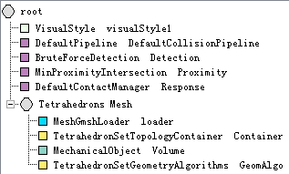

结果：

运行SOFA。

在场景中我们只得到四面体网格以拓扑和四面体的形式。在这一步没有相互作用。

### Topological Mapping (3/7)  ###

**3.Embedding the Model**

介绍：

这一步我们会使用ODE solver、有限元和质量给这个四面体网格添加力学性能，因此圆柱体可以被重力或user产生变形。

关键点：

- EulerImplicitSolver组件被用与解决力学ODE系统。
- CGLinearSolver组件在ODE系统的每一步上用于解决线性系统。
- TetrahedralCorotationalFEM用于在这个力学系统中创建四面体有限元。
- DiagonalMass描述了一个网格元素的global mass。
- Constraint在这里用于固定圆柱体的极端面

在Tetrahedrons Mesh节点下添加EulerImplicitSolver组件。

重复一个CGLinearSolver组件。改变tolerance值为1e-09，在Property 2/2 tab下，改变threshold值为1e-09。

添加一个TetrahedralCorotationalFEMForceField组件。改变FEM Poisson Ratio为"0.3"，以及FEM Young Modulus值为360.

添加一个DiagonalMass组件，在Property 2/2 tab下改变mass density为"2"。

添加一个FixedPlaneConstraint组件。在Property 2/2 tab下，改变normal direction of the plane为（0 0 1）， minimum plane distance from the origin的值为“-0.1”，以及maximum plane distance from the origin的值为"0.1"。

添加一个FixedConstraint组件。

结果：

添加这些组件创建了圆柱体的力学状态。在场景中添加一些重力，我们可以看到圆柱体开始弯曲。

在这一步，因为没有可视化模型。我们可以看到有限元。

### Topological Mapping (4/7)  ###

**4.Mapping to surface mesh：**

介绍：

这一步很重要。我们添加了一个子节点包含三角形的拓扑，由于拓扑映射组件的关系，它直接和四面体网格连接。这使我们可以显示一个可视化模型。

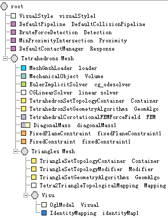

关键点：

这一步，我们添加一些对可视化模型有用的组件。

- 动态拓扑组件来存储表面网格。
- Tetra2TriangleTopologicalMapping组件用来map triangles on the border of the tetrahedral mesh to the surface topological container。
- 然后，OglModel用来显示表面网格。

在Tetrahedrons Mesh 节点下添加一个新的GNode，变名为"Triangle Mesh"。

将下面的组件添加到Triangles Mesh节点下，赋给它们名字：

- TriangleSetTopologyContainer named "Container"
- TriangleSetTopologyModifier named "Modifier" 
- TriangleSetGeometryAlgorithms named "GeomAlgo" 
- Tetra2TriangleTopologicalMapping named "Mapping"

TriangleSetTopologyModifier这个组件可以控制一个相关的TriangleSetTopologyContainer组件。因此在container之间有清晰的分离，它分配并存储memory，然后算法可以控制数据。

在Mapping属性里，改变Input topology to map为"@../Container"，然后改变Output topology to map为"@Container"。（在Modeler中好像无法完成此操作）

这告诉mapping转换tetrahedron拓扑为一个triangle拓扑。

在Triangles Mesh节点下添加一个新的GNode，然后改名为"Visu"。

在Visu node下添加一个OglModel组件，改名为"Visual"。

利用筛选器找到"IdentityMapping"组件。在右边的下拉式目录下选择Vec3d,ExtVec3f，然后添加到Visu节点下。

在Property 2/2 tab下，改变Input object to map为"@../../Volume",然后改变Output object to map为"@Visual"。（在Modeler中好像无法完成此操作）

结果：

运行SOFA。

在这一步力学特性是一样的。但是现在可以显示对象的表面了。

### Topological Mapping (5/7)  ###

**5.Change mesh behaviour**

介绍：

这一步将展现在一个子拓扑下直接定义力学行为。这会很有用，因为对于整个拓扑结构表面网格是很小的一部分。

关键点：

- 使用TriangularBendingSprings然后将网格表面的边缘添加上Springs
- 添加TriangleModel组件使能够和模型进行交互（使用鼠标和shift键）

在Triangles Mesh节点下添加TriangularBendingSprings组件。改变uniform stiffness for all the springs的值为10.

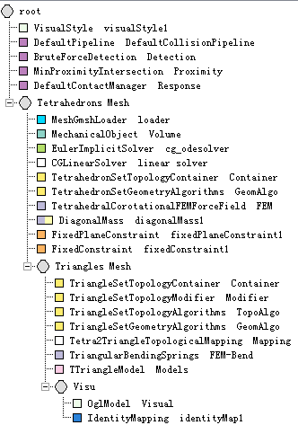

结果：

运行SOFA。通过鼠标和shift键使圆柱体变形。

（出现错误，其中ERROR(TriangularBendingSprings): object must have a Triangular Set Topology。后来不知道什么原因又好了。）

在这一步，网格的表面具有springs，因此圆柱体不会像之前弯曲的那么很。优点是圆柱的其余部分不会被考虑，可以快速的进行计算。

### Topological Mapping (6/7) ###

**6.Other mesh：**

介绍：

这一步和之前不同。它显示了一个已经具有力学特性的六面体网格，然后能够和一个表面网格关联。

关键点：

按下Edit in Modeler按钮，然后在Modeler中打开了已建好的场景图。

这个场景图包含我们已熟知的组件：

- 一个ODE solver和一个线性solver
- 带有几何点坐标的MechanicalObject
- 用于创建3D栅极网格RegularGridTopology
- 用于在这个力学系统上创建四面体有限元的HexahedronFEMForcefield
- DiagonalMass描述了网格元素的全部质量
- Constraint在这里用于固定立方体上顶面的四个角

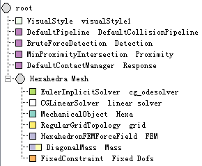

结果：

运行SOFA,然后使用鼠标和shift键拖拽立方体。

这个场景展现了在重力下的3d 立方体。它和"Embedding the Model"有相同的配置。

### Topological Mapping (7/7)  ###

**7.Same pipeline:**

介绍：

最后一步是一个拓扑映射的第二通道，从一个六面体网格到一个三角形网格，穿过Quads。

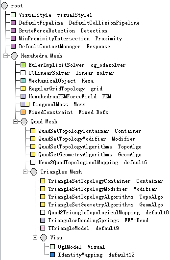

关键点：

- 动态的拓扑组件来存储quad mesh
- Hexa2QuadTopologicalMapping组件用于将处于六面体网格边缘的Quads映射到这个容器里。
- 动态的拓扑组件存储三角形网格。
- Quad2TriangleTopologicalMapping用于映射Quads到三角。
- 使用TriangularBendingSprings将Springs添加到网格表面的边缘
- 最后OglModel用于可视化表面网格

点击Edit in Modeler按钮。

再次的，一个预建好的图表在Modeler中打开。你可以看到图表的详细细节。

我们会看到5个节点，每一个都是前一个节点的子节点。This is a good visual representation of the flow of the collision pipeline.

从根节点开始，我们有场景所需要的全部基础组件，包括DefaultPipeline。

接下来是Hexahedral Mesh节点，包含Ogl solver用来检测模型会承受到的力.

一旦这个solver检测到了hexahedrons的运动，Quad Mesh节点映射这个运动到只有模型表面的quad表示。

接下来，Triangles Mesh映射这个quad表示的运动到一个三角形的表示。这里我们也给表面添加springs和约束。

最后，所以通过pipeline传递的信息被Visu节点使用，创建了这个模型的可视化表面。

结果：

运行SOFA。

这个最后一步显示了带有力学特性的拓扑映射的另一个例子，这和Change mesh behaviour的过程类似。
 
## （四）可视化 Visualization ##

### Mesh Loading and Rendering 1 (1/7)  ###

**1.Mesh Loading and Rendering 1**

介绍：

第一个教程的目地是在viewer中加载一个obj文件。然后在viewer中渲染。

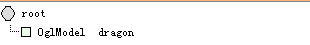

关键点：

OglModel是渲染文件的主要组件。这里所有的几何信息被赋予OpenGL，之后用于渲染模型。Vertex Buffer Object（如果支持的话）用于加速。

将OglModel放在场景中，然后在filename中输入你的OBJ文件路径。

创建一个新的场景。清空默认的组件，选择File>Clear。

添加一个OglModel组件在根节点下。改变Path to the model（在Property 2/4 tab下）为/Sofa/share/mesh/dragon.obj 。

运行SOFA。

什么都没有发生，但是你可以看到对象。

### Mesh Loading and Rendering 2 (2/7) ###

**2.Mesh Loading and Rendering 2**

介绍：

这一步展示了如何加载一个不是OBJ格式的mesh文件。

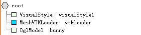

关键点：

就像我们在上一步看到的，OglModel仅仅能够渲染OBJ文件。在这个组件里直接完成，因为OBJ文件被广泛使用。但是如果你有一个不太通用的文件格式，将用到不同的方法进行渲染。

MeshLoader用来加载多种不同的文件。它加载的数据用来可以和OglModel联系起来，使用OglModel来进行可视化。在这个例子里，我们使用MeshOffLoader渲染一个OFF文件。

清空场景，只有一个root节点。

添加一个MeshVTKLoader组件，然后更改名字为"loader"。改变Filename of the object为/Sofa/share/mesh/aneurysm3d_2_small.off

添加一个OglModel组件。

通过选择File>Save保存你的场景文件。我们保存这个文件为myTutorial.scn

在你喜欢的XML编辑器中，打开myTutorial.scn，找到下面这行：

OglModel template="ExtVec3f"

name="oglModel8" 

在name属性后，添加src="@loader"。现在这行代码看起来像：

OglModel template="ExtVec3f" 

name="oglModel8" src="@loader" 

保存文件，再次打开myTutorial.scn。

运行SOFA。

你会看到一个aneurysm模型。如果看起来很暗，很难看清楚，不要担心。这仅仅因为这个模型的默认颜色的定义。

### Mesh Loading and Rendering 3 (3/7)  ###

**3.Mesh Loading and Rendering 3**

介绍：

现在我们要更深入的了解如何使用OglModel。

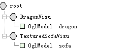
 
关键点：

清空场景图。

我们会使用简单的场景作为开始。

在root节点下添加两个GNode。分别更名为"DragonVis"和"TextureSofaVisu"。

分别在这两个节点下添加OglModel。更名为"dragon"和"sofa"。

在dragon中改变Path to the model为/Sofa/share/mesh/dragon.obj。以及在sofa中改变 Path to the model为/Sofa/share/mesh/canapVM.obj。

运行SOFA。

现在模型可以正确的加载并渲染，但是我们想要对它进行配置。

OglModel给出了不同的参数：

- Transformation：旋转，平移和比例，每一个都作为a vector of 3 floats
- Materials：描述环境，散射，反射，发射和发光的组件。它加载的方式不是一个和OBJ关联的.MTL文件，就是和在material范围内的字符串。你也可以使用color field，它直接填入material fields。
- Texture：在texturename field中的基本贴图。

在dragon的属性中，在Transformation下改变 Initial Translation of the object为(1 10 2),然后是Initial Rotation of the object为（90 0 0）,最后是Initial Scale of the object为（0.5 0.5 0.5）。

在Property 2/4 tab下，改变Ambient属性为(0 191 0 255),以及Diffuse属性为(51 51 0 229)。点击Specular和Shininess。设置Specular为（204 204 204 255）和Shininess为25.

运行SOFA。

现在我们可以看到一个绿色的dragon躺在sofa上。

在sofa的Property 2/4 tab下，使用文件浏览器设置Name of the Texture为/Sofa/share/textures/snakeskin.png

运行SOFA。

现在我们的sofa也设置好了。

### Lighting (4/7)  ###

**4.Lighting**

介绍：

接下来，我们会看到如何管理灯光。

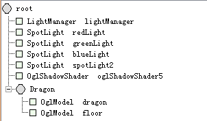

关键点：

清空场景。

在根节点下添加一个GNode，然后更名为"Dragon"。

在Dragon节点下添加一个OglModel，然后设置Path to the model为/Sofa/share/mesh/dragon.obj。

默认情况下，对于那些不想混用它的人，会有一个（位置性的）灯光在OpenGL Viewer下呈现出来。但是如果你想要微调你的场景，你可能想要修改这个灯光或是添加另一个灯光。

为了这样做，首先你要添加一个LightManager，不需要任何参数（后面会看到为什么我们需要它）。之后你可以增加OpenGL所允许灯光的最大数量，在一般系统下最大灯光数为8.

在root节点下添加一个LightManager组件，更名为"lightManager"。

在SOFA中有三种灯。它们和在OpenGL中一样：

- PositionalLight（主要参数是：position）；
- DirectionalLight（主要参数是：direction）；
- SpotLight（主要参数是：position和direction）。

color是所有这三个灯光的一个通用参数。

SpotLight有着其它非重要的参数：

cutoff和exponent（默认值可能就足够了）。

在root节点下添加三个Spotlight组件，分别命名为"redLight"，"greenLight"和"blueLight"。

在redLight下，设置color of the light为（1 0 0）,然后position为（-5 -2.5 20）。

在greenLight下，设置color of the light为（0 1 0），然后position为（0 2.5 20）。

在blueLight下，设置color of the light为（0 0 1），然后position为（5 -2.5 20）。

运行SOFA。

注意：

如果你想要整个场景被点亮，LightManager and *Light必须在root节点下。

### Shadowing (5/7)  ###

**5.Shadowing**

介绍：

在SOFA中计算阴影。

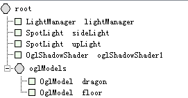

关键点：

由于有SpotLight，所以可以在SOFA中进行简单的阴影计算。我们所要做的就是放入OglShadowShader组件（Shaders一般会在后来看到），最好是和LightManager在一个节点下，例如场景中的root节点。

首先通过OglModel在Dragon节点下添加一个地板，然后设置Path to the model为/Sofa/share/mesh/floor.obj。然后设置position（Initial Translation of the object）为（0 -7 0）

在root节点下添加一个新的Spotlight，更名为upLight。设置它的position为（0 60 0），然后direction为（0 -1 0.01）。

在root节点下添加一个OglShadowShader组件。

然后，你只需要按下CONTROL+'L'键，或是设置LightManager中的Enable Shadow in the scene参数为true。

在Spotlight下有一个显著的参数是shadowTextureSize。它的值越高，shadow会越精细。要小心的利用它，因为如果它的值太高会使你的计算机变慢。可以考虑4096为最大值。

注意：

（按照例子，各个组件间的顺序不能改变，否则会出现错误）目前，shadows都被“hardly”渲染（轮廓不成熟）。不要忘记它会很消耗GPU，所以只有在必要时才启用shadows。

### Simple Shader (6/7)  ###

**6.Simple Shader**

介绍：

我们在可视化中探索的最后一个tweak是Shaders的使用，以及另一种替换OpenGL的方法。我们会添加自己的操作，在rendering pipeline中使用三个不同的部分。

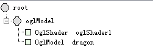

关键点：

清空图表。像我们之前所做的那样添加一个dragon OglModel。

Shaders在SOFA中通过OglShader组件来应用。在它的节点下所有的可视化模型（OglModels）以及它的子节点会应用shading。这种方式，你会在你的场景中拥有多个Shaders。

添加一个OlgShader组件。

mandatory属性是vertFilename和fragFilename，你可以给出vertex和fragment GLSL code的路径。

使用文件浏览器，设置vertFilename为/Sofa/share/shaders/phong.vert，然后设置fragFilename为/Sofa/share/shaders/phong.frag。

运行SOFA。

### Advanced Shader (7/7)  ###

**7.Advanced Shader**

介绍：

这一步根据之前的Shader部分，但是现在我们会看到如何更有效的使用它。

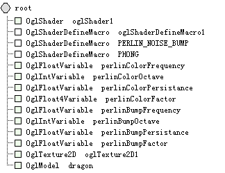

关键点：

我们已经看到如何call一个Shader。但是我们可能需要给Shader发送统一的值on the fly。这可以通过a set of objects称为Ogl{Type}{Size}Variable来完成。它们可以控制许多不同的格式：vectors, matrices, array of vectors in int and float types（看components/visualmodel/OglVariable.h有一列可用的类型）。

Texture也可以赋给Shader，使用OglTexture，包含许多参数可用；但是最重要的是texture unit id。

另一个问题是：如果你想要混合不同的效果（例如：toon shading和正常映射）。你可以写一个big Shader可以做许多事情，然后在一个macro系统中启动你所需要的。

使用你喜欢的编辑器，打开/Sofa/share/shaders/generalRenderingShader.vert和/Sofa/share/shaders/generalRenderingShader.frag。

在.frag文件中，看85行。这一部分定义了需要有效执行Perlin Noise Bump的变量。

现在看第369行。这一部分有效定义了Perlin Noise Bump。

注意任何一部分需要被编译，变量PERLIN_NOISE_BUMP被定义。我们可以直接的在图表中定义这个变量，和其他所需要的变量。

在OglShader组建中，改变vertFilename和fragFilename值为"/Sofa/share/shaders/generalrenderingshader.vert" and "/Sofa/share/shaders/generalrenderingshader.frag" 

添加一个OglShaderDefineMacro组件，然后改名为"PHONG"。

这会像上一步一样给出同样的shading。

添加一个OglShaderDefineMacro组件，改名为"PERLIN_NOISE_BUMP".

添加三个OglFloatVariable,分别命名为"perlinBumpFrequency", "perlinBumpFactor" and "perlinBumpPersistance"。分别设置它们的Set Uniform Value值为"6","0.9"和"0.2"。

添加一个OglIntVariable组件，然后命名为perlinBumpOctave。设置Set Uniform Value值为"1"。

运行SOFA。

我们定义了dragon的pattern所有值。现在我们定义颜色。

我们可以通过给它和变量同样的名字定义一个macro，像我们上面所做的，或是通过设定ID name。

添加一个OglShaderDefineMacro组件，然后设定ID name为"PERLIN_NOISE_COLOR".

添加一个OglFloat4Variable，命名为perlinColorFactor。然后设定Uniform Value为(0.2 0.9 0 0)。

添加两个OglFloatVariable。命名其中一个为"perlinColorFrequency"，然后赋给Set Uniform Value值'0.5'。命名另一个为"perlinColorPersistance"，然后赋给Set Uniform Value值'0.5'。

添加一个OglIntVariable，命名为perlinColorOctave，设定Set Uniform Value为"3"。

运行SOFA。

最后我们可以给dragon添加一个texture。

Perlin texture需要许多值，需要手动输入很多。We will cheat a bit。

在你喜欢的xml编辑器中打开你的场景。复制下面的黑体内容，然后粘贴到你的场景中，在</Node>的右边。

	<OglTexture2D id="perlinPermutationsTexture" proceduralTextureNbBits="8" proceduralTextureWidth="1" proceduralTextureHeight="256" repeat="true" linearInterpolation="false" proceduralTextureData="151 160 137 91 90 15 131 13 201 95 96 53 194 233 7 225 140 36 103 30 69 142 8 99 37 240 21 10 23 190 6 148 247 120 234 75 0 26 197 62 94 252 219 203 117 35 11 32 57 177 33 88 237 149 56 87 174 20 125 136 171 168 68 175 74 165 71 134 139 48 27 166 77 146 158 231 83 111 229 122 60 211 133 230 220 105 92 41 55 46 245 40 244 102 143 54 65 25 63 161 1 216 80 73 209 76 132 187 208 89 18 169 200 196 135 130 116 188 159 86 164 100 109 198 173 186 3 64 52 217 226 250 124 123 5 202 38 147 118 126 255 82 85 212 207 206 59 227 47 16 58 17 182 189 28 42 223 183 170 213 119 248 152 2 44 154 163 70 221 153 101 155 167 43 172 9 129 22 39 253 19 98 108 110 79 113 224 232 178 185 112 104 218 246 97 228 251 34 242 193 238 210 144 12 191 179 162 241 81 51 145 235 249 14 239 107 49 192 214 31 181 199 106 157 184 84 204 176 115 121 50 45 127 4 150 254 138 236 205 93 222 114 67 29 24 72 243 141 128 195 78 66 215 61 156 180" />

保存你的文件，然后再打开。运行SOFA。
 
## （五）Dentistry Haptic ##

### 1.Objective: ###

介绍：

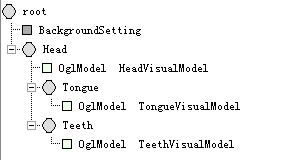

这个教程的目的是来理解，一步步的，如何创建一个带有Omni phantom device的场景。
教程的第一步展示了如何加载牙齿的可视化模型。第一行定义场景的全局变量，它是处于场景中的root节点下。

然后我们创建一个arborescence包含场景中的不同对象：

- A root node for all the head
- 在head节点下，我们使用OglModel组件显示可视化模型，命名为HeadVisualModel
- 在head节点下，我们为舌头和牙齿分别创建一个节点，分别命名为Tongue和Teeth
- 在每一个节点下，我们使用OglModel组件分别的去显示模型

### 2.Add instrument: ###

介绍：

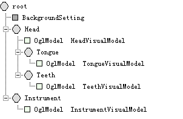

以相同的方式，我们添加一个设备的可视化模型，但是和head是不同的节点，命名此节点为Instrument。

添加一个OglModel组件，命名为InstrumentVisualModel。

### 3.Mechanical state: ###

介绍：

在这个场景中，我们创建一个移动对象的基本内容。

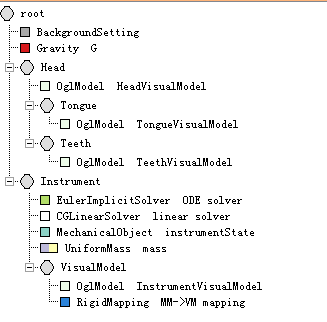

关键点：

- 首先我们使用Gravity组件在整个场景下设置重力。命名为G，设置Gravity in the world coordinate system的值为（0 -9.81 0）
- 我们设置instruments作为一个MechanicalObject。它描述了对象粒子的状态。命名为instrumentState
- 为了计算每一时间点的状态，我们需要一个时间积分器，例如EulerImplicitSolver。
- 我们需要一个linear solver，例如CGLinearSolver，来计算the linear system generated with our implicit solver。
- 我们最终使用UniformMass给这个对象添加质量。

注意：

重力可以在一个节点下使用the vec3d argument gravity设置，而不需要一个组件。

看看其他的教程，了解更多关于时间积分器。

### 4.Collision: ###

介绍：

在这一步，我们在teeth和instrument之间添加碰撞。

关键点：

- 使用hierarchical bounding boxes和一个接近检测算法来添加一个碰撞管道
- 对牙齿添加碰撞模型（三角、线、点）
- 对设备添加碰撞模型（线、点）
- 添加一个映射（RigidMapping）来“连接”力学模型和碰撞模型。

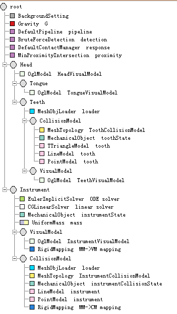

注意：

碰撞模型网格是charged使用对象MeshLoader and Mesh 。

### 5.Constraint： ###

介绍：

这一步教程的目的是在我们的场景中添加约束响应。当两个对象发生碰撞时，约束就会产生，来生成一个力避免下一个时间步的接触。

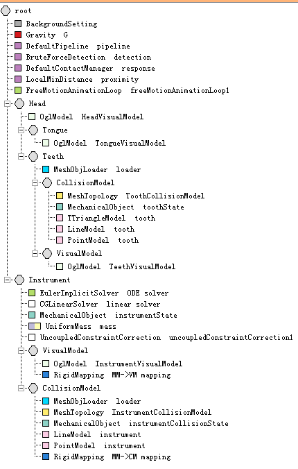

关键点：

- 在根节点下，我们添加FreeMotionAnimationLoop solver从对象中得到约束，计算LCP，然后传递接触校正。
- 在instrument节点，添加UncoupledConstraintCorrection来计算相关对象的约束。

创建过程：

1. 新建文件，删除默认组件MinProximityIntersection和TreeCollisionGroupManager。修改默认的DefaultContacManager组件，修改contact response class为FrictionContact。然后在root节点下，添加BackgroundSetting、Gravity、LocalMinDistance、FreeMotionAnimationLoop组件。修改BackgroundSetting属性，修改Color of the Background of the Viewer为0.901941 0.92549 0.964706.修改Gravity属性，修改Gravity in the world coordinate system为（0 -9.81 0）。修改LocalMinDistance属性，修改Proximity detection distance(接近探测距离)为0.15,修改Distance below which a contact is created(在*距离内创建一个接触)为0.05.

2. 在root节点下创建一个新的GNode，命名为Head。在Head节点下加入OglModel组件，修改属性，在Path to the model下添加” dentistry_haptics/data/mesh/head.obj”文件，然后在Name of the Texture下添加” dentistry_haptics/data/pics/head_basetexbaked.png”文件。

3. 在Head节点下添加新的GNode，命名为Tongue，然后在Tongue下添加OglModel组件，修改属性，在Path to the model下添加” dentistry_haptics/data/mesh/tongue.obj”文件，然后在Name of the Texture下添加” dentistry_haptics/data/pics/teeth_color.png”文件。

4. 在Head节点下再添加一个新的GNode，命名为Teeth，然后在Teeth节点下添加组件MeshObjLoader。修改属性，命名为loader，在Filename of the object下添加” dentistry_haptics/data/mesh/teeth.obj”。

5. 在Teeth节点下，添加新的节点，命名为CollisionModel。然后在CollisionModel下添加组件MeshTopology、MechanicalObject、TTriangleModel、LineModel、PointModel.修改MeshTopology属性，在List of point positions下添加” @../loader.position”。修改MechanicalObject属性，在position coordinates of the degrees of freedom下添加@../loader.position。修改TTriangleModel属性，修改Default contact stiffness（接触刚度）为5，对LineModel、PointModel组件做相同的修改。

6. 在Teeth节点下，添加新的节点，命名为VisualModel。然后在VisualModel节点下，添加组件OglModel。修改属性，在Path to the model下添加” dentistry_haptics/data/mesh/teeth.obj”，然后在Name of the Texture下添加” dentistry_haptics/data/pics/teeth_color.png”。
	
	现在头部模型，包含牙齿和舌头，已经建好。下面是建立设备模型。

7. 在root节点下添加新的节点，命名为Instrument。在Instrument节点下添加EulerImplicitSolver、CGLinearSolver、MechanicalObject（模版为Rigid）、UniformMass（模版为Rigid）以及UncoupledConstraintCorrection（模版为Rigid）组件。修改MechanicalObject 属性，命名为instrumentState。修改UniformMass属性，修改Sum of the particles’ masses为0.05，然后在Rigid file to load the mass parameters下加入” behaviormodels/dental_instrument.rigid”。修改UncoupledConstraintCorrection

8. 在Instrument节点下添加新的节点，命名为VisualModel，在VisualModel节点下添加组件OglModel、RigidMapping。修改OglModel属性，命名为InstrumentVisualModel，在Path to the model下添加” dentistry_haptics/data/mesh/dental_instrument.obj”，然后修改Initial Translation of the object为（0  0  -10）.

9. 在Instrument节点下添加新的节点，命名为CollisionModel。在CollisionModel节点下添加组件MeshObjLoader、MeshTopology、MechanicalObject(模版为Vec3d).修改MeshObjLoader属性，命名为loader，然后在Filename of the object下添加” dentistry_haptics/data/mesh/dental_instrument_centerline.obj”.修改MeshTopology属性，修改List of point positions为@loader.position.修改List of edge indices为@loader.edges.修改MechanicalObject属性，命名为instrumentCollisionState，修改position coordinates of the degrees of freedom为@loader.position。修改Translation of the DOFs为（0 -2 -10）.

10. 在CollisionModel节点下添加组件LineModel、PointModel、RigidMapping（模版为Rigid,Vec3d）.修改RigidMapping属性，修改Input object to map为@instrumentState，修改Output object to map为@instrumentCollisionState.

11. 运行SOFA。

### Connect Omni phanton device: ###

描述：

这一步介绍omni设备，然后连接它，并控制instrument。

关键点：

- 为Omni设备添加一个驱动
- 添加力学状态控制器，得到来自设备生成的数据，更新仿真系统中设备的位置。
- 添加一个触觉力计算（LCPForceFeedback）
- 添加VectorSpringForceField & JointSpringForceField，连接Omni设备和instrument的运动。

创建过程：

1. 在前一个例子的基础上，在root节点下添加新的节点Omni。这个节点要放在Instrument节点的前面。然后添加组件MechanicalObject（模版为Rigid）和MechanicalStateController（模版为Rigid）。修改MechanicalObject属性，命名为DOFs。修改MechanicalStateController属性，修改Main direction and orientation of the controlled DOF为（-1 0 0）。

2. 在Omni节点下添加新的节点RefModel，然后在RefModel节点下添加组件MeshObjLoader、MeshTopology、MechanicalObject（模版为Vec3d）、RigidMapping（模版为Rigid、Vec3d）。修改MeshObjLoader属性，命名为loader，在Filename of the object下添加dentistry_haptics/data/mesh/dental_instrument_centerline.obj文件。修改MeshTopology属性，修改List of point positions为@loader.position。修改List of edge indices为@loader.edges。修改MechanicalObject属性，命名为instrumentCollisionState，修改position coordinates of the degree of freedom为@loader.position。修改Translation of the DOFs为（-1.2 -1.6 3.55）。修改Rotation of the DOFs为（180 0 150）

3. 在Instrument节点下添加新的组件LCPForceFeedback、VectorSpringForceField、JointSpringForceField。修改LCPForceFeedback属性，修改multiply haptic force by this coef.为0.005。修改VectorSpringForceField属性，修改Default edge stiffness used in absence of file information为10，修改Default edge viscosity used in absence of file information为0，打开.scn文件，在VectorSpringForceField中添加object1="@Omni/RefModel/instrumentCollisionState"  object2="@Instrument/CollisionModel/instrumentCollisionState"。修改JointSpringForceField属性，打开.scn文件，在JointSpringForceField中添加object1="@Omni"  object2="@instrumentState"。

4. 最后在Instrument节点下的CollisionModel节点中添加TTriangleModel组件。

5. 完成创建，运行SOFA。

### Deformable model of the Tongue ###

介绍：

我们给舌头添加一个可变形模型。这表示舌头会根据作用在它上的力进行移动和变形。为了实现这个仿真，我们使用组件TetrahedralCorotanionalFEMForceField。它使用有限元的方法来计算内应力。

关键点：

在场景中添加一个可变形模型，我们需要创建一个MechanicalObject。所有的力和位移使用一个欧拉隐式解算器（EulerImplicitSolver）来用于时间积分，以及一个Conjugate Gradient线性解算器（CGLinearSolver）来解算线性方程。我们也需要一个容器来存储四面体（TetrahedronSetTopologyContainer）。通过这些组件，我们可以添加力场来计算内应力（TetrahedralCorotanionalFEMForceField）。

舌头的可视化模型会在一个映射（BarycentricMapping）的作用下，在可变形模型和可视化模型间进行更新。

注意：

- 在当前的场景里，舌头的可视化模型没有显示出来，但是可变形模型以蓝色的四面体显示出来了。
- 舌头的四面体网格使用SOFA中的CGAL插件进行生成。
- 舌头的可变形模型是由DiagonalMass生成。它用于说明SOFA中可用的不同质量。这种质量使用非均匀对角值计算质量矩阵，根据四面体的大小。

创建过程：

1. 在前面例子的基础上，对舌头进行重新建模。在Tongue节点下添加组件VisualStyle、EulerImplicitSolver、CGLinearSolver。

2. 在Tongue节点下继续添加组件MeshVTKLoader、TetrahedronSetTopologyContainer、MechanicalObject。修改MeshVTKLoader属性，命名为@volTongue，在Filename of the object下添加dentistry_haptics/data/mesh/volumetrictongue.vtu。修改TetrahedronSetTopologyContainer属性，命名为volume，然后修改Initial position of points为@volTongue.position，修改List of tetrahedron indices为@volTongue.tetras。修改MechanicalObject属性，命名为mecaTongue。

3. 继续在Tongue节点下添加组件DiagonalMass、TetrahedralCorotationalFEMForceField.修改TetrahedralCorotationalFEMForceField属性，命名为FEM，然后修改FEM Young Modulus为3000.删除OglModel组件。

4. 在Tongue节点下添加新的节点TongueVisualModel，然后添加组件OglModel和BarycentricMapping。修改OglModel属性，命名为TongueVisualModel，在Path to the model下添加” dentistry_haptics/data/mesh/tongue.obj”，然后在Name of the Texture下添加dentistry_haptics/data/pics/tongue_color.png。

5. 完成创建，运行SOFA。

### Collision model of the Tongue ###

介绍：添加节点TongueCollisionModel，考虑舌头的碰撞。

我们可以使用不同的网格（没有例子那么复杂）来对舌头进行碰撞建模，或者我们只使用在可变形模型中用到的体积网格的表面。这可以通过拓扑映射来完成。

创建过程：

1. 同样的在前一个例子的基础上，在Tongue节点下添加新的节点TongueCollisionModel。然后添加组件TriangleSetTopologyContainer、TriangleSetTopologyModifier、TriangleSetTopologyAlgorithms、TriangleSetGeometryAlgorithms.修改TriangleSetTopologyContainer属性，命名为TriContainer。

2. 在TongueCollisionModel节点下添加组件Tetra2TriangleTopologicalMapping、MechanicalObject、TTriangleModel、IdentityMapping(模版为Vec3d,Vec3d)。修改Tetra2TriangleTopologicalMapping属性，修改input="@../volume"  output="@TriContainer"。修改MechanicalObject属性，命名为colTongue。修改TTriangleModel属性，取消选择flag indicating if this collision model is active and should be included in default collision detections。修改IdentityMapping属性，取消选择Are forces mapped和Are masses mapped,最后修改input="@../mecaTongue"  output="@colTongue"。

### Annex: Mesh generation ###

初步注意：

注意这个场景需要CGAL插件。你必须编译并使用它。

介绍：

这个场景不是一个仿真，它只是从一个表面网格生成一个体积网格。和表面网格不同，体积网格变现对象的内部体积。目地是创建这个网格，然后导出它作为一个VTK文件，在之后的其它仿真中使用它。

关键点：

- 使用Mesh组件，加载表面网格。
- MeshGenerationFromPolyhedron组件（只有在CGAL插件下可用）从表面网格生成内部体积。
- 我们从第二个Mesh组件生成几何创建一个网格。
- 我们使用VTKExporter组件导出VTK文件格式的网格

注意：

MeshGenerationFromPolyhedron组件需要一些关键的参数来生成质量好的网格。
