## SOFA中切割的例子 ##

## 目录 ##

- 一、例子 TriangleSurfaceCutting(面切割)
- 二、SOFA中鼠标交互的管理
- 三、肝脏拓扑消除例子
- 四、眼睛视网膜网格消除的例子
 
## 一、例子 TriangleSurfaceCutting(面切割) ##

场景图：

 

创建过程：

1. 新建组件，保留默认组件，修改组件MinProximityIntersection属性，修改Proximity dection distance为0.8, Distance below which a contact is created为0.5。

2. 在root节点下添加新节点SquareGravity，然后添加组件EulerImplicitSolver和CGLinearSolver。

3. 在SquareGravity节点下继续添加组件MeshGmshLoader、TriangleSetTopologyContainer、TriangleSetTopologyModifier、TriangleSetTopologyAlgorithms、TriangleSetGeometryAlgorithms。

	修改MeshGmshLoader属性，命名为meshLoader，在Filename of the object下添加mesh文件夹中的square3.msh文件；修改Scale of the DOFs in 3 dimensions为（10 10 10）。

	修改TriangleSetTopologyContainer属性，修改Initial position of points为@meshLoader.position，修改List of edge indices为@meshLoader.edges，修改List of triangle indices为@meshLoader.triangles。

4. 在SquareGravity节点下添加MechanicalObject、DiagonalMass、FixedConstraint组件。

	修改DiagonalMass属性，修改mass density that allows to compute the particles masses from a mesh topology and geometry. Only used if > 0为0.15;

	修改FixedConstraint属性，修改Indices of the fixed points为2，添加（0 1）.

5. 在SquareGravity节点下继续添加组件TriangularFEMForceField、TriangularBendingSprings、TTriangleModel。

	修改TriangularFEMForceField属性，修改Poisson ratio in Hooke's law(vector)为0.3，修改Young modulus in Hooke's law(vector)为60.

	修改TriangularBendingSprings属性，修改uniform stiffness for the all springs为300。

6. 继续添加组件OglModel和IdentityMapping（模版为Vec3d,ExtVec3d）。

	修改OglModel属性，命名为Visual，修改Diffuse为红色；

	修改IdentityMapping属性，添加input="@./"  output="@Visual"。

7. 运行SOFA，使用鼠标进行薄纱切割仿真，鼠标中键去除一些基元，右键单击鼠标分两步创建切口。

效果如下：
 
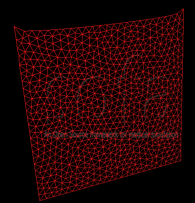

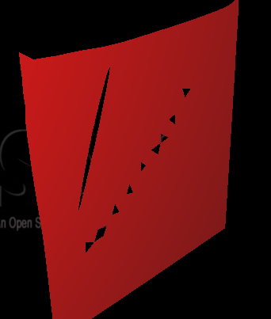 

## 二、SOFA中鼠标交互的管理 ##

### SOFA网站上关于鼠标交互的介绍 ###

鼠标管理：

基本的鼠标交互如下：

- 在鼠标上附加一个对象：当点击时，鼠标发出一条射线，在射线的一点间创建一个弹簧，然后会遇到一个DOF（自由度）
- 固定选择的粒子：当点击时，碰撞模型上靠近鼠标的粒子会通过一个牵引弹簧固定。
- 沿一条路径切割：按着鼠标，你能根据鼠标的路径进行切割。（只对三角网格有用）
- 使用鼠标设置动作势能：允许通过射线注入势能值给最靠近的DOF。
- 执行拓扑操作：对进行一些拓扑改变有用。目前只能移除基元。
- 给缝合两点添加弹簧：允许创建弹簧，伴随一个无效的静息长度，在两点之间，为了连接它们。
- 给没有“皮肤”的模型添加框架

可用操作：

**在鼠标上附加一个对象**

当点击时，鼠标发出一条射线，在射线的一点间创建一个弹簧，然后会遇到一个DOF（自由度）

当点击移动时，碰撞模型会出现。当点击鼠标按键进行移动，这将移动被选择的dof。然后释放鼠标按键，对象将恢复到它的平衡位置（如果力学特性允许的话）。反之释放按键会固定对象在当前位置。

**固定选择的粒子**

当点击时，碰撞模型上靠近鼠标的粒子会通过一个牵引弹簧固定。
当移动时，碰撞模型会出现，然后点击鼠标按键会通过牵引弹簧固定靠近鼠标的碰撞模型粒子。

**沿一条路径切割**

这种操作允许在一个三角网格上仿真切割。有两种方法来执行切割：

- 通过细分

	这种方法，第一次点击确定了切割的起始位置，然后第二次点击确定结束位置。在这两点间切割会被执行。如果你不释放"shift"键，你可以继续点击。切割会在之前的点和这个新点间执行。然后你可以获得连续切割。

	更高级的方法可通过以下方法设置：

	1. 从边缘到折断的距离：这允许执行切割一直到网格边缘或从网格边缘开始。为了这样子，你需要靠近边界点击。然后，点击的位置所定义面积的参数会被边界同化。更详细点是，对于一个在边界网格的三角。这一面积被边界和它质心点的最大值所定义。因此，采用100%的值意味着在边界和质心点的一次点击会被认为是点击在边界上。在这种情况下，两个选项会出现。要么点击接近顶点，要么切割会扩大到最后。或者切割只在边界上的正交投影点被点击后才执行。

	2. 沿着路径折断的距离：这允许沿着切割路径进行切割而不创建小三角。例如，如果切割路径经过靠近一个三角的一点，而不是切割边缘，那么会创建一个新的小三角，这个最后的点会被移动到切割路径上去。同样的，这里百分比和路径相关。因此，对于100%的值，这意味着切割通过一个点和质心点。最后的点会被移去。

	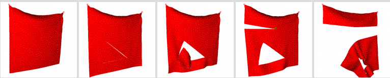
 
- 连续的

	第二种方法中，首次点击会初始化切割，然后切口会跟随鼠标的移动（就好像鼠标是一个切割刀）。同样的，释放"shift"键会结束切割。暂时的，这种方法不能处理snapping选项。

	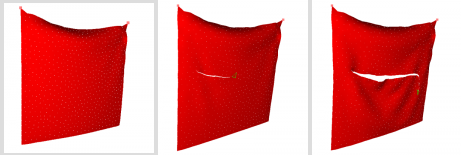
 
**使用鼠标设置动作势能**

这种操作允许通过射线注入势能值给最靠近的DOF。两个参数需要指明：

- 要注入的值
- 需要设置值的mechanicalObject的XML标签

**执行拓扑操作**

- 移除一个元素：这种操作允许移除一个拓扑元素（表面或体积，根据碰撞模型的类型）。注意移除一个体积元素是可行的，通过使用一个表面碰撞模型，如果这个场景中包括一个拓扑映射。

- 移除一区域元素：这一操作允许移除一区域元素（对于面是圆，对于立方体是球体）。根据使用到的碰撞模型会遇到不同的情况。

对于表面碰撞模型：

1. 在表面网格，它会移除一部分网格（见下图）。

	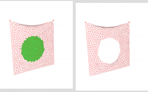

2. 在一个体网格上，使用面选项会移除表面元素以及关联的体积元素（这样会sharp表面上的元素，见下图1）。使用体积选项会移除一个球体积元素（见下图2）。

	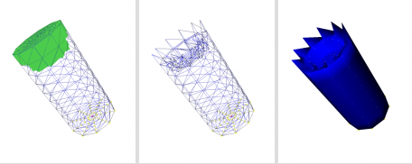

	图1
	
	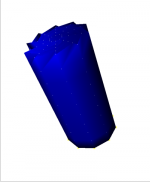  

	图2

对于体积碰撞模型：

1. 使用体积选项会和以上具有相同的结果（移除一个球体积元素）
2. 使用面选项会移除在表面网格上的一层（见下图）。

## 三、肝脏拓扑消除例子 ##

场景图：

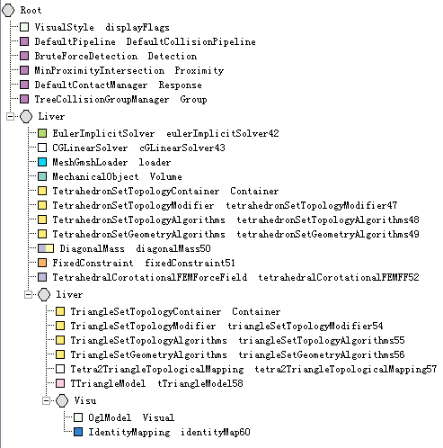

创建过程：

1. 新建文件，保留默认组件。
2. 在root节点下，添加节点Liver，然后添加组件EulerImplicitSolver、CGLinearSolver。
3. 在Liver节点下添加组件MeshGmshLoader、MechanicalObject。

	修改MeshGmshLoader属性，命名为loader，然后在Filename of the object下添加mesh文件夹下的liver.msh文件；

	修改MechanicalObject属性，命名为Volume，修改position coordinates of the degrees of freedom为@loader.position。

4. 在Liver节点下添加组件TetrahedronSetTopologyContainer、TetrahedronSetTopologyModifier、TetrahedronSetTopologyAlgorithms、TetrahedronSetGeometryAlgorithms。

	修改TetrahedronSetTopologyContainer属性，命名为Container，修改Initial position of points为@loader.position，修改List of edge indices为@loader.edges，修改List of triangle indices为@loader.triangles，修改List of tetrahedron indices为@loader.tetras。

5. 在Liver节点下继续添加组件DiagonalMass、FixedConstraint、TetrahedralCorotationalFEMForceField。

	修改DiagonalMass属性，修改mess density that allows to compute the particles masses from a mesh topology and geometry. Only used if>0。为0.5；

	修改FixedConstraint属性，修改Indices of the fixed points为3，然后添加（3 39 64）；

	修改TetrahedralCorotationalFEMForceField属性，修改FEM Poisson Ratio为0.3，FEM Young Modulus为3000.

6. 在Liver节点下，添加新的节点liver，然后添加组件TriangleSetTopologyContainer、TriangleSetTopologyModifier、TriangleSetTopologyAlgorithms、TriangleSetGeometryAlgorithms。

	修改TriangleSetTopologyContainer属性，命名为Container，修改Filename of the mesh为@.fileTopology，修改Number of points为@.nbPoints，修改Initial position of points为@.position，修改List of edge indices为@.edges，修改It ture, will check the connexity of the mesh为@.checkConnexity，修改List of triangle indices为@.triangles。

7. 在liver节点下添加组件Tetra2TriangleTopologicalMapping、TTriangleModel。

8. 在liver节点下新添节点Visu，然后添加组件OglModel、IdentityMapping（模版为Vec3d,ExtVec3f）。

	修改OglModel属性，命名为Visual，修改Diffuse为红色。

9. 运行SOFA，使用鼠标消除网格，效果如下：

	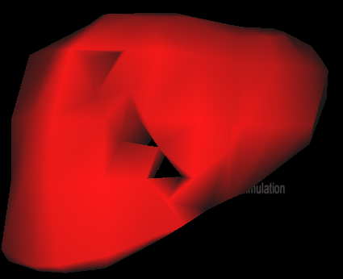 

## 四、眼睛视网膜网格消除的例子 ##

场景图：

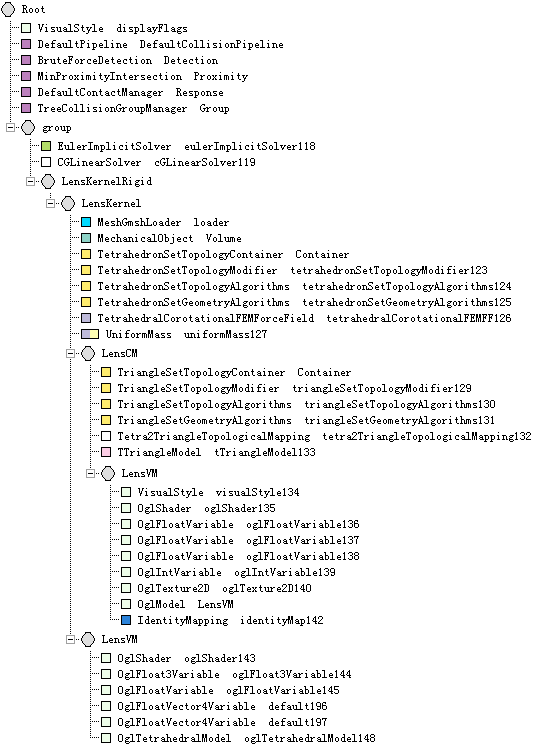

这个例子是在原来完整的眼睛手术的例子上的顺序进行创建的。

创建过程：

1. 新建文件，保留默认组件。

2. 在root节点下，添加节点group，然后在这个节点下添加组件EulerImplicitSolver、CGLinearSolver。

3. 然后在group节点下添加节点LensKernelRigid，在这个节点下添加节点LensKernel。

4. 在LensKernel节点下，添加组件MeshGmshLoader、MechanicalObject。

	修改MeshGmshLoader属性，命名为loader，在Filename of the object下添加“ophtalmo/data/mesh/eye_lens_cortex_3.msh”文件；

	修改MechanicalObject属性，命名为Volume，修改position coordinates of the degrees of freedom为@loader.position。

5. 在LensKernel节点下添加组件TetrahedronSetTopologyContainer、TetrahedronSetTopologyModifier、TetrahedronSetTopologyAlgorithms、TetrahedronSetGeometryAlgorithms。
修改TetrahedronSetTopologyContainer属性，命名为Container，修改Initial position of points为@loader.position，修改List of edge indices为@loader.edges，修改List of triangle indices为@loader.triangles，修改List of tetrahedron indices为@loader.tetras。

6. 在LensKernel节点下添加组件TetrahedralCorotationalFEMForceField、UniformMass。
修改TetrahedralCorotationalFEMForceField属性，修改FEM Young Modulus为2000；
修改UniformMass属性，修改Sum of the particles' masses为0.01。

7. 在LensKernel节点下，添加节点LensCM，然后在这个节点下添加组件TriangleSetTopologyContainer、TriangleSetTopologyModifier、TriangleSetTopologyAlgorithms、TriangleSetGeometryAlgorithms。

	修改TriangleSetTopologyContainer属性，命名为Container，修改Filename of the mesh为@.fileTopology，修改Number of points为@.nbPoints，修改Initial position of points为@.position，修改List of edge indices为@.edges，修改It true, will check the connexity of the mesh为@.checkConnexity，修改List of triangle indices为@.triangles。

8. 在LensCM节点下添加组件Tetra2TriangleTopologicalMapping、TTriangleModel。

	修改Tetra2TriangleTopologicalMapping属性，添加input="@../Container"  output="@Container"；

	修改TTriangleModel属性，修改Default contact stiffness为10000，修改Default contact friction coefficient为0。

9. 在节点LensCM下添加节点LensVM，然后在这个节点下添加组件VisualStyle、OglShader、OglFloatVariable、OglFloatVariable、OglFloatVariable、OglIntVariable、OglTexture2D。

	修改VisualStyle属性，选择Visual；

	修改OglShader属性，修改Set the vertex shader filename to loader为shaders/generalRenderingShader.vert，修改Set the fragment shader filename to load为shaders/generalRenderingShader.frag；

	修改（第一个）OglFloatVariable属性，修改Set an ID name为altitude，修改Set Uniform Value为0.2；

	修改（第二个）OglFloatVariable属性，修改Set an ID name为border_alpha，修改Set Uniform Value为0.4；

	修改（第三个）OglFloatVariable属性，修改Set an ID name为border_gamma，修改Set Uniform Value为1；

	修改OglIntVariable属性，修改Set an ID name为axis，修改Set Uniform Value为2；

	修改OglTexture2D属性，修改Set an ID name为planeTexture，修改Texture2D Filename为textures/lights4-small-noise.png。

10. 在LensVM节点下继续添加组件OglModel、IdentityMapping（模版为Vec3d,ExtVec3f）。

	修改OglModel属性，命名为LensVM，修改Ambient为（33 28 20 7），修改Diffuse为（165 140 114 7）；

	修改IdentityMapping属性，添加input="@../.."  output="@LensVM"。

11. 在LensKernel节点下添加新的节点LensVM，然后添加组件OglShader、OglFloat3Variable、OglFloatVariable、OglFloatVector4Variable、OglFloatVector4Variable、OglTetrahedralModel。

	修改OglShader属性，修改Set the vertex shader filename to load为shaders/PT.vert，修改Set the fragment shader filename to loader为shaders/PT.frag，修改Set the geometry shader filename to loader为shaders/PT.geo，修改Set input types for the geometry shader为10，修改Set output types for the geometry shader为5，修改Set max number of vertices in output for the geometry shader为12；

	修改OglFloat3Variable属性，修改Set an ID name为fragmentColor，修改Set Uniform Value为（0.7 0.6 0.6）；

	修改OglFloatVariable属性，修改Set an ID name为fragmentOpacity，修改Set Uniform Value为3；

	修改(第一个)OglFloatVector4Variable属性，修改Set an ID name为MappingTable;（其中的Set Uniform Value不知道该如何修改？）

	修改(第二个)OglFloatVector4Variable属性，修改Set an ID name为RunSelectTable。（其中的Set Uniform Value不知道该如何修改？不修改运行时会出现错误）

12. 运行SOFA，效果如下：

	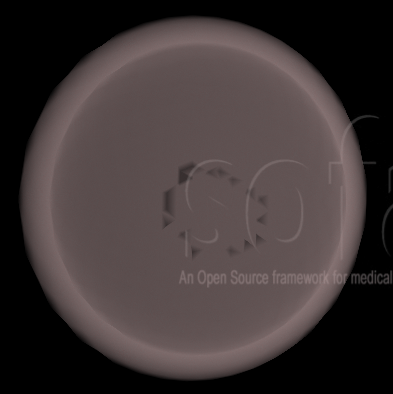