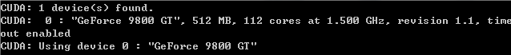
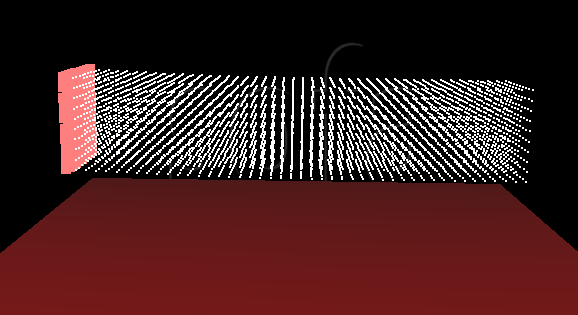

## SofaCUDA ##

## 目录 ##

- 一、安装SofaCUDA插件
- 二、创建例子beam10x10x46-fem-implicit-CPU.scn
- 三、利用SofaCUDA插件创建的例子（修改）

## 一、安装SofaCUDA插件 ##

SofaCUDA是一个插件，提供了一些Sofa组件，在使用CUDA时能够应用。它允许显卡进行多线程编程。这可以在使用许多网格仿真时，极大的改善场景的性能。

1. 安装CUDA开发工具
    - 1.1首先确认电脑上有一个CUDA-Capable GPU

        右键点击我的电脑——>设备管理器——>显示适配器。在我的电脑上显示的是NVIDIA GeForce 9800 GT。然后查看显卡型号是否在[这个列表](http://www.nvidia.com/object/cuda_gpus.html)上。可以看到GeForce 9800 GT在列表上，然后计算能力为1.0。

    - 1.2下载NVIDIA CUDA Toolkit

        在[这里](https://developer.nvidia.com/cuda-downloads)下载NVIDIA CUDA Toolkit。NVIDIA CUDA Toolkit包含了驱动和需要创建的工具。

    - 1.3安装CUDA

        下载完后，直接安装就好了。

    - 1.4检验安装

        运行编译好的例子

        在命令提示符下输入：nvcc -V，检查CUDA Toolkit的版本。

        在Win7下进入到“C:\ProgramData\NVIDIA Corporation\CUDA Samples\v5.0\bin\win32\Release”文件夹，然后运行“deviceQuery”，来验证硬件和软件是否正确配置。

        运行“bandwidthTest”，来测试系统和CUDA-capable设备能够正确的通信。

        为了检验CUDA的图形表现能力，可以运行“Particles ”。

        以上都没问题，说明CUDA安装成功了。

        注意如果运行以上程序时，出现CUDA error，可能是因为系统的内存不够了，可以关掉电脑运行的一些程序，然后再次运行上面的示例。

        参考自：[NVIDIA CUDA Getting Started Guide for Microsoft Windows](http://docs.nvidia.com/cuda/cuda-getting-started-guide-for-microsoft-windows/index.html)

2. 在SOFA中编译CudaCompilation

    CUDA安装好后，在SOFA中编译CudaCompilation很简单。使用CMake，过程和之间介绍的一样，只是在这里要选择SOFA-PLUGIN_SOFACUDA选项（还有一些其它选项，可以参考SOFA网站上的说明进行选择）。选择完之后，Configure，Generate，然后就能够进行编译了。

3. 测试

    编译完成后，可以使用Sofa中提供的例子进行测试，其中使用了SofaCuda的例子在“Sofa\applications\plugins\SofaCUDA\examples”文件夹中。

    打开Sofa Modeler，选择Edit——>Plugin Manager——>Add ...，之后选择“SofaCUDA_1_0.dll”文件，这样就将SofaCUDA插件添加进来了，其中在Component list中可以看到新增加的组件。

    之后再次运行Sofa Modeler，可以看到命令提示框中显示如下：

    

    说明Sofa已经可以使用CUDA了，运行例子，显示的效果可以看出更加流畅了。
 
## 二、创建例子beam10x10x46-fem-implicit-CPU.scn ##

创建过程：

1. 新建文件，删除默认组件MinProximityIntersection和ThreeCollisionGroupManager。增加组件NewProximityIntersection。修改NewProximityIntersection的属性，修改"Proximity detection distance"为0.002，修改"Distance below which a contact is created"为0.001。（这里是修改碰撞检测的距离）

2. 增加节点Floor。在Floor节点下，添加组件RegularGridTopology和MechanicalObject（模版为Vec3d）。

    修改RegularGridTopology属性，修改“Min end of the diagonal”为（10 -3.05 -10），修改“Max end of the diagonal”为（-10 -3.05 10），修改“Offset all the grid points”为（10 -3.05 -10）；

    修改List of edge indices为4，修改为以下值：

    0      1

    2      3

    0      2

    1      3

    修改List of quad indices为1，修改List of hexahedron indices为0；

    修改grid resoulution（网格分辨率）为（2 1 2）。

    或是直接修改对应XML文件中的内容，替换为：
          
        <RegularGrid
               nx="2" ny="1" nz="2"
               xmin="10" xmax="-10"
               ymin="-3.05" ymax="-3.05"
               zmin="-10" zmax="10" />

    不需要对MechanicalObject属性做修改。

3. 在Floor节点下添加新的节点Visu。

    在Visu节点下添加组件OglModel和IdentityMapping（模版为Vec3d,ExtVec3f）。

    修改OglModel属性，命名为“Visual”，可以将Diffuse改为红色。

    修改IdentityMapping属性，

4. 上面完成了Floor模型创建，接下来在root节点下，添加新的节点M1，然后添加组件EulerImplicitSolver和CGLinearSolver。

5. 在M1节点下，添加组件RegularGridTopology和MechanicalObject（模版为Vec3d）。

    修改组件RegularGridTopology属性，修改“Min end of the diagonal”为（-1.5 0 -7.5），修改“Max end of the diagonal”为（1.5 3 7.5），修改“Offset all the grid points”为（-1.5 0 -7.5）；

    修改grid resoulution（网格分辨率）为（10 10 46）。

    直接修改对应XML文件中的内容，替换为：
      
        <RegularGrid
               nx="10" ny="10" nz="46"
               xmin="-1.5" xmax="1.5"
               ymin="0" ymax="3"
               zmin="-7.5" zmax="7.5"
          />

    不需要对MechanicalObject属性做修改。

6. 在M1节点下添加组件UniformMass（模版为Vec3d）、BoxROI(模版为Vec3d)和FixedConstraint（模版为Vec3d）。

    修改UniformMass属性，修改“Sum of the particles' masses”（粒子的总质量）为400。

    修改BoxROI属性，修改"Box defined by xmin, ymin, zmin, xmax, ymax, zmax"为1，添加（-1.6 -0.1 -7.6 1.6 3.1 -7.4）。

    修改FixedConstraint属性，修改Indices of the fixed points为“@[-1].indices”。

7. 在M1节点下添加组件TetrahedronFEMForceField（模版为Vec3d）和PlaneForceField（模版为Vec3d）。

    修改TetrahedronFEMForceField属性，修改“FEM Poisson Ratio”为0.4，修改FEM Young Modulus为1，值为10000；

    修改PlaneForceField属性，修改“plane d coef”为-3，修改“force stiffness”为10000，选择“enable/disable drawing of plane”。

8. 在M1节点下，添加新的节点1，然后添加组件RegularGridTopology、MechanicalObject（模版为Vec3d）、TSphereModel（模版为Vec3d）、BarycentricMapping（模版为Vec3d，Vec3d）。

    修改RegularGridTopology属性，修改“Min end of the diagonal”为（-0.75 0.75 -5.5），修改“Max end of the diagonal”为（0.75 2.25 6.5），修改“Offset all the grid points”为（-0.75 0.75 -5.5）；

    修改grid resoulution（网格分辨率）为（2 2 9）。｝

    直接修改对应XML文件中的内容，替换为：
                  
        <RegularGrid
            nx="2" ny="2" nz="9"
            xmin="-0.75" xmax="0.75"
            ymin="0.75" ymax="2.25"
            zmin="-5.5" zmax="6.5"
        />

    不需要对MechanicalObject属性做修改。

9. 在M1节点下，添加新的节点2，然后添加组件CubeTopology、VisualModelImpl、SubsetMapping（模版为Vec3d，ExtVec3f）。

    修改CubeTopology属性，修改"x grid resolution"为10、修改"y grid resolution"为10、修改"z grid resolution"为46，选择split corner points to have planar normals，修改Min为（-1.5 0 -7.5），修改Max为（1.5 3 7.5）；｝

    直接修改对应XML文件中的内容，替换为：
            
          <CubeTopology internalPoints="0" splitNormals="1"  
                    nx="10" ny="10" nz="46"
                    xmin="-1.5" xmax="1.5"
                    ymin="0" ymax="3"
                    zmin="-7.5" zmax="7.5"
          />

    修改VisualModelImpl属性，命名为Visual；

10. 运行Sofa，效果如下：

    

## 三、利用SofaCUDA插件创建的例子（修改） ##

1. 在root节点下添加组件RequiredPlugin，将组件NewProximityIntersection替换为组件CudaProximityIntersection。同样的修改CudaProximityIntersection属性，修改"Proximity detection distance"为0.002，修改"Distance below which a contact is created"为0.001。

2. 替换M1节点下的MechanicalObject组件（模版为Vec3d），将这个组件替换为模版为CudaVec3f的MechanicalObject组件。

3. 替换M1节点下的UniformMass组件（模版为Vec3d），将这个组件替换为模版为CudaVec3f的UniformMass组件。修改UniformMass属性，修改“Sum of the particles' masses”（粒子的总质量）为400。

4. 修改M1节点下的BoxROI组件（模版为Vec3d），替换为模版为CudaVec3f的BoxROI组件。

    修改BoxROI属性，修改"Box defined by xmin, ymin, zmin, xmax, ymax, zmax"为1，添加（-1.6 -0.1 -7.6 1.6 3.1 -7.4）。

5. 修改M1节点下的FixedConstraint组件（模版为Vec3d），替换为模版为CudaVec3f的FixedConstraint组件。

    修改FixedConstraint属性，修改Indices of the fixed points为“@[-1].indices”。

6. 同样的，修改TetrahedronFEMForceField的模版为CudaVec3f。修改TetrahedronFEMForceField属性，修改“FEM Poisson Ratio”为0.4，修改FEM Young Modulus为1，值为10000；

    修改PlaneForceField的模版为CudaVec3f。修改PlaneForceField属性，修改“plane d coef”为-3，修改“force stiffness”为10000，选择“enable/disable drawing of plane”。

7. 类似的，修改节点1下的组件MechanicalObject模版为CudaVec3f，修改TSphereModel模版为CudaVec3f，修改BarycentricMapping模版为（CudaVec3f,CudaVec3f）。

8. 最后，将节点2下的组件VisualModelImpl替换为模版为CudaVec3f的MappedObject组件。修改MappedObject的属性，命名为Mapped。

    修改SubsetMapping模版为（CudaVec3f,CudaVec3f）。

9. 运行SOFA，可以看出运行比之前流畅一些。
