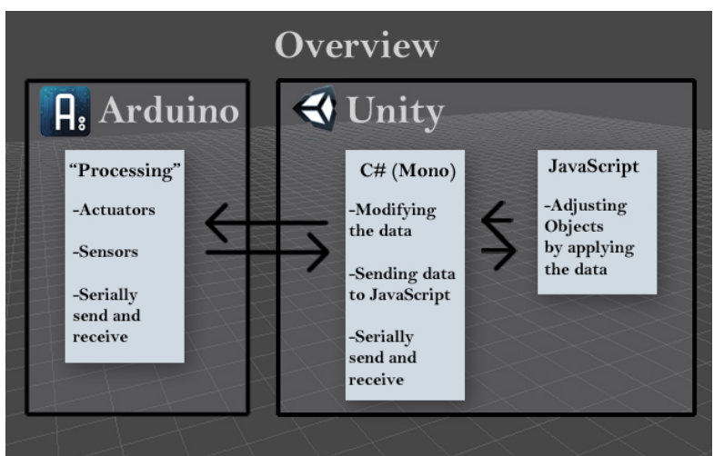

##概览

1. Unity发送字符或数字给串口。
2. 当Arduino接收到后，Adruino发送所有的输入和输出到串口。
3. Unity接收到这个信息，然后使用C#脚本处理成适当的格式。
4. JavaScript然后从C#脚本中接收这些数据，之后可以很容易的使用这些数据修改Unity中任意
或所有的对象。

##教程

###快速和简单的设置
1. 将Unity项目文件放在容易读取的位置。
2. 打开并上传程序‘Arduino-Unity_sketch.pde’到Arduino。
3. 在Unity中，打开名为‘Unity project files’的Unity项目文件夹。
4. 打开场景‘Direct Connection Arduino’。
5. 要保证在脚本'GuiArduinoSerialScript.cs'中的串口号正确。这个脚本位于Standard Assets/Scripts/Direct Connection。
在第七行，你要改变变量'COMPort'。
6. 在Unity中按下Play按钮。
7. GameObjects(cubes)旋转很快或很慢，根据模拟输入的变化。当数字输入为1时，GameObjects上移，然后当为0时，回到原始位置。

