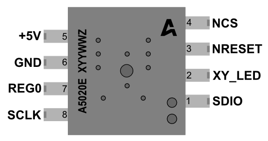
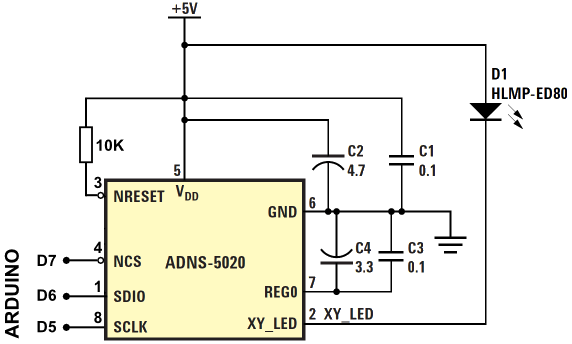

## 将光学鼠标转为Arduino Web摄像机 ##

光学鼠标使用小的相机来记录表面用来计算鼠标的移动。这个教程中我会展示如何在你的浏览器中显示这个相机的信号。

我使用的鼠标是Logitecg RX 250，其中有ADNS-5020光学传感器。这个传感器以灰度的形式记录15x15像素的图片。它包括鼠标的X-Y运动。

你需要的东西有：

- Arduino
- Ethernet shield
- 带有ADNS-5020传感器的光学鼠标
- 10K电阻

### 连接 ###

要确保传感器的（NRESET，NCS，DSIO，SCLK）引脚不要连到鼠标的任何东西。

电路连接如下

### Arduino程序 ###

在下面的程序中替换receiverIP（我的电脑为192.168.1.102）值为你的电脑IP。

	#include <SPI.h>
	#include <Ethernet.h>
	#include <EthernetUdp.h>

	byte arduinoMac[] = { 0xDE, 0xAD, 0xBE, 0xEF, 0xFE, 0xED };
	IPAddress arduinoIP(192, 168, 1, 177); // desired IP for Arduino
	unsigned int arduinoPort = 8888;      // port of Arduino

	IPAddress receiverIP(192, 168, 1, 102); // IP of udp packets receiver
	unsigned int receiverPort = 6000;      // port to listen on my PC

	EthernetUDP Udp;

	int SCLK = 5;
	int SDIO = 6;
	int NCS  = 7;

	void setup() {
	  Serial.begin(9600);
	  Ethernet.begin(arduinoMac,arduinoIP);
	  Udp.begin(arduinoPort);
  
	  pinMode(SCLK, OUTPUT);
	  pinMode(SDIO, OUTPUT);
	  pinMode(NCS, OUTPUT);
  
	  mouse_reset();
	  delay(10);
	}

	void loop() {
	  char img[225];
	  for (int i=0;i<225;i++){
	      img[i]=readLoc(0x0b);
	      img[i] &= 0x7F;
	      img[i]+=1;//if there is 0 value, part of udp package is lost
	      Serial.print(img[i], DEC);
	      Serial.print(",");
	      delay(2);
	  }  
	  Serial.println();
	  Udp.beginPacket(receiverIP, receiverPort); //start udp packet
	  Udp.write(img); //write mouse data to udp packet
	  Udp.endPacket(); // end packet
	
	  delay(500);
	}
	
	void mouse_reset(){
	  // Initiate chip reset
	  digitalWrite(NCS, LOW);
	  pushbyte(0x3a);
	  pushbyte(0x5a);
	  digitalWrite(NCS, HIGH);
	  delay(10);
	  // Set 1000cpi resolution
	  digitalWrite(NCS, LOW);
	  pushbyte(0x0d);
	  pushbyte(0x01);
	  digitalWrite(NCS, HIGH);
	}

	unsigned int readLoc(uint8_t addr){
	  unsigned int ret=0;
	  digitalWrite(NCS, LOW);
	  pushbyte(addr);
	  ret=pullbyte();
	  digitalWrite(NCS, HIGH);
	  return(ret);
	}
	
	void pushbyte(uint8_t c){
	  pinMode(SDIO, OUTPUT);
	  for(unsigned int i=0x80;i;i=i>>1){
	    digitalWrite(SCLK, LOW);
	    digitalWrite(SDIO, c & i);
	    digitalWrite(SCLK, HIGH);
	  }
	}
	
	unsigned int pullbyte(){
	  unsigned int ret=0;
	  pinMode(SDIO, INPUT);
	  for(unsigned int i=0x80; i>0; i>>=1) {
	    digitalWrite(SCLK, LOW);
	    ret |= i*digitalRead(SDIO);
	    digitalWrite(SCLK, HIGH);
	  }
	  pinMode(SDIO, OUTPUT);
	  return(ret);
	}

打开串口窗口，你会看到鼠标数据的输出。

### 安装Node.js和Socket.IO ###

为了在浏览器中显示数据，你需要安装Node.js和socket.io。首先安装Node.js，然后使用下面命令安装Socket.IO：

	npm install socket.io

### Node.js和网站程序 ###

下面的代码中，我们配置node.js来监听来自Arduino的数据，使用socket.io发送所有的数据到浏览器，然后设置一个基本的web服务器。

	var dgram = require("dgram");
	var server = dgram.createSocket("udp4");

	var io = require('socket.io').listen(8000); // server listens for socket.io communication at port 8000
	io.set('log level', 1); // disables debugging. this is optional. you may remove it if desired.

	server.on("message", function (msg, rinfo) { //every time new data arrives do this:
	  //console.log("server got: " + msg + " from " + rinfo.address + ":" + rinfo.port); 
	  //console.log("server got:" + msg); 
	  io.sockets.emit('message', msg);
	});

	server.on("listening", function () {
	  var address = server.address();
	  console.log("server listening " + address.address + ":" + address.port);
	});

	server.bind(6000); //listen to udp traffic on port 6000

	var http = require("http"),
	    url = require("url"),
	    path = require("path"),
	    fs = require("fs")
	    port = process.argv[2] || 8888;

	http.createServer(function(request, response) {

	  var uri = url.parse(request.url).pathname
	    , filename = path.join(process.cwd(), uri);

	  var contentTypesByExtension = {
	    '.html': "text/html",
	    '.css':  "text/css",
	    '.js':   "text/javascript"
	  };

	  fs.exists(filename, function(exists) {
  
		if(!exists) {
	      response.writeHead(404, {"Content-Type": "text/plain"});
	      response.write("404 Not Found\n");
	      response.end();
	      return;
	    }
	
	    if (fs.statSync(filename).isDirectory()) filename += '/index.html';

	    fs.readFile(filename, "binary", function(err, file) {
	      var headers = {};
	      var contentType = contentTypesByExtension[path.extname(filename)];
	      if (contentType) headers["Content-Type"] = contentType;
	      response.writeHead(200, headers);
	      response.write(file, "binary");
	      response.end();
	    });
	  });
	}).listen(parseInt(port, 10));

	console.log("Static file server running at\n  => http://localhost:" + port + "/\nCTRL + C to shutdown");

只要将上面的代码保存为code.js就行了。

我们需要创建一个网站来转换从socket.io得到的数据为15x15图片。

代码如下：

	<html>
	<head>
		
		
		
	</head>
	<body>
		

	</body>
	</html>

代码保存为index.html

### 运行 ###

运行：

	node code.js

然后在浏览器打开http://localhost:8888/，你会看到来自鼠标实时的图片。

原文链接：[Convert Optical Mouse into Arduino Web Camera](http://frenki.net/2013/12/convert-optical-mouse-into-arduino-web-camera/)