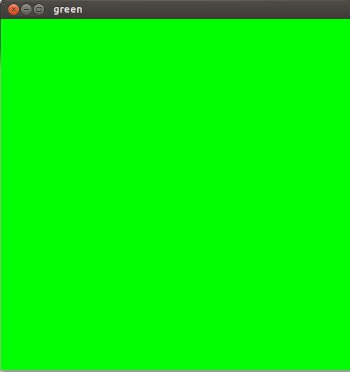

# 1.绿色的窗口 #

## 程序Green_window.c ##
 
	#include<GL/glut.h>
 
	void green(void){
    	glClear(GL_COLOR_BUFFER_BIT);
    	glFlush();
	}
 
	int main(int argc,char** argv){
    	glutInit(&argc, argv);
    	glutInitWindowSize(500,500);
    	glutInitDisplayMode(GLUT_SINGLE|GLUT_RGB);
    	glutCreateWindow("green");
    	glutDisplayFunc(green);
    	glClearColor(0.0,1.0,0.0,0.0);
    	glutMainLoop();
    	return 0;
	}

## 测试 ##

	# gcc -lGL -lGLU -lglut Green_window.c
	# ./a.out

## 效果 ##
	

### 链接 ###

[Computer Graphics – 1. Print Green Window](http://www.techtofun.com/2013/08/11/computer-graphics-1-print-green-window/)