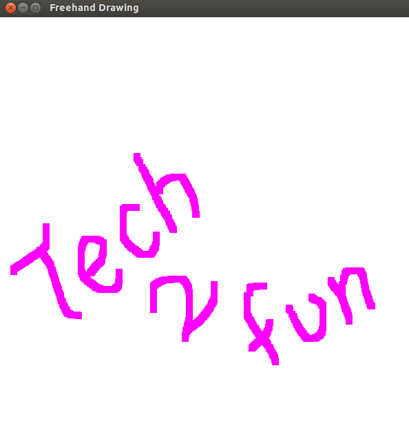

# 10.徒手画#

## 程序Freehand_Drawing.cpp ##
 
	#include<GL/glut.h>
	#include<cmath>
 
	GLint screen_height=600;
	GLint screen_width=600;	
	int brush_size=10;
 
	void free_dots(void){
    	glClear(GL_COLOR_BUFFER_BIT);
    	glFlush();
	}
 
	void point(GLint x, GLint y){
    	glBegin(GL_POINTS);
        glColor3f(1.0,0.0,1.0);
        glVertex2d(x,y);
    	glEnd();
    	glFlush();
	}
 
	void reshape(GLsizei w, GLsizei h){
    	screen_width=w;
    	screen_height=h;
 
	    glMatrixMode(GL_PROJECTION);
    	glLoadIdentity();
    	gluOrtho2D(0,w,0,h);
    	glViewport(0,0,w,h);
	}
 
	void my_mouse(int button, int state, int x, int y){
 
    	if((button==GLUT_LEFT_BUTTON) && (state==GLUT_DOWN)){
    	    point(x,screen_height-y);
    	}
    	else if((button==GLUT_RIGHT_BUTTON)&&(state==GLUT_DOWN)){
    	    glClear(GL_COLOR_BUFFER_BIT);
    	    glFlush();
    	}
	}
 
	void moving_cursor(int x, int y){
    	GLint mx=x, my=screen_height - y;
    	glRecti(mx, my, mx+brush_size, my+brush_size);
    	glFlush();
	}
	
	void init(){
    	glClearColor(1.0f,1.0f,1.0f,0.0f);
    	glColor3f(0.0f,0.0f,0.0f);
    	glPointSize(1);
 
    	glMatrixMode(GL_PROJECTION);
    	glLoadIdentity();
    	gluOrtho2D(0,screen_width,0,screen_height);
	}
 
	int main(int argc,char **argv){
    	glutInit(&argc,argv);
    	glutInitWindowSize(600,600);
    	glutInitWindowPosition(60,60);
    	glutInitDisplayMode(GLUT_SINGLE|GLUT_RGB);
    	glutCreateWindow("Freehand Drawing");
     
    	glutDisplayFunc(free_dots);
    	glutMouseFunc(my_mouse);
    	glutMotionFunc(moving_cursor);
    	glutReshapeFunc(reshape);
     
    	init();
    	glutMainLoop();
	}

## 测试 ##

	# g++ -lGL -lGLU -lglut Freehand_Drawing.cpp
	# ./a.out

## 效果 ##
	

### 链接 ###

[Computer Graphics – 10. Freehand Drawing](http://www.techtofun.com/2013/08/17/computer-graphics-10-freehand-drawing/)