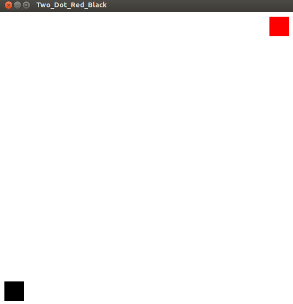

# 3.两点 #

## 程序Two Dots Red Black.cpp ##
 
	#include<GL/glut.h>
 
	void display(void){
	    glClear(GL_COLOR_BUFFER_BIT);
	    glColor3d(0.0,0.0,0.0);
	    glBegin(GL_POINTS), glVertex2d(25.0,25.0), glEnd();
	    glColor3d(1.0,0.0,0.0);
	    glBegin(GL_POINTS), glVertex2d(475,475), glEnd();
	    glFlush();
	}
 
	int main(int argc,char** argv){
	    glutInit(&argc,argv);
	    glutInitWindowSize(600,600);
	    glutInitDisplayMode(GLUT_SINGLE | GLUT_RGB);
	    glutCreateWindow("Two_Dots_Red_Black");
	    glutDisplayFunc(display);
	    gluOrtho2D(0,500,0,500);
	    glClearColor(1.0,1.0,1.0,1.0);
	    glPointSize(40);
	    glutMainLoop();
	    return 0;
	}

## 测试 ##

	# g++ -lGL -lGLU -lglut Two_Dots_Red_Black.cpp
	# ./a.out

## 效果 ##
	

### 链接 ###

[Computer Graphics – 3. Two Dots](http://www.techtofun.com/2013/08/13/computer-graphics-3-two-dots/)