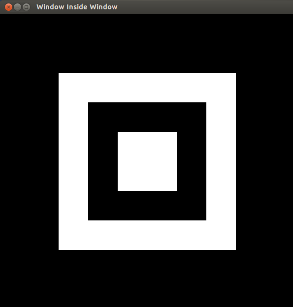

# 4.方块套方块#

## 程序Square_in_Square.cpp ##
 
	#include<GL/glut.h>
 
	void window(void){
    	glClear(GL_COLOR_BUFFER_BIT);
    	glColor3d(1.0,1.0,1.0);
    	glBegin(GL_QUADS);
    	glVertex2d(100,400);
    	glVertex2d(100,100);
    	glVertex2d(400,100);
    	glVertex2d(400,400);
    	glEnd();
     
    	glColor3d(0,0,0);
    	glBegin(GL_QUADS);
    	glVertex2d(150,350);
    	glVertex2d(150,150);
    	glVertex2d(350,150);
    	glVertex2d(350,350);
    	glEnd();
 
    	glColor3d(1.0,1.0,1.0);
    	glBegin(GL_QUADS);
    	glVertex2d(200,300);
    	glVertex2d(200,200);
    	glVertex2d(300,200);
    	glVertex2d(300,300);
    	glEnd();
     
    	glFlush();
	}
 
	int main(int argc,char**argv){
    	glutInit(&argc,argv);
    	glutInitWindowSize(600,600);
    	glutInitDisplayMode(GLUT_SINGLE | GLUT_RGB);
    	glutCreateWindow("Square in Square");
    	glutDisplayFunc(window);
    	gluOrtho2D(0,500,0,500);
    	glClearColor(0.0,0.0,0.0,0.0);
    	glutMainLoop();
    	return 0;
	}

## 测试 ##

	# g++ -lGL -lGLU -lglut Square_in_Square.cpp
	# ./a.out

## 效果 ##
	

### 链接 ###

[Computer Graphics – 4. Square in Square](http://www.techtofun.com/2013/08/13/computer-graphics-4-square-in-square/)