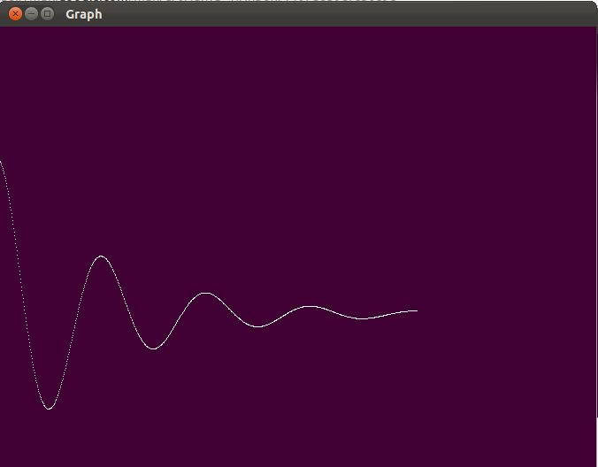

# 6.e^(-x)*cos(2*x*π ) 曲线图#

## 程序graph.cpp ##
 
	#include<GL/glut.h>
	#include<math.h>
	double f(GLdouble x)
	{   return (exp(-1 * x)*cos(2*3.14159*x));
	}
	void display()
	{   glClear(GL_COLOR_BUFFER_BIT);
 
		glBegin(GL_POINTS);
		for(GLdouble x=0;x<4.0;x+=0.005)
		{       glVertex2d(x*(350.0/4),(f(x)*(350.0/2))+(350.0/2));
		}
 
		glEnd();
		glFlush();
	}
	int main(int argc, char** argv)
	{       
         glutInit(&argc,argv);
         glutInitDisplayMode(GLUT_SINGLE|GLUT_RGB);
         glutInitWindowSize(500,500);
         glutCreateWindow("Graph");
         glutDisplayFunc(display);
         gluOrtho2D(0.0,500.0,0.0,500.0);
         glClearColor(0.25,0.0,0.2,1.0);
         glutMainLoop();
	}

## 测试 ##

	# g++ -lGL -lGLU -lglut graph.cpp
	# ./a.out

## 效果 ##
	

### 链接 ###

[Computer Graphics – 6. e^(-x)*cos(2*x*π ) Graph](http://www.techtofun.com/2013/08/14/computer-graphics-6-e-xcos2x%CF%80-wave/)